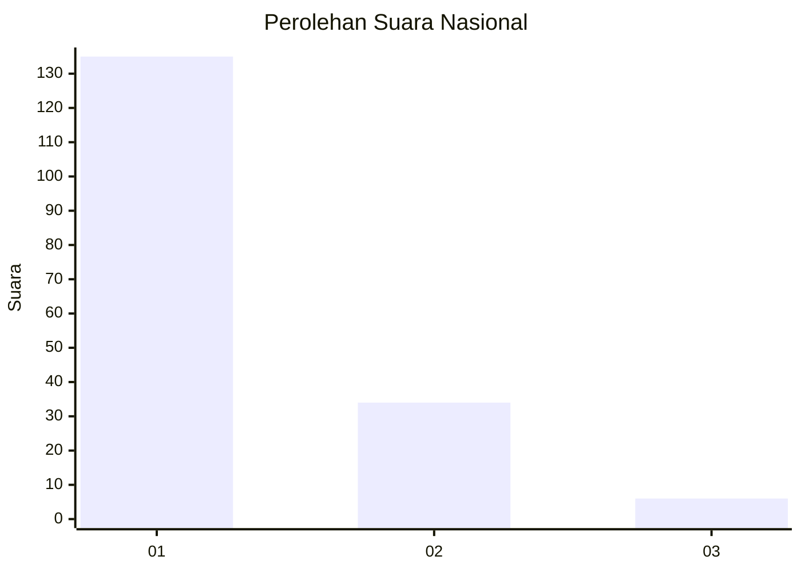
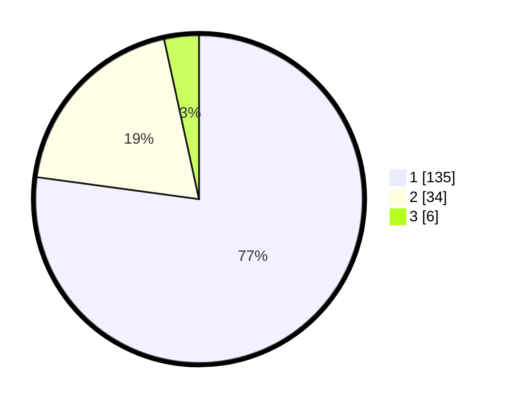

# Hasil

## Grafik

## Tabel

| No. | Nama Paslon    | Suara | Suara (raw) | Persentase |
|:--- |:-------------- | -----:| -----------:| ----------:|
| 1   | ANIES MUHAIMIN | 135   | [135][p-1]  | 77,14      |
| 2   | PRABOWO GIBRAN | 34    | [34][p-2]   | 19,43      |
| 3   | GANJAR MAHFUD  | 6     | [6][p-3]    | 3,43       |

[p-1]: https://github.com/gigit-pemilu/pemilu-2024/blob/main/pilpres/hitung-suara/sub/11-aceh/sub/14-aceh-jaya/sub/04-sampoi-niet/sub/2001-lhok-kruet/sub/001-tps/sub/paslon-1.txt
[p-2]: https://github.com/gigit-pemilu/pemilu-2024/blob/main/pilpres/hitung-suara/sub/11-aceh/sub/14-aceh-jaya/sub/04-sampoi-niet/sub/2001-lhok-kruet/sub/001-tps/sub/paslon-2.txt
[p-3]: https://github.com/gigit-pemilu/pemilu-2024/blob/main/pilpres/hitung-suara/sub/11-aceh/sub/14-aceh-jaya/sub/04-sampoi-niet/sub/2001-lhok-kruet/sub/001-tps/sub/paslon-3.txt

## Foto C Plano

https://sirekap-obj-formc.kpu.go.id/7e65/pemilu/ppwp/11/14/04/20/01/1114042001001-20240214-220707--13bc69ef-60b2-40e5-a79c-232a221d71e2.jpg

https://sirekap-obj-formc.kpu.go.id/7e65/pemilu/ppwp/11/14/04/20/01/1114042001001-20240217-101733--39920f2d-be7f-455d-a2d0-37461bada9cf.jpg

https://sirekap-obj-formc.kpu.go.id/7e65/pemilu/ppwp/11/14/04/20/01/1114042001001-20240217-102025--61edd5d7-52d2-4000-88f3-9c87dda435dc.jpg

## Metadata

| Key        | Value               |
| ---------- | ------------------- |
| Time Stamp | 2024-02-17 10:30:03 |

## DATA PEMILIH TETAP

Jumlah pemilih dalam DPT: **200**.
 * L: **97**.
 * P: **103**.

## DATA PENGGUNA HAK PILIH

Jumlah pengguna hak pilih dalam DPT: **178**.
 * L: **83**.
 * P: **95**.

Jumlah pengguna hak pilih dalam DPTb: **1**.
 * L: **0**.
 * P: **1**.

Jumlah pengguna hak pilih dalam DPK: **0**.
 * L: **0**.
 * P: **0**.

Jumlah pengguna hak pilih: **179**.
 * L: **83**.
 * P: **96**.

## JUMLAH SUARA SAH DAN TIDAK SAH

JUMLAH SELURUH SUARA SAH: **175**.

JUMLAH SUARA TIDAK SAH: **4**.

JUMLAH SELURUH SUARA SAH DAN SUARA TIDAK SAH: **179**.

