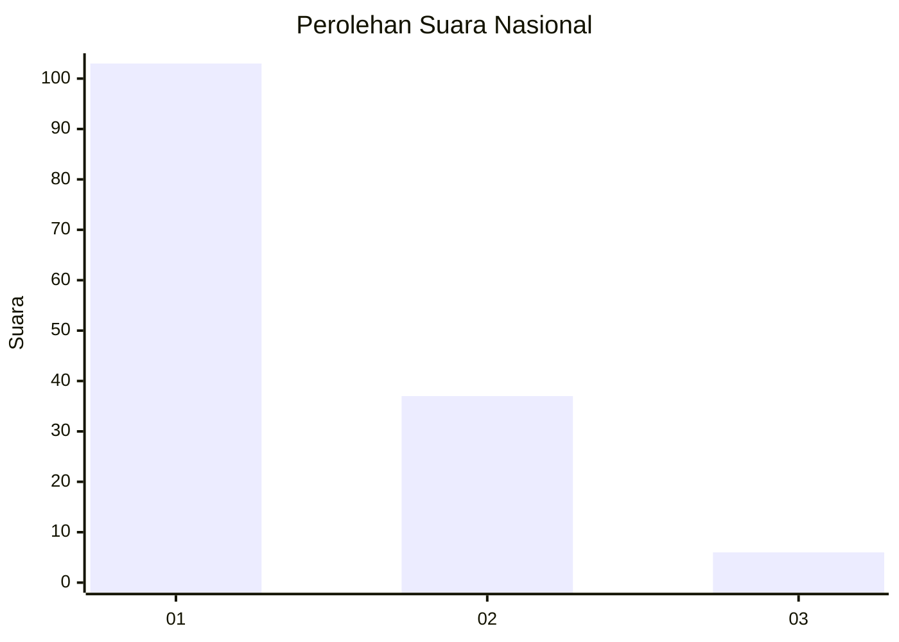
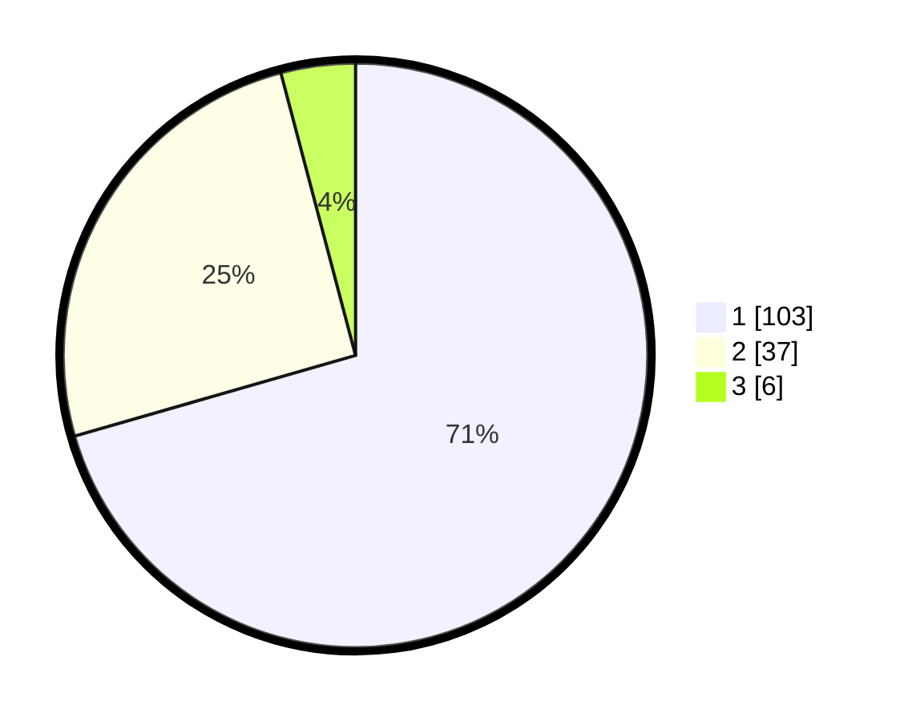

# Hasil

## Grafik

## Tabel

| No. | Nama Paslon    | Suara | Suara (raw) | Persentase |
|:--- |:-------------- | -----:| -----------:| ----------:|
| 1   | ANIES MUHAIMIN | 103   | [103][p-1]  | 70,55      |
| 2   | PRABOWO GIBRAN | 37    | [37][p-2]   | 25,34      |
| 3   | GANJAR MAHFUD  | 6     | [6][p-3]    | 4,11       |

[p-1]: https://github.com/gigit-pemilu/pemilu-2024/blob/main/pilpres/hitung-suara/sub/11-aceh/sub/14-aceh-jaya/sub/04-sampoi-niet/sub/2003-meunasah-kulam/sub/001-tps/sub/paslon-1.txt
[p-2]: https://github.com/gigit-pemilu/pemilu-2024/blob/main/pilpres/hitung-suara/sub/11-aceh/sub/14-aceh-jaya/sub/04-sampoi-niet/sub/2003-meunasah-kulam/sub/001-tps/sub/paslon-2.txt
[p-3]: https://github.com/gigit-pemilu/pemilu-2024/blob/main/pilpres/hitung-suara/sub/11-aceh/sub/14-aceh-jaya/sub/04-sampoi-niet/sub/2003-meunasah-kulam/sub/001-tps/sub/paslon-3.txt

## Foto C Plano

https://sirekap-obj-formc.kpu.go.id/ba24/pemilu/ppwp/11/14/04/20/03/1114042003001-20240216-231730--6645d243-2c6f-428f-9df8-40d7e473e7b5.jpg

https://sirekap-obj-formc.kpu.go.id/ba24/pemilu/ppwp/11/14/04/20/03/1114042003001-20240216-232156--26469396-5a6d-41ad-8bcd-8efb6f9ead08.jpg

https://sirekap-obj-formc.kpu.go.id/ba24/pemilu/ppwp/11/14/04/20/03/1114042003001-20240216-232443--1005e7f6-fa8b-4142-9a80-e876875fd03e.jpg

## Metadata

| Key        | Value               |
| ---------- | ------------------- |
| Time Stamp | 2024-02-16 23:30:00 |

## DATA PEMILIH TETAP

Jumlah pemilih dalam DPT: **164**.
 * L: **77**.
 * P: **87**.

## DATA PENGGUNA HAK PILIH

Jumlah pengguna hak pilih dalam DPT: **148**.
 * L: **68**.
 * P: **80**.

Jumlah pengguna hak pilih dalam DPTb: **2**.
 * L: **1**.
 * P: **1**.

Jumlah pengguna hak pilih dalam DPK: **0**.
 * L: **0**.
 * P: **0**.

Jumlah pengguna hak pilih: **150**.
 * L: **69**.
 * P: **81**.

## JUMLAH SUARA SAH DAN TIDAK SAH

JUMLAH SELURUH SUARA SAH: **146**.

JUMLAH SUARA TIDAK SAH: **4**.

JUMLAH SELURUH SUARA SAH DAN SUARA TIDAK SAH: **150**.

