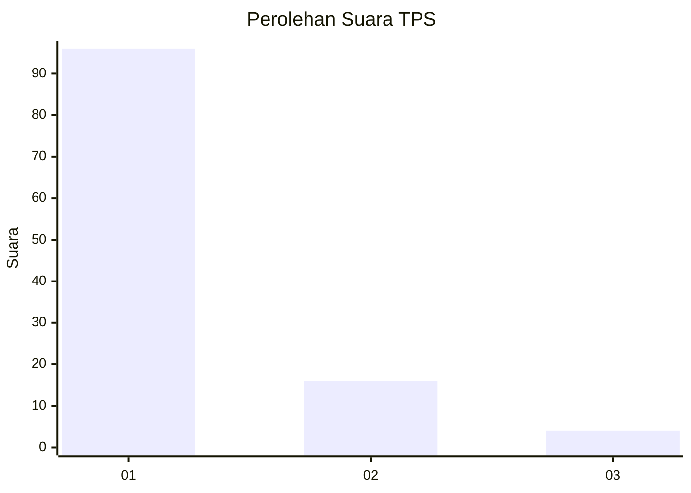
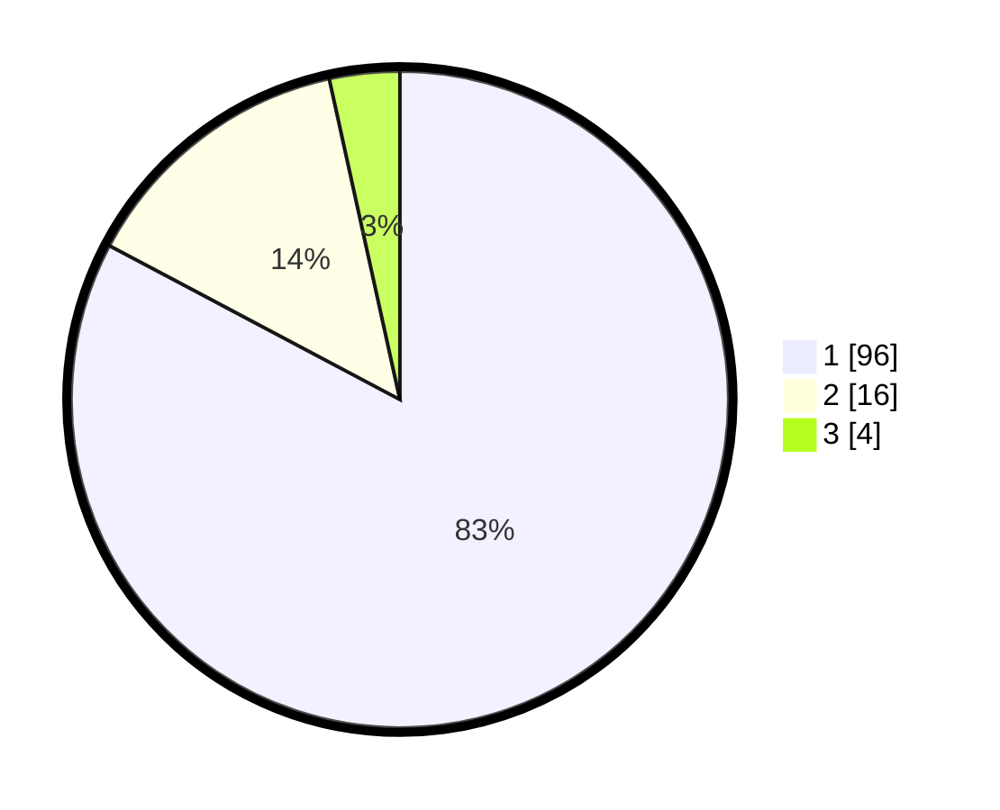

# Hasil

## Grafik

## Tabel

| No. | Nama Paslon    | Suara | Suara (raw) | Persentase |
|:--- |:-------------- | -----:| -----------:| ----------:|
| 1   | ANIES MUHAIMIN | 96    | [96][p-1]   | 82,76      |
| 2   | PRABOWO GIBRAN | 16    | [16][p-2]   | 13,79      |
| 3   | GANJAR MAHFUD  | 4     | [4][p-3]    | 3,45       |

[p-1]: https://github.com/gigit-pemilu/pemilu-2024-11-aceh/blob/main/pilpres/hitung-suara/sub/11-aceh/sub/14-aceh-jaya/sub/04-sampoi-niet/sub/2004-crak-mong/sub/002-tps/sub/paslon-1.txt
[p-2]: https://github.com/gigit-pemilu/pemilu-2024-11-aceh/blob/main/pilpres/hitung-suara/sub/11-aceh/sub/14-aceh-jaya/sub/04-sampoi-niet/sub/2004-crak-mong/sub/002-tps/sub/paslon-2.txt
[p-3]: https://github.com/gigit-pemilu/pemilu-2024-11-aceh/blob/main/pilpres/hitung-suara/sub/11-aceh/sub/14-aceh-jaya/sub/04-sampoi-niet/sub/2004-crak-mong/sub/002-tps/sub/paslon-3.txt

## Foto C Plano

https://sirekap-obj-formc.kpu.go.id/ff6c/pemilu/ppwp/11/14/04/20/04/1114042004002-20240217-024617--aa888d2b-c71f-4d83-9834-d60bc2729dc1.jpg

https://sirekap-obj-formc.kpu.go.id/ff6c/pemilu/ppwp/11/14/04/20/04/1114042004002-20240217-024617--267467b2-a6f3-4c47-a39e-42e3f466fcec.jpg

https://sirekap-obj-formc.kpu.go.id/ff6c/pemilu/ppwp/11/14/04/20/04/1114042004002-20240216-204618--36bab7e3-7df0-4223-8ad4-1ca3bbfb143c.jpg

## Metadata

| Key        | Value               |
| ---------- | ------------------- |
| Time Stamp | 2024-02-17 12:00:00 |

## DATA PEMILIH TETAP

Jumlah pemilih dalam DPT: **135**.
 * L: **74**.
 * P: **61**.

## DATA PENGGUNA HAK PILIH

Jumlah pengguna hak pilih dalam DPT: **114**.
 * L: **65**.
 * P: **49**.

Jumlah pengguna hak pilih dalam DPTb: **0**.
 * L: **0**.
 * P: **0**.

Jumlah pengguna hak pilih dalam DPK: **2**.
 * L: **2**.
 * P: **0**.

Jumlah pengguna hak pilih: **116**.
 * L: **67**.
 * P: **49**.

## JUMLAH SUARA SAH DAN TIDAK SAH

JUMLAH SELURUH SUARA SAH: **116**.

JUMLAH SUARA TIDAK SAH: **0**.

JUMLAH SELURUH SUARA SAH DAN SUARA TIDAK SAH: **116**.

