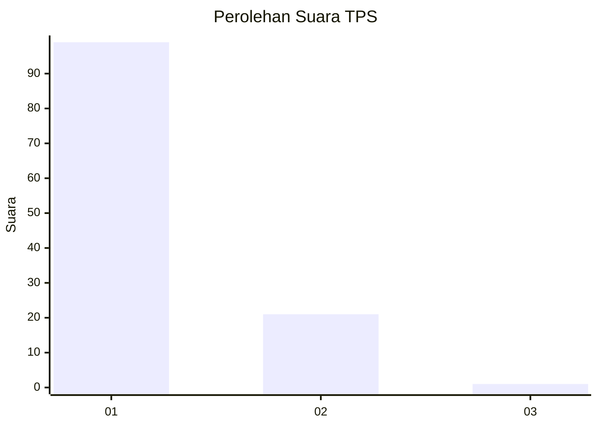
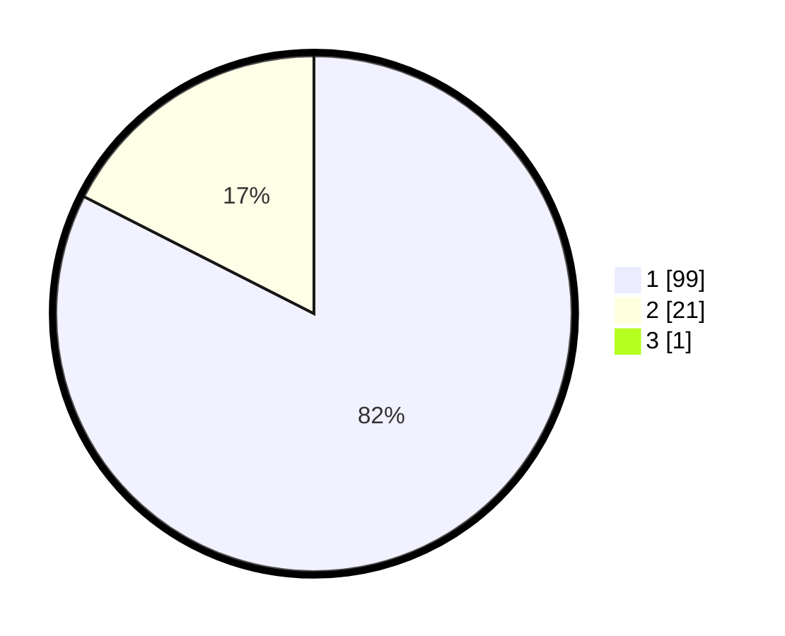

# Hasil

## Grafik

## Tabel

| No. | Nama Paslon    | Suara | Suara (raw) | Persentase |
|:--- |:-------------- | -----:| -----------:| ----------:|
| 1   | ANIES MUHAIMIN | 99    | [99][p-1]   | 81,82      |
| 2   | PRABOWO GIBRAN | 21    | [21][p-2]   | 17,36      |
| 3   | GANJAR MAHFUD  | 1     | [1][p-3]    | 0,83       |

[p-1]: https://github.com/gigit-pemilu/pemilu-2024-11-aceh/blob/main/pilpres/hitung-suara/sub/11-aceh/sub/14-aceh-jaya/sub/04-sampoi-niet/sub/2009-cot-langsat/sub/001-tps/sub/paslon-1.txt
[p-2]: https://github.com/gigit-pemilu/pemilu-2024-11-aceh/blob/main/pilpres/hitung-suara/sub/11-aceh/sub/14-aceh-jaya/sub/04-sampoi-niet/sub/2009-cot-langsat/sub/001-tps/sub/paslon-2.txt
[p-3]: https://github.com/gigit-pemilu/pemilu-2024-11-aceh/blob/main/pilpres/hitung-suara/sub/11-aceh/sub/14-aceh-jaya/sub/04-sampoi-niet/sub/2009-cot-langsat/sub/001-tps/sub/paslon-3.txt

## Foto C Plano

https://sirekap-obj-formc.kpu.go.id/cbf2/pemilu/ppwp/11/14/04/20/09/1114042009001-20240214-232119--c6f8d5b9-7517-4a6d-aed4-d1a13a25e390.jpg

https://sirekap-obj-formc.kpu.go.id/cbf2/pemilu/ppwp/11/14/04/20/09/1114042009001-20240214-234351--7357514c-8a87-498e-ba2c-181c74d0f937.jpg

https://sirekap-obj-formc.kpu.go.id/cbf2/pemilu/ppwp/11/14/04/20/09/1114042009001-20240214-234439--12e55eca-904d-44cc-9579-cf2e92f173d4.jpg

## Metadata

| Key        | Value               |
| ---------- | ------------------- |
| Time Stamp | 2024-02-17 12:00:00 |

