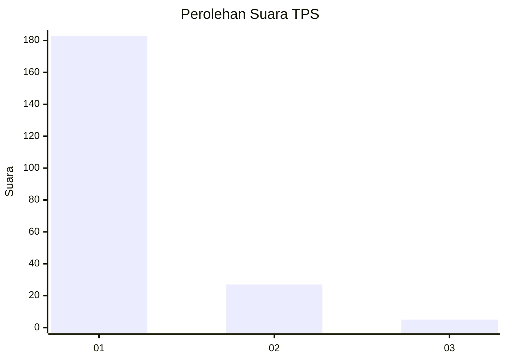
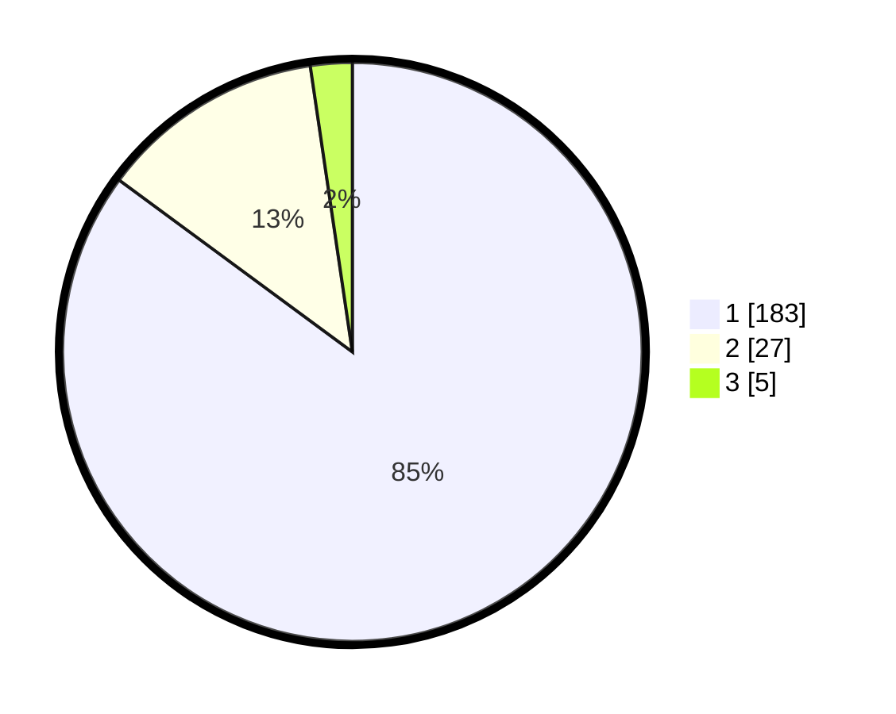

# Hasil

## Grafik

## Tabel

| No. | Nama Paslon    | Suara | Suara (raw) | Persentase |
|:--- |:-------------- | -----:| -----------:| ----------:|
| 1   | ANIES MUHAIMIN | 183   | [183][p-1]  | 85,12      |
| 2   | PRABOWO GIBRAN | 27    | [27][p-2]   | 12,56      |
| 3   | GANJAR MAHFUD  | 5     | [5][p-3]    | 2,33       |

[p-1]: https://github.com/gigit-pemilu/pemilu-2024-11-aceh/blob/main/pilpres/hitung-suara/sub/11-aceh/sub/14-aceh-jaya/sub/04-sampoi-niet/sub/2014-ranto-sabon/sub/001-tps/sub/paslon-1.txt
[p-2]: https://github.com/gigit-pemilu/pemilu-2024-11-aceh/blob/main/pilpres/hitung-suara/sub/11-aceh/sub/14-aceh-jaya/sub/04-sampoi-niet/sub/2014-ranto-sabon/sub/001-tps/sub/paslon-2.txt
[p-3]: https://github.com/gigit-pemilu/pemilu-2024-11-aceh/blob/main/pilpres/hitung-suara/sub/11-aceh/sub/14-aceh-jaya/sub/04-sampoi-niet/sub/2014-ranto-sabon/sub/001-tps/sub/paslon-3.txt

## Foto C Plano

https://sirekap-obj-formc.kpu.go.id/21d2/pemilu/ppwp/11/14/04/20/14/1114042014001-20240217-103424--126684ac-9a99-4023-b585-1f3c6ad348e6.jpg

https://sirekap-obj-formc.kpu.go.id/21d2/pemilu/ppwp/11/14/04/20/14/1114042014001-20240217-102943--bab2f924-4691-4f44-bff4-0927d80f2187.jpg

https://sirekap-obj-formc.kpu.go.id/21d2/pemilu/ppwp/11/14/04/20/14/1114042014001-20240217-103105--997a2e25-b7b3-4f01-8604-59d93b654888.jpg

## Metadata

| Key        | Value               |
| ---------- | ------------------- |
| Time Stamp | 2024-02-17 11:30:03 |

