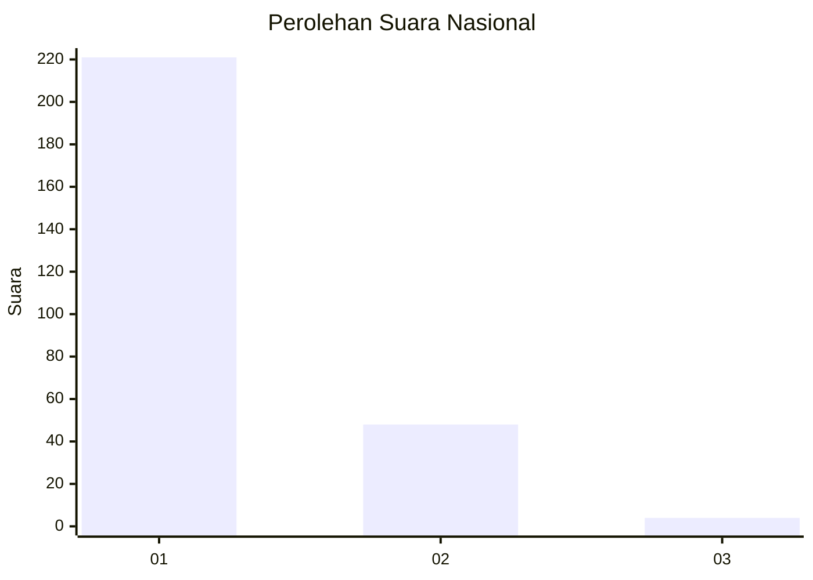
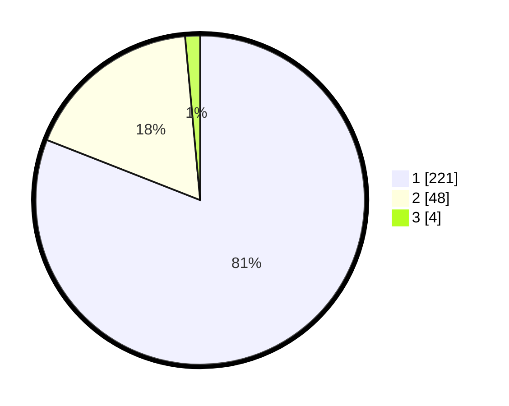

# Hasil

## Grafik

## Tabel

| No. | Nama Paslon    | Suara | Suara (raw) | Persentase |
|:--- |:-------------- | -----:| -----------:| ----------:|
| 1   | ANIES MUHAIMIN | 221   | [221][p-1]  | 80,95      |
| 2   | PRABOWO GIBRAN | 48    | [48][p-2]   | 17,58      |
| 3   | GANJAR MAHFUD  | 4     | [4][p-3]    | 1,47       |

[p-1]: https://github.com/gigit-pemilu/pemilu-2024/blob/main/pilpres/hitung-suara/sub/11-aceh/sub/14-aceh-jaya/sub/04-sampoi-niet/sub/2016-ie-jeureungeh/sub/001-tps/sub/paslon-1.txt
[p-2]: https://github.com/gigit-pemilu/pemilu-2024/blob/main/pilpres/hitung-suara/sub/11-aceh/sub/14-aceh-jaya/sub/04-sampoi-niet/sub/2016-ie-jeureungeh/sub/001-tps/sub/paslon-2.txt
[p-3]: https://github.com/gigit-pemilu/pemilu-2024/blob/main/pilpres/hitung-suara/sub/11-aceh/sub/14-aceh-jaya/sub/04-sampoi-niet/sub/2016-ie-jeureungeh/sub/001-tps/sub/paslon-3.txt

## Foto C Plano

https://sirekap-obj-formc.kpu.go.id/1ecc/pemilu/ppwp/11/14/04/20/16/1114042016001-20240215-070120--b392a157-eecb-4406-a98f-8bb40370f416.jpg

https://sirekap-obj-formc.kpu.go.id/1ecc/pemilu/ppwp/11/14/04/20/16/1114042016001-20240215-070319--977b198b-7bf6-4f96-a782-9dc6491cf400.jpg

https://sirekap-obj-formc.kpu.go.id/1ecc/pemilu/ppwp/11/14/04/20/16/1114042016001-20240215-070620--547be47b-d5e2-4cae-ab01-2c4ba6741669.jpg

## Metadata

| Key        | Value               |
| ---------- | ------------------- |
| Time Stamp | 2024-02-15 21:01:18 |

