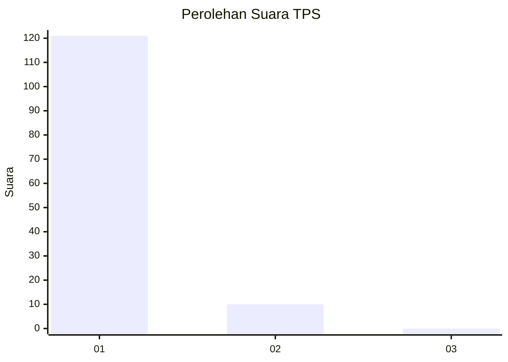
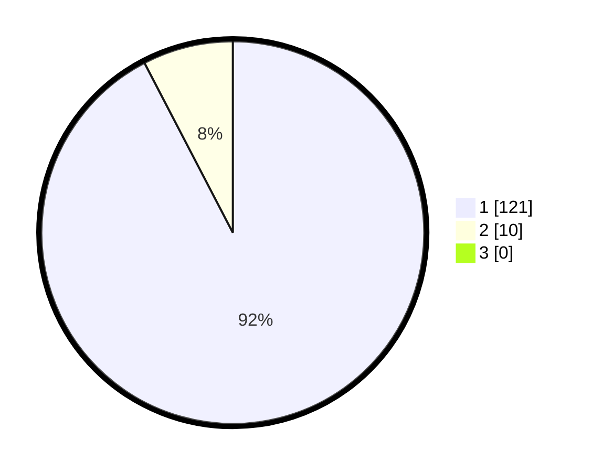

# Hasil

## Grafik

## Tabel

| No. | Nama Paslon    | Suara | Suara (raw) | Persentase |
|:--- |:-------------- | -----:| -----------:| ----------:|
| 1   | ANIES MUHAIMIN | 121   | [121][p-1]  | 92,37      |
| 2   | PRABOWO GIBRAN | 10    | [10][p-2]   | 7,63       |
| 3   | GANJAR MAHFUD  | 0     | [0][p-3]    | 0,00       |

[p-1]: https://github.com/gigit-pemilu/pemilu-2024-11-aceh/blob/main/pilpres/hitung-suara/sub/11-aceh/sub/14-aceh-jaya/sub/05-jaya/sub/2012-sabet/sub/001-tps/sub/paslon-1.txt
[p-2]: https://github.com/gigit-pemilu/pemilu-2024-11-aceh/blob/main/pilpres/hitung-suara/sub/11-aceh/sub/14-aceh-jaya/sub/05-jaya/sub/2012-sabet/sub/001-tps/sub/paslon-2.txt
[p-3]: https://github.com/gigit-pemilu/pemilu-2024-11-aceh/blob/main/pilpres/hitung-suara/sub/11-aceh/sub/14-aceh-jaya/sub/05-jaya/sub/2012-sabet/sub/001-tps/sub/paslon-3.txt

## Foto C Plano

https://sirekap-obj-formc.kpu.go.id/78e0/pemilu/ppwp/11/14/05/20/12/1114052012001-20240215-144317--e75b7e36-89fa-4865-8a8f-92cf8ebe3560.jpg

https://sirekap-obj-formc.kpu.go.id/78e0/pemilu/ppwp/11/14/05/20/12/1114052012001-20240215-144502--83fce224-a411-4794-bedc-e5821917d38f.jpg

https://sirekap-obj-formc.kpu.go.id/78e0/pemilu/ppwp/11/14/05/20/12/1114052012001-20240215-144609--bdd04c72-a91f-4e58-b9fe-a82a453ab05c.jpg

## Metadata

| Key        | Value               |
| ---------- | ------------------- |
| Time Stamp | 2024-02-15 17:00:25 |

