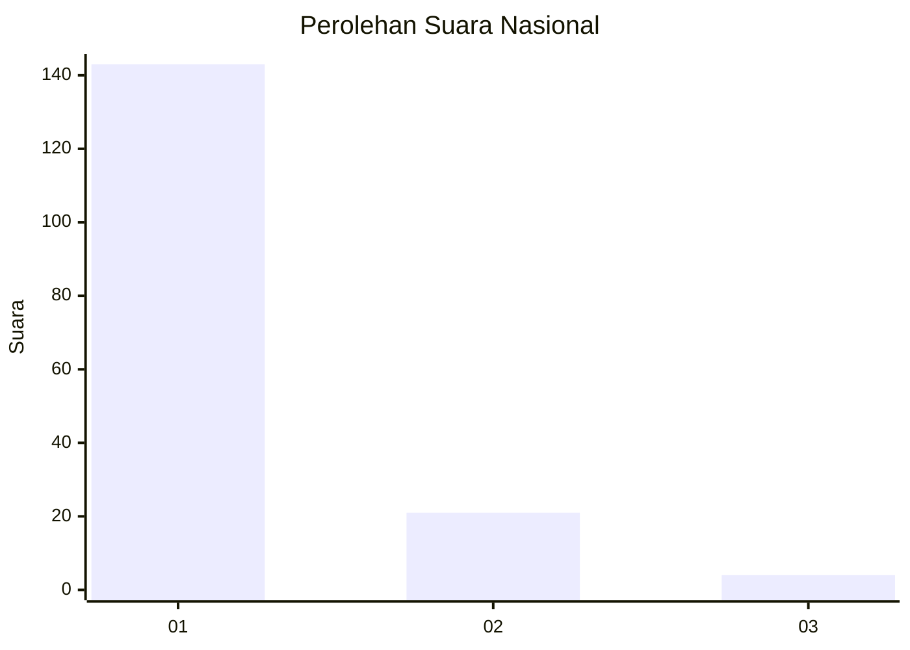
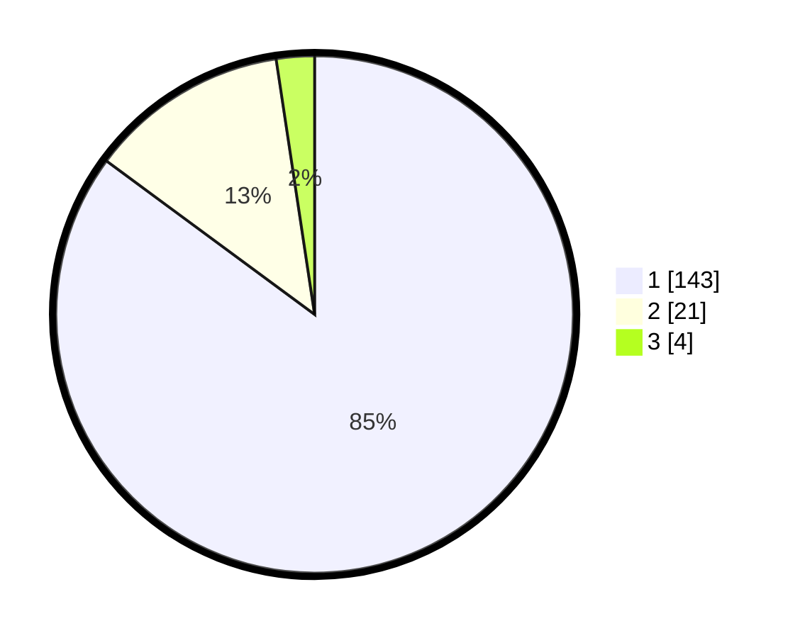

# Hasil

## Grafik

## Tabel

| No. | Nama Paslon    | Suara | Suara (raw) | Persentase |
|:--- |:-------------- | -----:| -----------:| ----------:|
| 1   | ANIES MUHAIMIN | 143   | [143][p-1]  | 85,12      |
| 2   | PRABOWO GIBRAN | 21    | [21][p-2]   | 12,50      |
| 3   | GANJAR MAHFUD  | 4     | [4][p-3]    | 2,38       |

[p-1]: https://github.com/gigit-pemilu/pemilu-2024/blob/main/pilpres/hitung-suara/sub/11-aceh/sub/14-aceh-jaya/sub/05-jaya/sub/2013-sango/sub/002-tps/sub/paslon-1.txt
[p-2]: https://github.com/gigit-pemilu/pemilu-2024/blob/main/pilpres/hitung-suara/sub/11-aceh/sub/14-aceh-jaya/sub/05-jaya/sub/2013-sango/sub/002-tps/sub/paslon-2.txt
[p-3]: https://github.com/gigit-pemilu/pemilu-2024/blob/main/pilpres/hitung-suara/sub/11-aceh/sub/14-aceh-jaya/sub/05-jaya/sub/2013-sango/sub/002-tps/sub/paslon-3.txt

## Foto C Plano

https://sirekap-obj-formc.kpu.go.id/525b/pemilu/ppwp/11/14/05/20/13/1114052013002-20240215-193056--624e5719-9603-4c48-b82f-5b45424e06d0.jpg

https://sirekap-obj-formc.kpu.go.id/525b/pemilu/ppwp/11/14/05/20/13/1114052013002-20240215-193324--a417c965-969f-4290-bde3-bba45c46591c.jpg

## Metadata

| Key        | Value               |
| ---------- | ------------------- |
| Time Stamp | 2024-02-24 22:31:28 |

