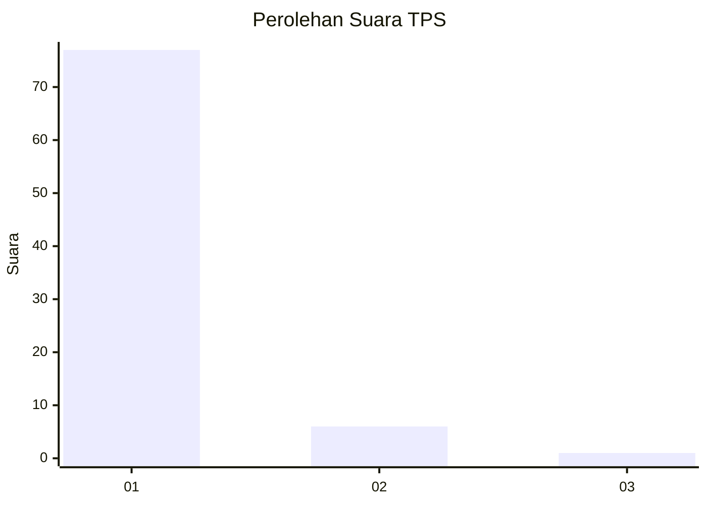
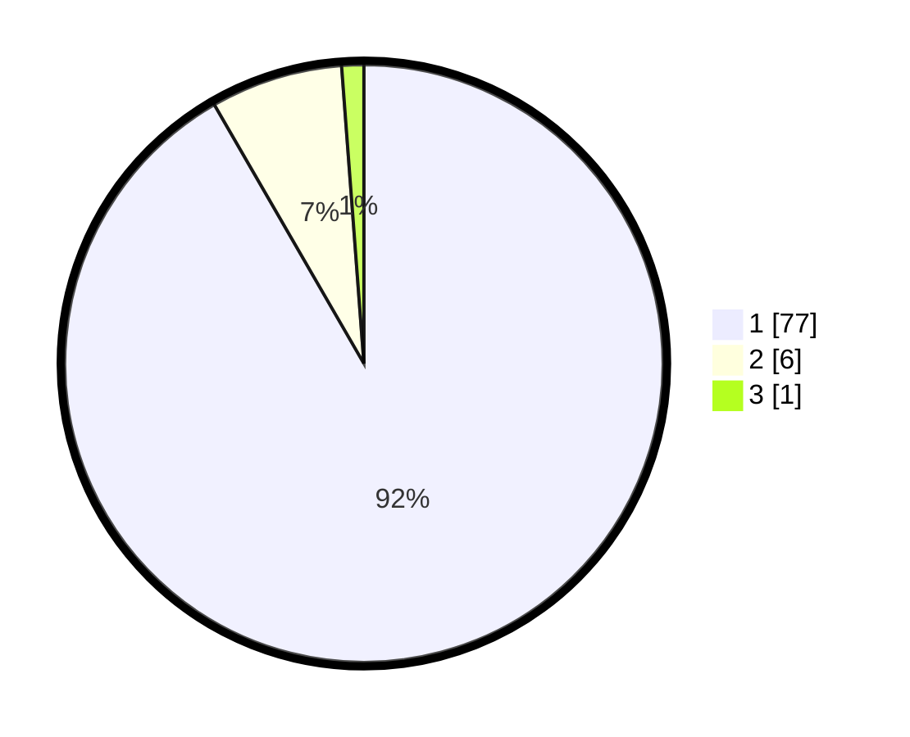

# Hasil

## Grafik

## Tabel

| No. | Nama Paslon    | Suara | Suara (raw) | Persentase |
|:--- |:-------------- | -----:| -----------:| ----------:|
| 1   | ANIES MUHAIMIN | 77    | [77][p-1]   | 91,67      |
| 2   | PRABOWO GIBRAN | 6     | [6][p-2]    | 7,14       |
| 3   | GANJAR MAHFUD  | 1     | [1][p-3]    | 1,19       |

[p-1]: https://github.com/gigit-pemilu/pemilu-2024-11-aceh/blob/main/pilpres/hitung-suara/sub/11-aceh/sub/14-aceh-jaya/sub/05-jaya/sub/2014-mareu/sub/001-tps/sub/paslon-1.txt
[p-2]: https://github.com/gigit-pemilu/pemilu-2024-11-aceh/blob/main/pilpres/hitung-suara/sub/11-aceh/sub/14-aceh-jaya/sub/05-jaya/sub/2014-mareu/sub/001-tps/sub/paslon-2.txt
[p-3]: https://github.com/gigit-pemilu/pemilu-2024-11-aceh/blob/main/pilpres/hitung-suara/sub/11-aceh/sub/14-aceh-jaya/sub/05-jaya/sub/2014-mareu/sub/001-tps/sub/paslon-3.txt

## Foto C Plano

https://sirekap-obj-formc.kpu.go.id/8c63/pemilu/ppwp/11/14/05/20/14/1114052014001-20240216-140100--58e9d86b-bb5b-489c-b156-63b5e981f1bd.jpg

https://sirekap-obj-formc.kpu.go.id/8c63/pemilu/ppwp/11/14/05/20/14/1114052014001-20240216-140101--28e3965c-af13-4fb4-b5c6-da52d32bc5de.jpg

https://sirekap-obj-formc.kpu.go.id/8c63/pemilu/ppwp/11/14/05/20/14/1114052014001-20240216-140100--20d05438-3e43-4e4b-9d08-95b0179e340e.jpg

## Metadata

| Key        | Value               |
| ---------- | ------------------- |
| Time Stamp | 2024-02-17 13:37:34 |

## DATA PEMILIH TETAP

Jumlah pemilih dalam DPT: **84**.
 * L: **43**.
 * P: **41**.

## DATA PENGGUNA HAK PILIH

Jumlah pengguna hak pilih dalam DPT: **84**.
 * L: **43**.
 * P: **41**.

Jumlah pengguna hak pilih dalam DPTb: **0**.
 * L: **0**.
 * P: **0**.

Jumlah pengguna hak pilih dalam DPK: **0**.
 * L: **0**.
 * P: **0**.

Jumlah pengguna hak pilih: **84**.
 * L: **43**.
 * P: **41**.

## JUMLAH SUARA SAH DAN TIDAK SAH

JUMLAH SELURUH SUARA SAH: **84**.

JUMLAH SUARA TIDAK SAH: **0**.

JUMLAH SELURUH SUARA SAH DAN SUARA TIDAK SAH: **84**.

