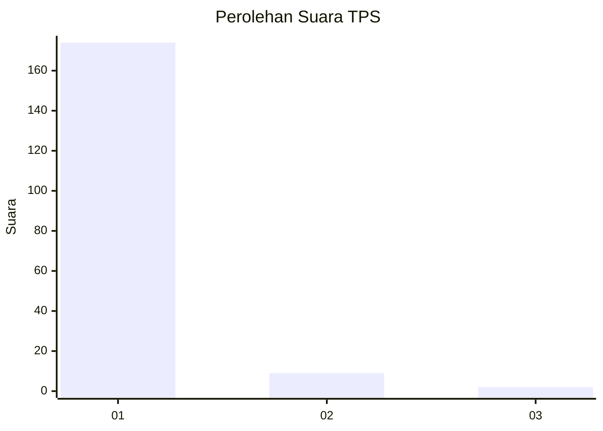
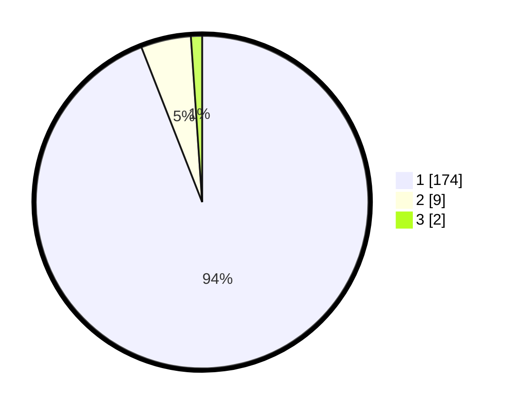

# Hasil

## Grafik

## Tabel

| No. | Nama Paslon    | Suara | Suara (raw) | Persentase |
|:--- |:-------------- | -----:| -----------:| ----------:|
| 1   | ANIES MUHAIMIN | 174   | [174][p-1]  | 94,05      |
| 2   | PRABOWO GIBRAN | 9     | [9][p-2]    | 4,86       |
| 3   | GANJAR MAHFUD  | 2     | [2][p-3]    | 1,08       |

[p-1]: https://github.com/gigit-pemilu/pemilu-2024-11-aceh/blob/main/pilpres/hitung-suara/sub/11-aceh/sub/14-aceh-jaya/sub/05-jaya/sub/2020-babah-ie/sub/001-tps/sub/paslon-1.txt
[p-2]: https://github.com/gigit-pemilu/pemilu-2024-11-aceh/blob/main/pilpres/hitung-suara/sub/11-aceh/sub/14-aceh-jaya/sub/05-jaya/sub/2020-babah-ie/sub/001-tps/sub/paslon-2.txt
[p-3]: https://github.com/gigit-pemilu/pemilu-2024-11-aceh/blob/main/pilpres/hitung-suara/sub/11-aceh/sub/14-aceh-jaya/sub/05-jaya/sub/2020-babah-ie/sub/001-tps/sub/paslon-3.txt

## Foto C Plano

https://sirekap-obj-formc.kpu.go.id/856c/pemilu/ppwp/11/14/05/20/20/1114052020001-20240215-122439--ee8f5836-3e79-490b-8a90-398925937974.jpg

https://sirekap-obj-formc.kpu.go.id/856c/pemilu/ppwp/11/14/05/20/20/1114052020001-20240215-122717--7d9de6df-3e56-41bb-a4f5-c3b8c0505df7.jpg

https://sirekap-obj-formc.kpu.go.id/856c/pemilu/ppwp/11/14/05/20/20/1114052020001-20240215-122938--b9ed76ce-3ca5-49b0-ba3d-86c157236f1e.jpg

## Metadata

| Key        | Value               |
| ---------- | ------------------- |
| Time Stamp | 2024-02-15 19:30:26 |

