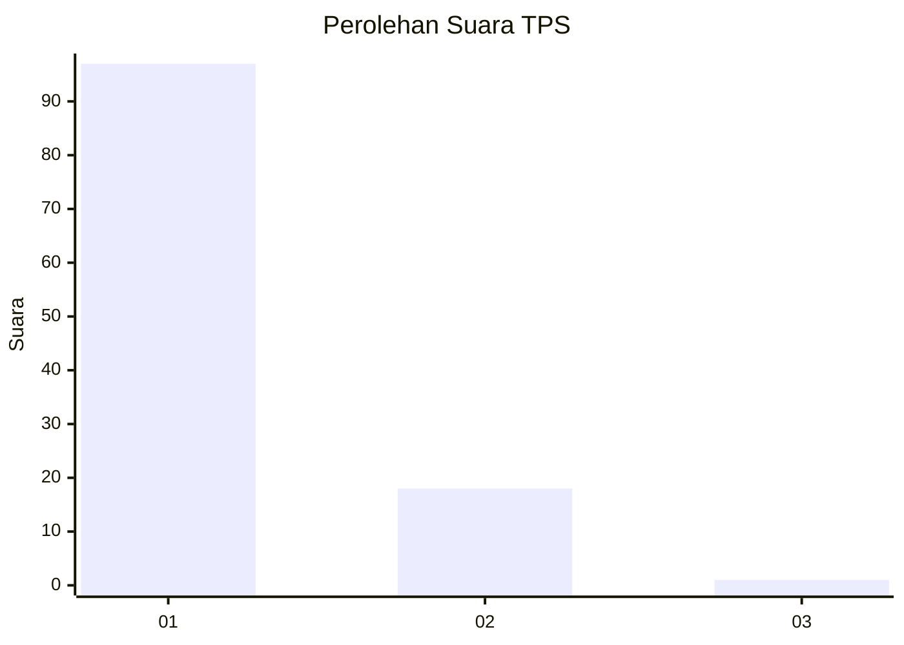
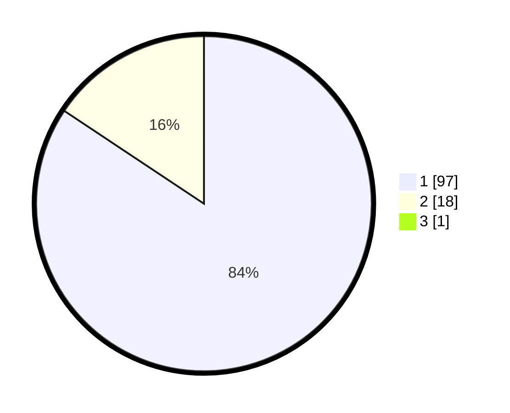

# Hasil

## Grafik

## Tabel

| No. | Nama Paslon    | Suara | Suara (raw) | Persentase |
|:--- |:-------------- | -----:| -----------:| ----------:|
| 1   | ANIES MUHAIMIN | 97    | [97][p-1]   | 83,62      |
| 2   | PRABOWO GIBRAN | 18    | [18][p-2]   | 15,52      |
| 3   | GANJAR MAHFUD  | 1     | [1][p-3]    | 0,86       |

[p-1]: https://github.com/gigit-pemilu/pemilu-2024-11-aceh/blob/main/pilpres/hitung-suara/sub/11-aceh/sub/14-aceh-jaya/sub/05-jaya/sub/2028-babah-krueng/sub/002-tps/sub/paslon-1.txt
[p-2]: https://github.com/gigit-pemilu/pemilu-2024-11-aceh/blob/main/pilpres/hitung-suara/sub/11-aceh/sub/14-aceh-jaya/sub/05-jaya/sub/2028-babah-krueng/sub/002-tps/sub/paslon-2.txt
[p-3]: https://github.com/gigit-pemilu/pemilu-2024-11-aceh/blob/main/pilpres/hitung-suara/sub/11-aceh/sub/14-aceh-jaya/sub/05-jaya/sub/2028-babah-krueng/sub/002-tps/sub/paslon-3.txt

## Foto C Plano

https://sirekap-obj-formc.kpu.go.id/2a79/pemilu/ppwp/11/14/05/20/28/1114052028002-20240216-000251--43be145e-5b34-43c6-bc9b-a98aaf9a0d40.jpg

https://sirekap-obj-formc.kpu.go.id/2a79/pemilu/ppwp/11/14/05/20/28/1114052028002-20240216-000428--947ebbc1-b885-4e94-93ff-d5079d8dd20f.jpg

https://sirekap-obj-formc.kpu.go.id/2a79/pemilu/ppwp/11/14/05/20/28/1114052028002-20240216-000554--0f717752-7412-4c89-9714-bb42a6d9da86.jpg

## Metadata

| Key        | Value               |
| ---------- | ------------------- |
| Time Stamp | 2024-02-16 10:00:28 |

