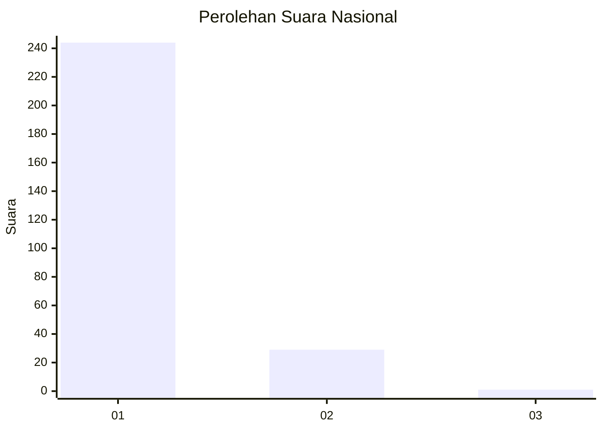
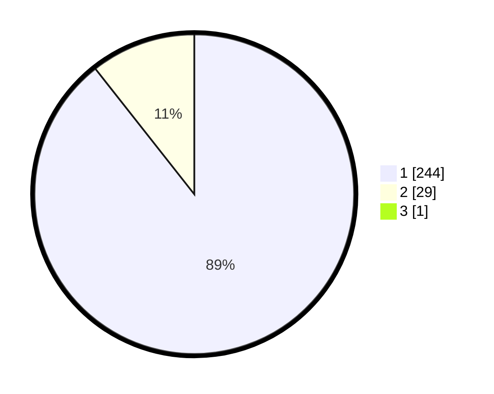

# Hasil

## Grafik

## Tabel

| No. | Nama Paslon    | Suara | Suara (raw) | Persentase |
|:--- |:-------------- | -----:| -----------:| ----------:|
| 1   | ANIES MUHAIMIN | 244   | [244][p-1]  | 89,05      |
| 2   | PRABOWO GIBRAN | 29    | [29][p-2]   | 10,58      |
| 3   | GANJAR MAHFUD  | 1     | [1][p-3]    | 0,36       |

[p-1]: https://github.com/gigit-pemilu/pemilu-2024/blob/main/pilpres/hitung-suara/sub/11-aceh/sub/14-aceh-jaya/sub/05-jaya/sub/2038-lhuet/sub/001-tps/sub/paslon-1.txt
[p-2]: https://github.com/gigit-pemilu/pemilu-2024/blob/main/pilpres/hitung-suara/sub/11-aceh/sub/14-aceh-jaya/sub/05-jaya/sub/2038-lhuet/sub/001-tps/sub/paslon-2.txt
[p-3]: https://github.com/gigit-pemilu/pemilu-2024/blob/main/pilpres/hitung-suara/sub/11-aceh/sub/14-aceh-jaya/sub/05-jaya/sub/2038-lhuet/sub/001-tps/sub/paslon-3.txt

## Foto C Plano

https://sirekap-obj-formc.kpu.go.id/c582/pemilu/ppwp/11/14/05/20/38/1114052038001-20240215-102050--e16d05c1-a061-4452-ba9b-6b2944f71706.jpg

https://sirekap-obj-formc.kpu.go.id/c582/pemilu/ppwp/11/14/05/20/38/1114052038001-20240215-102239--b35f3998-c9a7-4c81-845b-e351e39470f9.jpg

https://sirekap-obj-formc.kpu.go.id/c582/pemilu/ppwp/11/14/05/20/38/1114052038001-20240215-102403--7665471b-48c0-4b27-a1b8-11c66b23fe42.jpg

## Metadata

| Key        | Value               |
| ---------- | ------------------- |
| Time Stamp | 2024-02-15 16:30:25 |

