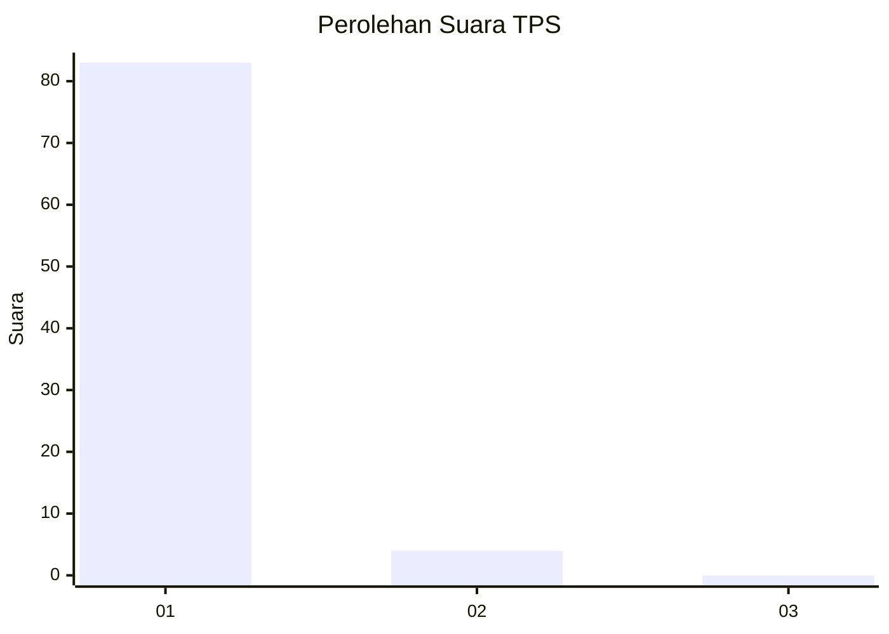
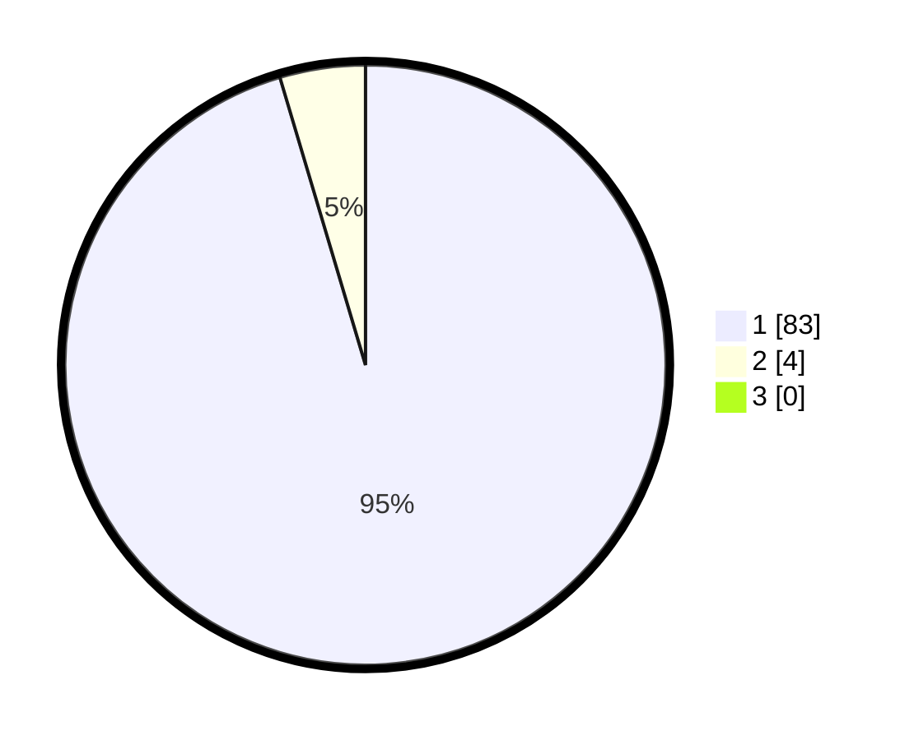

# Hasil

## Grafik

## Tabel

| No. | Nama Paslon    | Suara | Suara (raw) | Persentase |
|:--- |:-------------- | -----:| -----------:| ----------:|
| 1   | ANIES MUHAIMIN | 83    | [83][p-1]   | 95,40      |
| 2   | PRABOWO GIBRAN | 4     | [4][p-2]    | 4,60       |
| 3   | GANJAR MAHFUD  | 0     | [0][p-3]    | 0,00       |

[p-1]: https://github.com/gigit-pemilu/pemilu-2024-11-aceh/blob/main/pilpres/hitung-suara/sub/11-aceh/sub/14-aceh-jaya/sub/05-jaya/sub/2043-rumpet/sub/001-tps/sub/paslon-1.txt
[p-2]: https://github.com/gigit-pemilu/pemilu-2024-11-aceh/blob/main/pilpres/hitung-suara/sub/11-aceh/sub/14-aceh-jaya/sub/05-jaya/sub/2043-rumpet/sub/001-tps/sub/paslon-2.txt
[p-3]: https://github.com/gigit-pemilu/pemilu-2024-11-aceh/blob/main/pilpres/hitung-suara/sub/11-aceh/sub/14-aceh-jaya/sub/05-jaya/sub/2043-rumpet/sub/001-tps/sub/paslon-3.txt

## Foto C Plano

https://sirekap-obj-formc.kpu.go.id/7935/pemilu/ppwp/11/14/05/20/43/1114052043001-20240216-114603--c5295884-74a5-4fbf-ae17-4eb39e1e2f77.jpg

https://sirekap-obj-formc.kpu.go.id/7935/pemilu/ppwp/11/14/05/20/43/1114052043001-20240216-113659--d1562b36-a5a3-4331-bd9a-e13ff4e9855d.jpg

https://sirekap-obj-formc.kpu.go.id/7935/pemilu/ppwp/11/14/05/20/43/1114052043001-20240216-113745--702d791f-9d60-4af5-bb94-9c76e1ec46c4.jpg

## Metadata

| Key        | Value               |
| ---------- | ------------------- |
| Time Stamp | 2024-02-16 16:25:10 |

