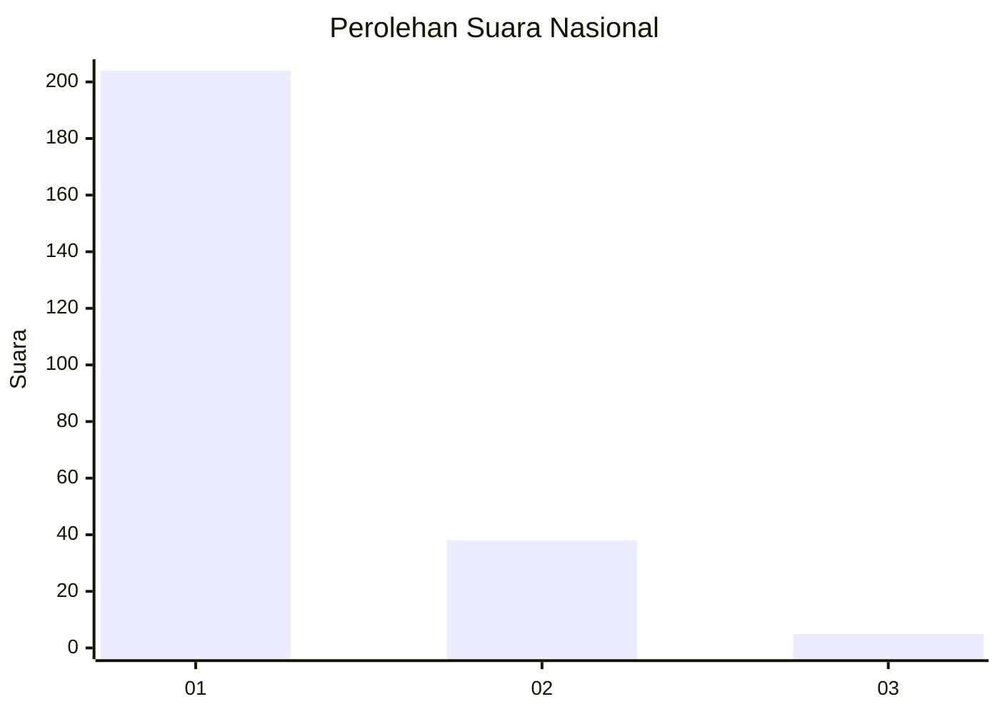
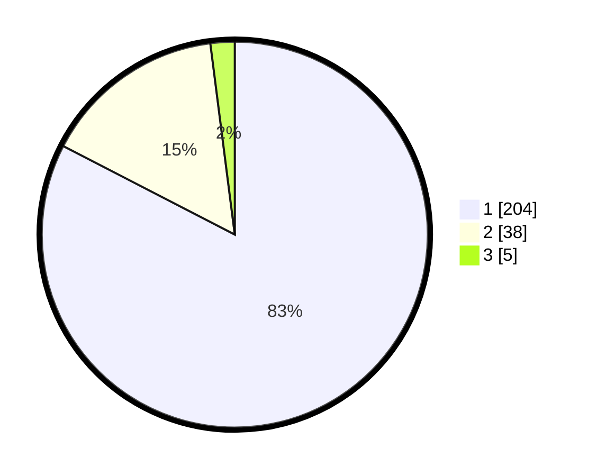

# Hasil

## Grafik

## Tabel

| No. | Nama Paslon    | Suara | Suara (raw) | Persentase |
|:--- |:-------------- | -----:| -----------:| ----------:|
| 1   | ANIES MUHAIMIN | 204   | [204][p-1]  | 82,59      |
| 2   | PRABOWO GIBRAN | 38    | [38][p-2]   | 15,38      |
| 3   | GANJAR MAHFUD  | 5     | [5][p-3]    | 2,02       |

[p-1]: https://github.com/gigit-pemilu/pemilu-2024/blob/main/pilpres/hitung-suara/sub/11-aceh/sub/14-aceh-jaya/sub/06-panga/sub/2002-kuta-tuha/sub/003-tps/sub/paslon-1.txt
[p-2]: https://github.com/gigit-pemilu/pemilu-2024/blob/main/pilpres/hitung-suara/sub/11-aceh/sub/14-aceh-jaya/sub/06-panga/sub/2002-kuta-tuha/sub/003-tps/sub/paslon-2.txt
[p-3]: https://github.com/gigit-pemilu/pemilu-2024/blob/main/pilpres/hitung-suara/sub/11-aceh/sub/14-aceh-jaya/sub/06-panga/sub/2002-kuta-tuha/sub/003-tps/sub/paslon-3.txt

## Foto C Plano

https://sirekap-obj-formc.kpu.go.id/db29/pemilu/ppwp/11/14/06/20/02/1114062002003-20240214-213424--952da7c2-e53e-406b-adab-70051a588216.jpg

https://sirekap-obj-formc.kpu.go.id/db29/pemilu/ppwp/11/14/06/20/02/1114062002003-20240214-213752--bc180cc3-0503-44e8-935e-cd65412bf295.jpg

https://sirekap-obj-formc.kpu.go.id/db29/pemilu/ppwp/11/14/06/20/02/1114062002003-20240214-213849--89192f06-c94c-483e-97b3-b568aa662382.jpg

## Metadata

| Key        | Value               |
| ---------- | ------------------- |
| Time Stamp | 2024-02-16 10:00:28 |

