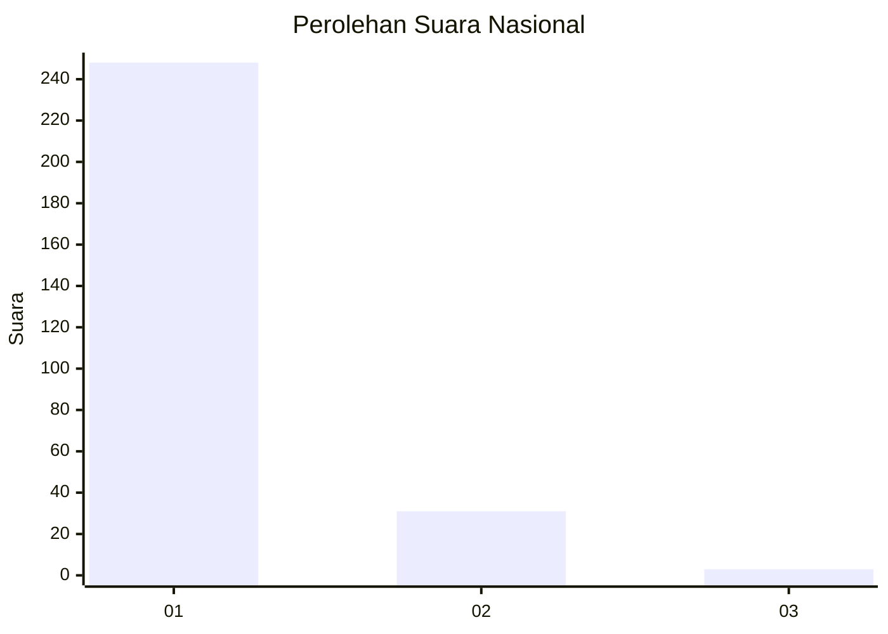
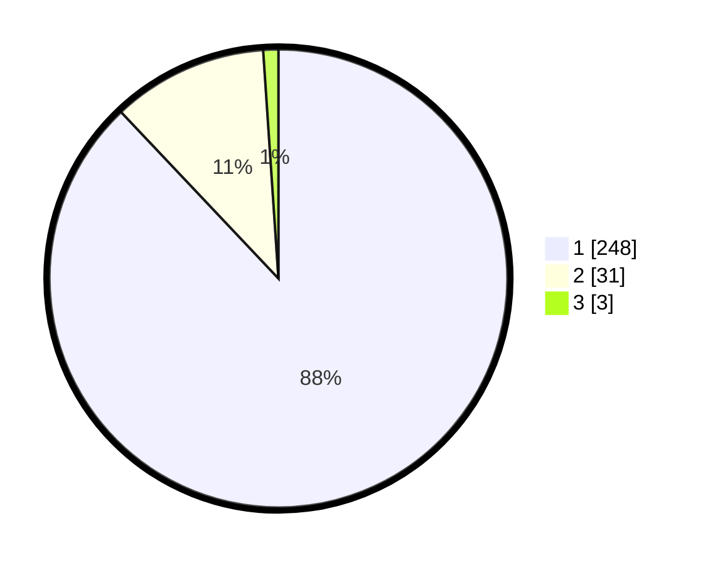

# Hasil

## Grafik

## Tabel

| No. | Nama Paslon    | Suara | Suara (raw) | Persentase |
|:--- |:-------------- | -----:| -----------:| ----------:|
| 1   | ANIES MUHAIMIN | 248   | [248][p-1]  | 87,94      |
| 2   | PRABOWO GIBRAN | 31    | [31][p-2]   | 10,99      |
| 3   | GANJAR MAHFUD  | 3     | [3][p-3]    | 1,06       |

[p-1]: https://github.com/gigit-pemilu/pemilu-2024/blob/main/pilpres/hitung-suara/sub/11-aceh/sub/14-aceh-jaya/sub/06-panga/sub/2003-tuwi-kareung/sub/001-tps/sub/paslon-1.txt
[p-2]: https://github.com/gigit-pemilu/pemilu-2024/blob/main/pilpres/hitung-suara/sub/11-aceh/sub/14-aceh-jaya/sub/06-panga/sub/2003-tuwi-kareung/sub/001-tps/sub/paslon-2.txt
[p-3]: https://github.com/gigit-pemilu/pemilu-2024/blob/main/pilpres/hitung-suara/sub/11-aceh/sub/14-aceh-jaya/sub/06-panga/sub/2003-tuwi-kareung/sub/001-tps/sub/paslon-3.txt

## Foto C Plano

https://sirekap-obj-formc.kpu.go.id/65cc/pemilu/ppwp/11/14/06/20/03/1114062003001-20240216-093736--ec2d3e20-5fa5-4e5d-ab96-5372e6d05cb3.jpg

https://sirekap-obj-formc.kpu.go.id/65cc/pemilu/ppwp/11/14/06/20/03/1114062003001-20240216-093749--42248319-1fcc-4061-8ff6-159958b4ae16.jpg

https://sirekap-obj-formc.kpu.go.id/65cc/pemilu/ppwp/11/14/06/20/03/1114062003001-20240216-095551--306d136a-0524-4e74-a683-8b43ebff3c87.jpg

## Metadata

| Key        | Value               |
| ---------- | ------------------- |
| Time Stamp | 2024-02-19 06:16:00 |

## DATA PEMILIH TETAP

Jumlah pemilih dalam DPT: **290**.
 * L: **146**.
 * P: **144**.

## DATA PENGGUNA HAK PILIH

Jumlah pengguna hak pilih dalam DPT: **282**.
 * L: **141**.
 * P: **141**.

Jumlah pengguna hak pilih dalam DPTb: **2**.
 * L: **0**.
 * P: **2**.

Jumlah pengguna hak pilih dalam DPK: **5**.
 * L: **3**.
 * P: **2**.

Jumlah pengguna hak pilih: **289**.
 * L: **144**.
 * P: **145**.

## JUMLAH SUARA SAH DAN TIDAK SAH

JUMLAH SELURUH SUARA SAH: **282**.

JUMLAH SUARA TIDAK SAH: **7**.

JUMLAH SELURUH SUARA SAH DAN SUARA TIDAK SAH: **289**.

