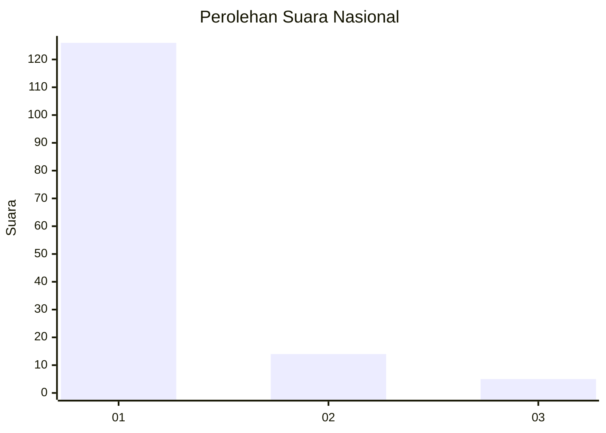
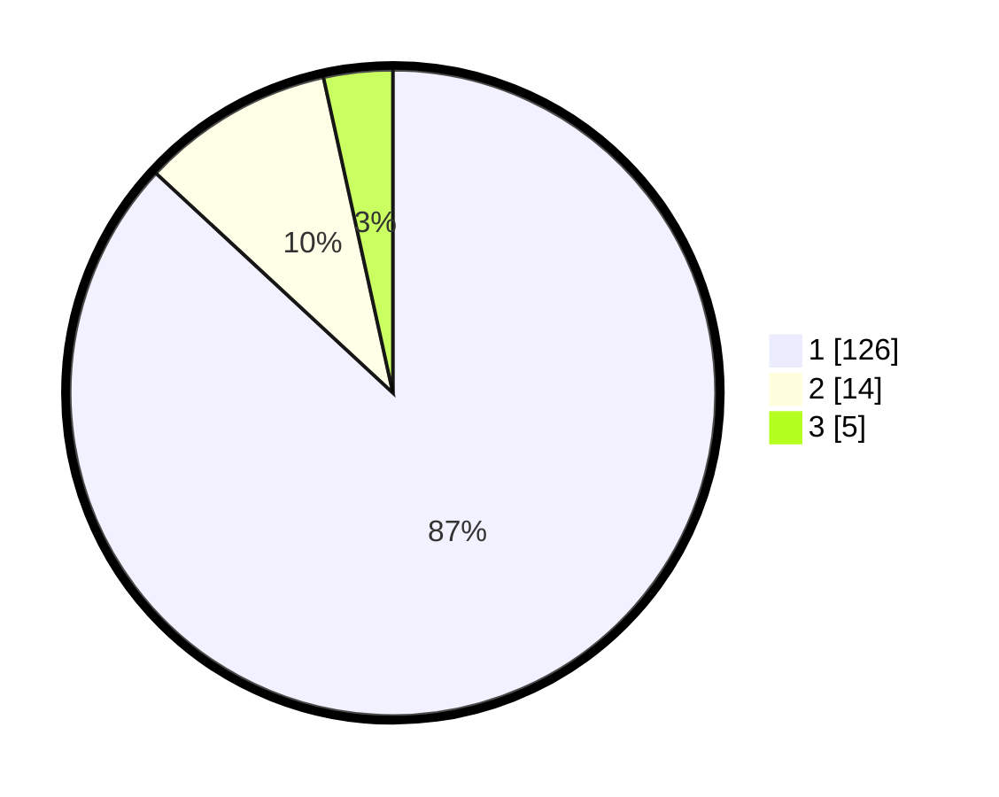

# Hasil

## Grafik

## Tabel

| No. | Nama Paslon    | Suara | Suara (raw) | Persentase |
|:--- |:-------------- | -----:| -----------:| ----------:|
| 1   | ANIES MUHAIMIN | 126   | [126][p-1]  | 86,90      |
| 2   | PRABOWO GIBRAN | 14    | [14][p-2]   | 9,66       |
| 3   | GANJAR MAHFUD  | 5     | [5][p-3]    | 3,45       |

[p-1]: https://github.com/gigit-pemilu/pemilu-2024/blob/main/pilpres/hitung-suara/sub/11-aceh/sub/14-aceh-jaya/sub/06-panga/sub/2003-tuwi-kareung/sub/003-tps/sub/paslon-1.txt
[p-2]: https://github.com/gigit-pemilu/pemilu-2024/blob/main/pilpres/hitung-suara/sub/11-aceh/sub/14-aceh-jaya/sub/06-panga/sub/2003-tuwi-kareung/sub/003-tps/sub/paslon-2.txt
[p-3]: https://github.com/gigit-pemilu/pemilu-2024/blob/main/pilpres/hitung-suara/sub/11-aceh/sub/14-aceh-jaya/sub/06-panga/sub/2003-tuwi-kareung/sub/003-tps/sub/paslon-3.txt

## Foto C Plano

https://sirekap-obj-formc.kpu.go.id/c9b3/pemilu/ppwp/11/14/06/20/03/1114062003003-20240215-141033--0c73b6d0-114e-4d4e-8880-8623b8f14390.jpg

https://sirekap-obj-formc.kpu.go.id/c9b3/pemilu/ppwp/11/14/06/20/03/1114062003003-20240215-141205--2a6e4a05-2e1b-4295-9203-60765ee1dc7e.jpg

https://sirekap-obj-formc.kpu.go.id/c9b3/pemilu/ppwp/11/14/06/20/03/1114062003003-20240215-141535--69354da5-b054-42c8-a906-d0ba301e6341.jpg

## Metadata

| Key        | Value               |
| ---------- | ------------------- |
| Time Stamp | 2024-02-16 10:30:29 |

