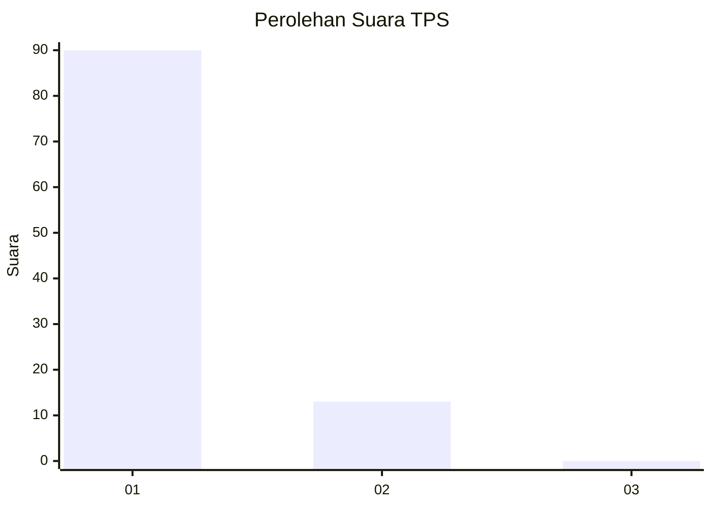
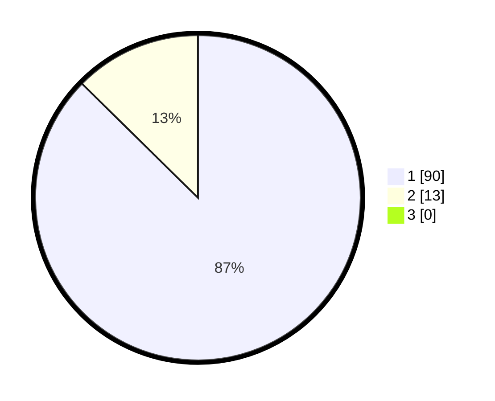

# Hasil

## Grafik

## Tabel

| No. | Nama Paslon    | Suara | Suara (raw) | Persentase |
|:--- |:-------------- | -----:| -----------:| ----------:|
| 1   | ANIES MUHAIMIN | 90    | [90][p-1]   | 87,38      |
| 2   | PRABOWO GIBRAN | 13    | [13][p-2]   | 12,62      |
| 3   | GANJAR MAHFUD  | 0     | [0][p-3]    | 0,00       |

[p-1]: https://github.com/gigit-pemilu/pemilu-2024-11-aceh/blob/main/pilpres/hitung-suara/sub/11-aceh/sub/14-aceh-jaya/sub/06-panga/sub/2013-alue-abed/sub/001-tps/sub/paslon-1.txt
[p-2]: https://github.com/gigit-pemilu/pemilu-2024-11-aceh/blob/main/pilpres/hitung-suara/sub/11-aceh/sub/14-aceh-jaya/sub/06-panga/sub/2013-alue-abed/sub/001-tps/sub/paslon-2.txt
[p-3]: https://github.com/gigit-pemilu/pemilu-2024-11-aceh/blob/main/pilpres/hitung-suara/sub/11-aceh/sub/14-aceh-jaya/sub/06-panga/sub/2013-alue-abed/sub/001-tps/sub/paslon-3.txt

## Foto C Plano

https://sirekap-obj-formc.kpu.go.id/f08c/pemilu/ppwp/11/14/06/20/13/1114062013001-20240215-004348--7bc2055d-ea95-439b-a96b-fd839785c566.jpg

https://sirekap-obj-formc.kpu.go.id/f08c/pemilu/ppwp/11/14/06/20/13/1114062013001-20240215-012514--a8a0f016-860c-4ce0-bc8f-2b3db8d393d4.jpg

https://sirekap-obj-formc.kpu.go.id/f08c/pemilu/ppwp/11/14/06/20/13/1114062013001-20240215-004418--34c02a8f-a6cc-4877-b2eb-4b81618e0c41.jpg

## Metadata

| Key        | Value               |
| ---------- | ------------------- |
| Time Stamp | 2024-02-15 12:00:28 |

