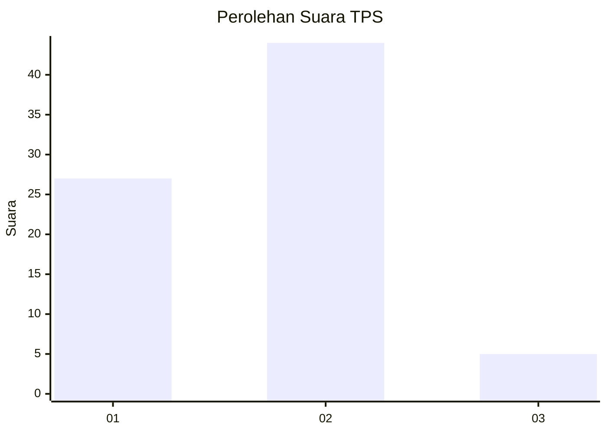
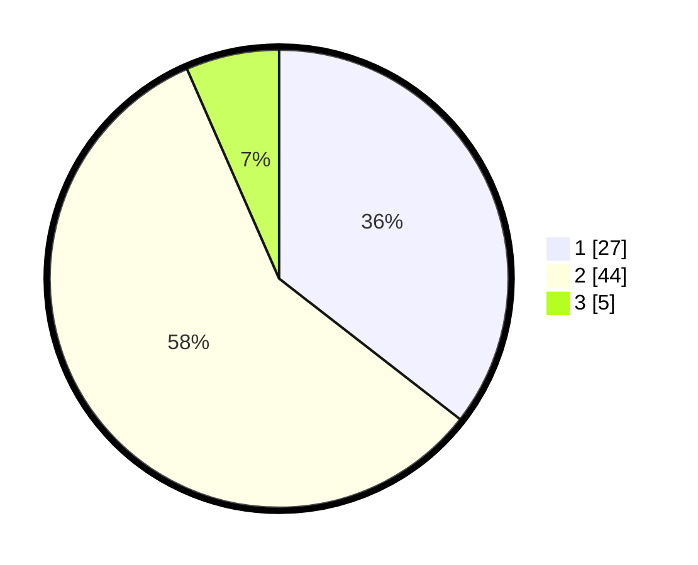

# Hasil

## Grafik

## Tabel

| No. | Nama Paslon    | Suara | Suara (raw) | Persentase |
|:--- |:-------------- | -----:| -----------:| ----------:|
| 1   | ANIES MUHAIMIN | 27    | [27][p-1]   | 35,53      |
| 2   | PRABOWO GIBRAN | 44    | [44][p-2]   | 57,89      |
| 3   | GANJAR MAHFUD  | 5     | [5][p-3]    | 6,58       |

[p-1]: https://github.com/gigit-pemilu/pemilu-2024-11-aceh/blob/main/pilpres/hitung-suara/sub/11-aceh/sub/14-aceh-jaya/sub/06-panga/sub/2016-alue-teungoh/sub/001-tps/sub/paslon-1.txt
[p-2]: https://github.com/gigit-pemilu/pemilu-2024-11-aceh/blob/main/pilpres/hitung-suara/sub/11-aceh/sub/14-aceh-jaya/sub/06-panga/sub/2016-alue-teungoh/sub/001-tps/sub/paslon-2.txt
[p-3]: https://github.com/gigit-pemilu/pemilu-2024-11-aceh/blob/main/pilpres/hitung-suara/sub/11-aceh/sub/14-aceh-jaya/sub/06-panga/sub/2016-alue-teungoh/sub/001-tps/sub/paslon-3.txt

## Foto C Plano

https://sirekap-obj-formc.kpu.go.id/7103/pemilu/ppwp/11/14/06/20/16/1114062016001-20240215-042746--d4d48537-515c-4d7e-8456-0cdde1f07991.jpg

https://sirekap-obj-formc.kpu.go.id/7103/pemilu/ppwp/11/14/06/20/16/1114062016001-20240215-043051--d4d55919-c017-4ff0-b147-ad5c8df9cb28.jpg

https://sirekap-obj-formc.kpu.go.id/7103/pemilu/ppwp/11/14/06/20/16/1114062016001-20240215-043239--a915eeec-4887-4cfe-af5a-c5158931a7dd.jpg

## Metadata

| Key        | Value               |
| ---------- | ------------------- |
| Time Stamp | 2024-02-15 23:29:50 |

## DATA PEMILIH TETAP

Jumlah pemilih dalam DPT: **74**.
 * L: **34**.
 * P: **40**.

## DATA PENGGUNA HAK PILIH

Jumlah pengguna hak pilih dalam DPT: **74**.
 * L: **34**.
 * P: **40**.

Jumlah pengguna hak pilih dalam DPTb: **2**.
 * L: **1**.
 * P: **1**.

Jumlah pengguna hak pilih dalam DPK: **0**.
 * L: **0**.
 * P: **0**.

Jumlah pengguna hak pilih: **75**.
 * L: **35**.
 * P: **41**.

## JUMLAH SUARA SAH DAN TIDAK SAH

JUMLAH SELURUH SUARA SAH: **76**.

JUMLAH SUARA TIDAK SAH: **0**.

JUMLAH SELURUH SUARA SAH DAN SUARA TIDAK SAH: **76**.

