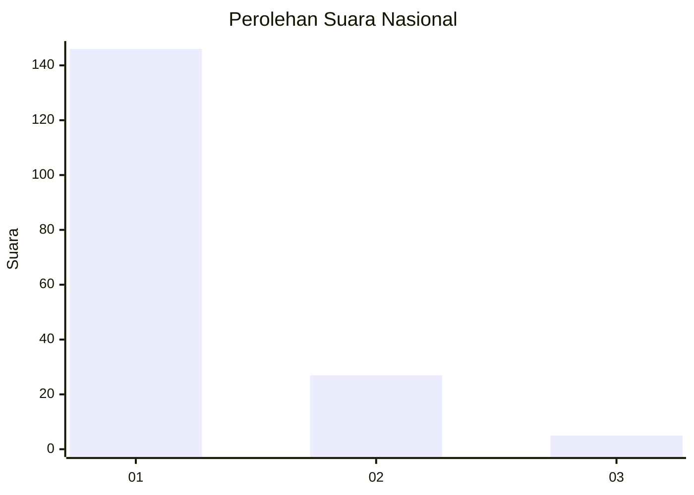
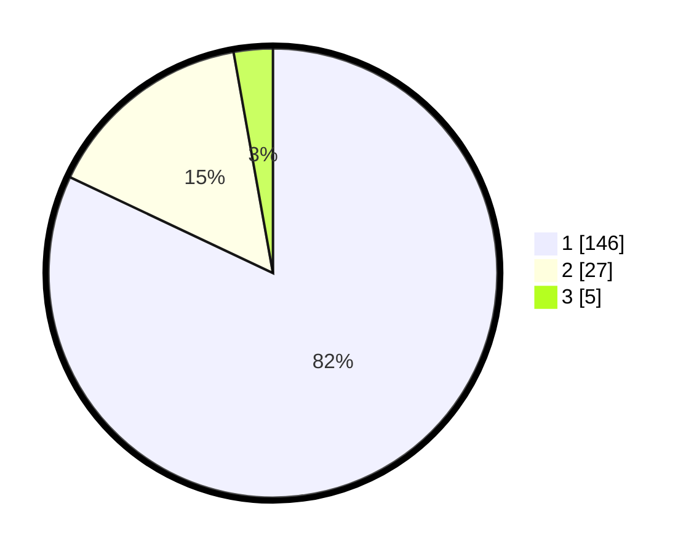

# Hasil

## Grafik

## Tabel

| No. | Nama Paslon    | Suara | Suara (raw) | Persentase |
|:--- |:-------------- | -----:| -----------:| ----------:|
| 1   | ANIES MUHAIMIN | 146   | [146][p-1]  | 82,02      |
| 2   | PRABOWO GIBRAN | 27    | [27][p-2]   | 15,17      |
| 3   | GANJAR MAHFUD  | 5     | [5][p-3]    | 2,81       |

[p-1]: https://github.com/gigit-pemilu/pemilu-2024/blob/main/pilpres/hitung-suara/sub/11-aceh/sub/14-aceh-jaya/sub/06-panga/sub/2018-tuwi-eumpeuk/sub/001-tps/sub/paslon-1.txt
[p-2]: https://github.com/gigit-pemilu/pemilu-2024/blob/main/pilpres/hitung-suara/sub/11-aceh/sub/14-aceh-jaya/sub/06-panga/sub/2018-tuwi-eumpeuk/sub/001-tps/sub/paslon-2.txt
[p-3]: https://github.com/gigit-pemilu/pemilu-2024/blob/main/pilpres/hitung-suara/sub/11-aceh/sub/14-aceh-jaya/sub/06-panga/sub/2018-tuwi-eumpeuk/sub/001-tps/sub/paslon-3.txt

## Foto C Plano

https://sirekap-obj-formc.kpu.go.id/126c/pemilu/ppwp/11/14/06/20/18/1114062018001-20240215-042745--038c14c3-c6b3-42e3-940b-52d98eaa6145.jpg

https://sirekap-obj-formc.kpu.go.id/126c/pemilu/ppwp/11/14/06/20/18/1114062018001-20240215-043434--d24618e6-92b1-403b-960c-2d6347c2f749.jpg

https://sirekap-obj-formc.kpu.go.id/126c/pemilu/ppwp/11/14/06/20/18/1114062018001-20240215-051719--5f986e00-3552-48a2-92aa-5add8a1a622d.jpg

## Metadata

| Key        | Value               |
| ---------- | ------------------- |
| Time Stamp | 2024-02-15 21:01:18 |

