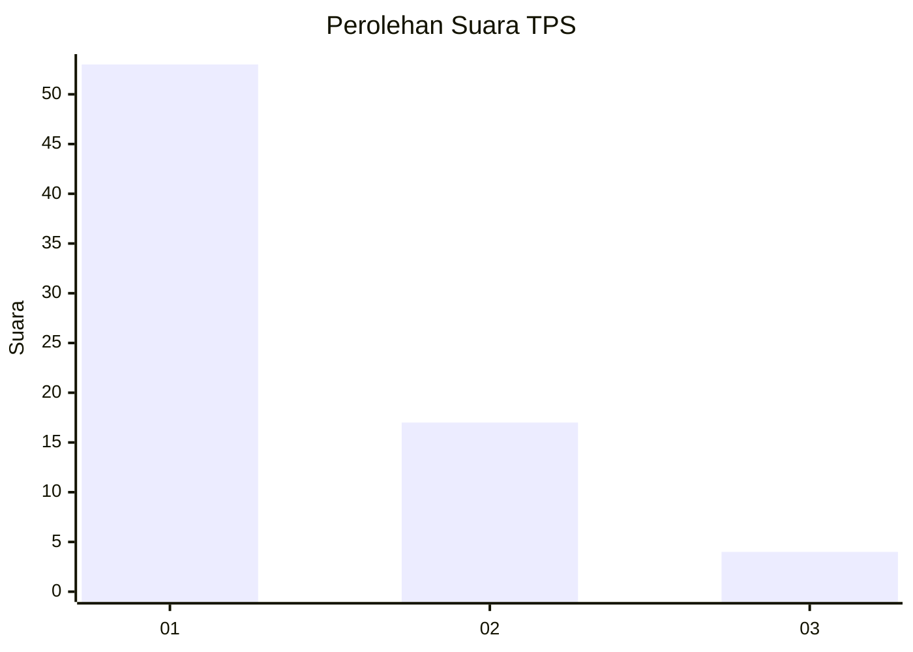
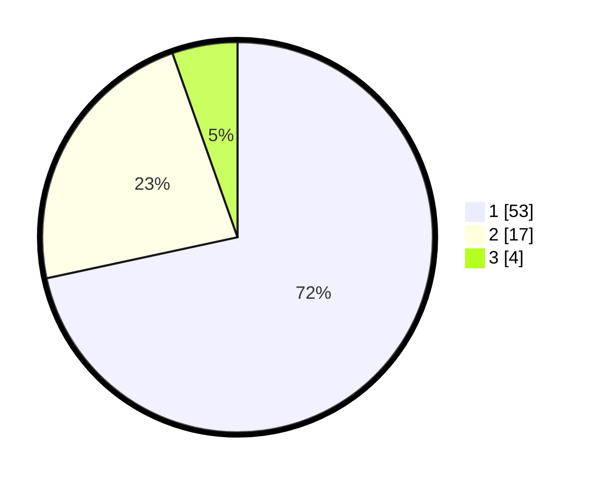

# Hasil

## Grafik

## Tabel

| No. | Nama Paslon    | Suara | Suara (raw) | Persentase |
|:--- |:-------------- | -----:| -----------:| ----------:|
| 1   | ANIES MUHAIMIN | 53    | [53][p-1]   | 71,62      |
| 2   | PRABOWO GIBRAN | 17    | [17][p-2]   | 22,97      |
| 3   | GANJAR MAHFUD  | 4     | [4][p-3]    | 5,41       |

[p-1]: https://github.com/gigit-pemilu/pemilu-2024-11-aceh/blob/main/pilpres/hitung-suara/sub/11-aceh/sub/14-aceh-jaya/sub/06-panga/sub/2019-panton-kabu/sub/001-tps/sub/paslon-1.txt
[p-2]: https://github.com/gigit-pemilu/pemilu-2024-11-aceh/blob/main/pilpres/hitung-suara/sub/11-aceh/sub/14-aceh-jaya/sub/06-panga/sub/2019-panton-kabu/sub/001-tps/sub/paslon-2.txt
[p-3]: https://github.com/gigit-pemilu/pemilu-2024-11-aceh/blob/main/pilpres/hitung-suara/sub/11-aceh/sub/14-aceh-jaya/sub/06-panga/sub/2019-panton-kabu/sub/001-tps/sub/paslon-3.txt

## Foto C Plano

https://sirekap-obj-formc.kpu.go.id/0a12/pemilu/ppwp/11/14/06/20/19/1114062019001-20240215-202800--5d3d3a13-0472-49ce-9c72-bbaf7079efcb.jpg

https://sirekap-obj-formc.kpu.go.id/0a12/pemilu/ppwp/11/14/06/20/19/1114062019001-20240215-202818--829bbbd3-fdbb-48f7-8eba-8af934b1b511.jpg

https://sirekap-obj-formc.kpu.go.id/0a12/pemilu/ppwp/11/14/06/20/19/1114062019001-20240215-203809--4fbb2580-0dab-4b4a-aabe-4927aa57c160.jpg

## Metadata

| Key        | Value               |
| ---------- | ------------------- |
| Time Stamp | 2024-02-28 21:00:00 |

## DATA PEMILIH TETAP

Jumlah pemilih dalam DPT: **75**.
 * L: **36**.
 * P: **39**.

## DATA PENGGUNA HAK PILIH

Jumlah pengguna hak pilih dalam DPT: **73**.
 * L: **34**.
 * P: **39**.

Jumlah pengguna hak pilih dalam DPTb: **2**.
 * L: **1**.
 * P: **1**.

Jumlah pengguna hak pilih dalam DPK: **2**.
 * L: **1**.
 * P: **1**.

Jumlah pengguna hak pilih: **77**.
 * L: **36**.
 * P: **41**.

## JUMLAH SUARA SAH DAN TIDAK SAH

JUMLAH SELURUH SUARA SAH: **74**.

JUMLAH SUARA TIDAK SAH: **3**.

JUMLAH SELURUH SUARA SAH DAN SUARA TIDAK SAH: **77**.

