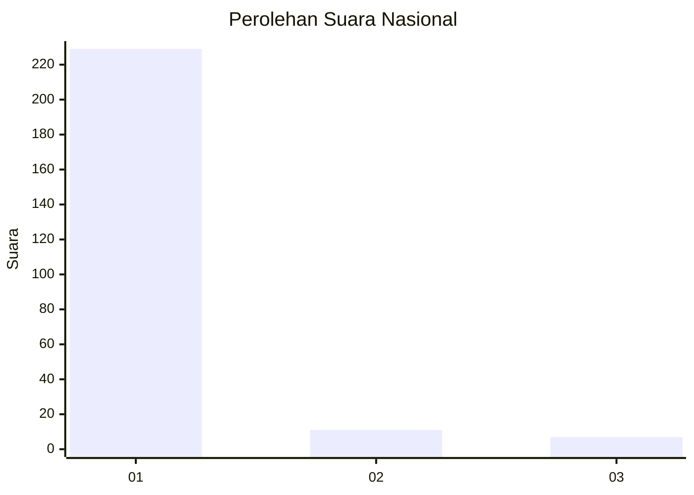
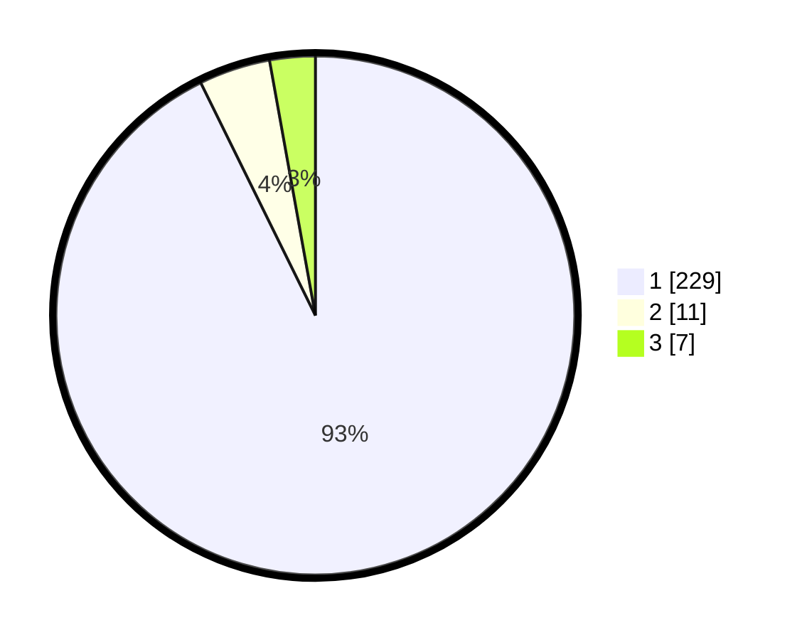

# Hasil

## Grafik

## Tabel

| No. | Nama Paslon    | Suara | Suara (raw) | Persentase |
|:--- |:-------------- | -----:| -----------:| ----------:|
| 1   | ANIES MUHAIMIN | 229   | [229][p-1]  | 92,71      |
| 2   | PRABOWO GIBRAN | 11    | [11][p-2]   | 4,45       |
| 3   | GANJAR MAHFUD  | 7     | [7][p-3]    | 2,83       |

[p-1]: https://github.com/gigit-pemilu/pemilu-2024/blob/main/pilpres/hitung-suara/sub/11-aceh/sub/14-aceh-jaya/sub/07-indra-jaya/sub/2001-ujong-muloh/sub/001-tps/sub/paslon-1.txt
[p-2]: https://github.com/gigit-pemilu/pemilu-2024/blob/main/pilpres/hitung-suara/sub/11-aceh/sub/14-aceh-jaya/sub/07-indra-jaya/sub/2001-ujong-muloh/sub/001-tps/sub/paslon-2.txt
[p-3]: https://github.com/gigit-pemilu/pemilu-2024/blob/main/pilpres/hitung-suara/sub/11-aceh/sub/14-aceh-jaya/sub/07-indra-jaya/sub/2001-ujong-muloh/sub/001-tps/sub/paslon-3.txt

## Foto C Plano

https://sirekap-obj-formc.kpu.go.id/c763/pemilu/ppwp/11/14/07/20/01/1114072001001-20240215-010129--7a0663ce-7bb8-4e8b-b545-615c81a8bec4.jpg

https://sirekap-obj-formc.kpu.go.id/c763/pemilu/ppwp/11/14/07/20/01/1114072001001-20240215-010313--0a109fe1-1bf0-4388-8a47-8bea231a3b5a.jpg

https://sirekap-obj-formc.kpu.go.id/c763/pemilu/ppwp/11/14/07/20/01/1114072001001-20240215-010913--3403cd8a-6d8f-42fa-8227-6c41a8f39619.jpg

## Metadata

| Key        | Value               |
| ---------- | ------------------- |
| Time Stamp | 2024-02-15 15:00:29 |

