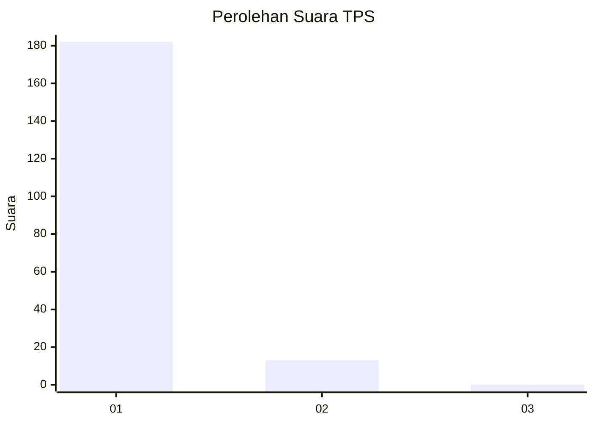
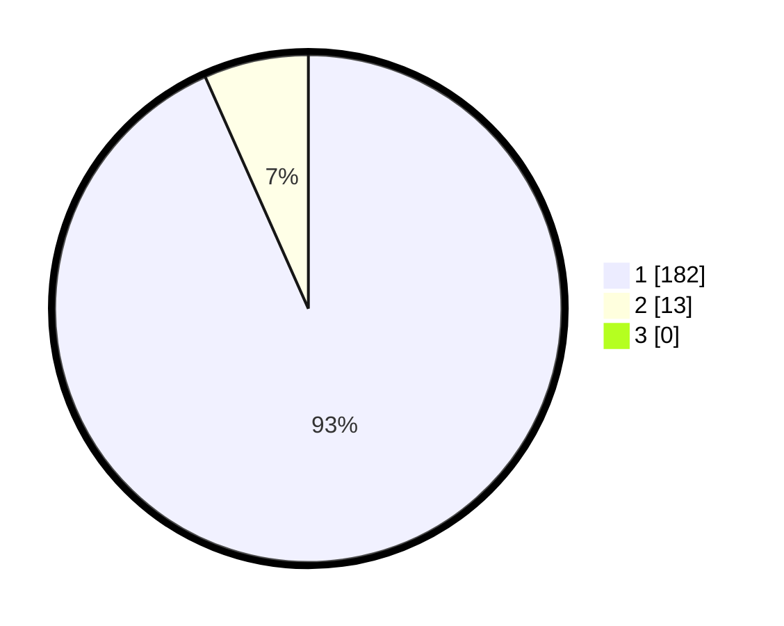

# Hasil

## Grafik

## Tabel

| No. | Nama Paslon    | Suara | Suara (raw) | Persentase |
|:--- |:-------------- | -----:| -----------:| ----------:|
| 1   | ANIES MUHAIMIN | 182   | [182][p-1]  | 93,33      |
| 2   | PRABOWO GIBRAN | 13    | [13][p-2]   | 6,67       |
| 3   | GANJAR MAHFUD  | 0     | [0][p-3]    | 0,00       |

[p-1]: https://github.com/gigit-pemilu/pemilu-2024-11-aceh/blob/main/pilpres/hitung-suara/sub/11-aceh/sub/14-aceh-jaya/sub/07-indra-jaya/sub/2001-ujong-muloh/sub/002-tps/sub/paslon-1.txt
[p-2]: https://github.com/gigit-pemilu/pemilu-2024-11-aceh/blob/main/pilpres/hitung-suara/sub/11-aceh/sub/14-aceh-jaya/sub/07-indra-jaya/sub/2001-ujong-muloh/sub/002-tps/sub/paslon-2.txt
[p-3]: https://github.com/gigit-pemilu/pemilu-2024-11-aceh/blob/main/pilpres/hitung-suara/sub/11-aceh/sub/14-aceh-jaya/sub/07-indra-jaya/sub/2001-ujong-muloh/sub/002-tps/sub/paslon-3.txt

## Foto C Plano

https://sirekap-obj-formc.kpu.go.id/8158/pemilu/ppwp/11/14/07/20/01/1114072001002-20240215-145650--4545484f-e427-4702-962f-85f8f0cf81d3.jpg

https://sirekap-obj-formc.kpu.go.id/8158/pemilu/ppwp/11/14/07/20/01/1114072001002-20240215-145924--460d5fd2-fe8b-486b-8198-ec50d65d7bbe.jpg

https://sirekap-obj-formc.kpu.go.id/8158/pemilu/ppwp/11/14/07/20/01/1114072001002-20240215-150139--ea630980-7d5e-43ac-93a8-745b3bdc9e0a.jpg

## Metadata

| Key        | Value               |
| ---------- | ------------------- |
| Time Stamp | 2024-02-15 16:30:25 |

