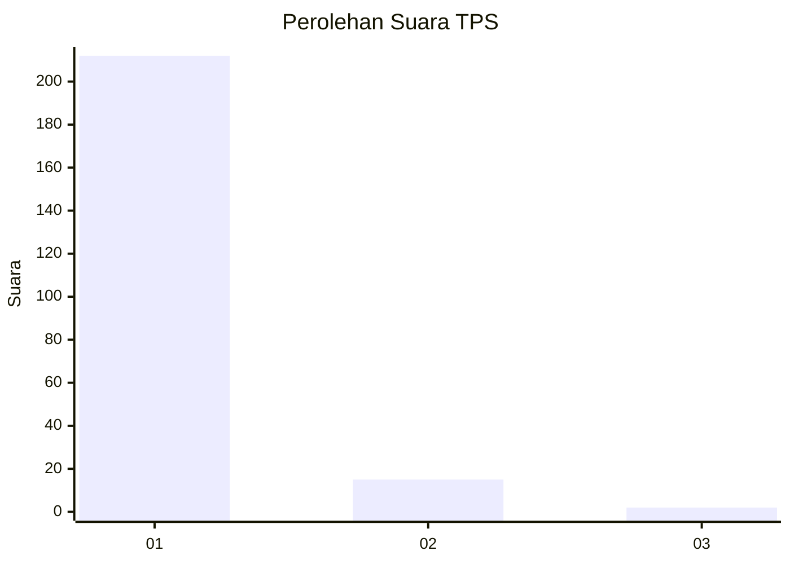
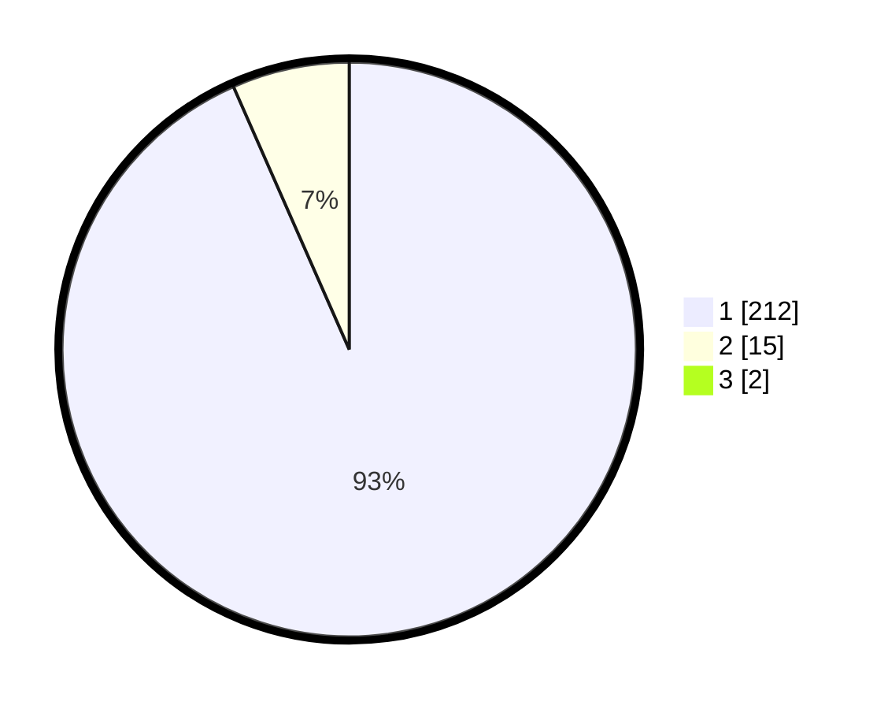

# Hasil

## Grafik

## Tabel

| No. | Nama Paslon    | Suara | Suara (raw) | Persentase |
|:--- |:-------------- | -----:| -----------:| ----------:|
| 1   | ANIES MUHAIMIN | 212   | [212][p-1]  | 92,58      |
| 2   | PRABOWO GIBRAN | 15    | [15][p-2]   | 6,55       |
| 3   | GANJAR MAHFUD  | 2     | [2][p-3]    | 0,87       |

[p-1]: https://github.com/gigit-pemilu/pemilu-2024-11-aceh/blob/main/pilpres/hitung-suara/sub/11-aceh/sub/14-aceh-jaya/sub/07-indra-jaya/sub/2003-meunasah-rayeuk/sub/001-tps/sub/paslon-1.txt
[p-2]: https://github.com/gigit-pemilu/pemilu-2024-11-aceh/blob/main/pilpres/hitung-suara/sub/11-aceh/sub/14-aceh-jaya/sub/07-indra-jaya/sub/2003-meunasah-rayeuk/sub/001-tps/sub/paslon-2.txt
[p-3]: https://github.com/gigit-pemilu/pemilu-2024-11-aceh/blob/main/pilpres/hitung-suara/sub/11-aceh/sub/14-aceh-jaya/sub/07-indra-jaya/sub/2003-meunasah-rayeuk/sub/001-tps/sub/paslon-3.txt

## Foto C Plano

https://sirekap-obj-formc.kpu.go.id/109a/pemilu/ppwp/11/14/07/20/03/1114072003001-20240216-182234--15ca1696-0c8f-4309-8ae4-6be968ff4ea9.jpg

https://sirekap-obj-formc.kpu.go.id/109a/pemilu/ppwp/11/14/07/20/03/1114072003001-20240217-112909--d42e2ae2-b7ce-46b0-811e-2cd6e3b677e4.jpg

https://sirekap-obj-formc.kpu.go.id/109a/pemilu/ppwp/11/14/07/20/03/1114072003001-20240217-113158--bb125edc-8415-49c0-b2f6-9038a65373a6.jpg

## Metadata

| Key        | Value               |
| ---------- | ------------------- |
| Time Stamp | 2024-02-17 13:37:34 |

