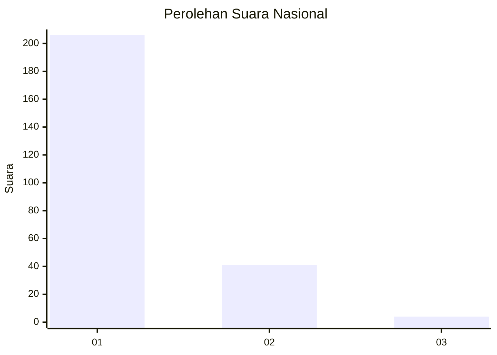
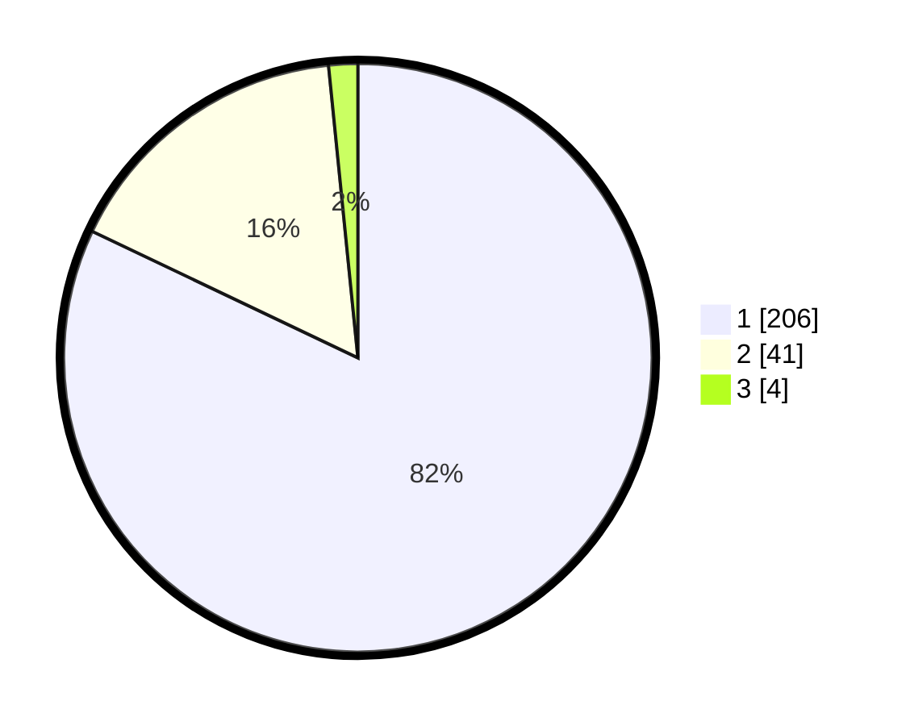

# Hasil

## Grafik

## Tabel

| No. | Nama Paslon    | Suara | Suara (raw) | Persentase |
|:--- |:-------------- | -----:| -----------:| ----------:|
| 1   | ANIES MUHAIMIN | 206   | [206][p-1]  | 82,07      |
| 2   | PRABOWO GIBRAN | 41    | [41][p-2]   | 16,33      |
| 3   | GANJAR MAHFUD  | 4     | [4][p-3]    | 1,59       |

[p-1]: https://github.com/gigit-pemilu/pemilu-2024/blob/main/pilpres/hitung-suara/sub/11-aceh/sub/14-aceh-jaya/sub/07-indra-jaya/sub/2007-babah-dua/sub/002-tps/sub/paslon-1.txt
[p-2]: https://github.com/gigit-pemilu/pemilu-2024/blob/main/pilpres/hitung-suara/sub/11-aceh/sub/14-aceh-jaya/sub/07-indra-jaya/sub/2007-babah-dua/sub/002-tps/sub/paslon-2.txt
[p-3]: https://github.com/gigit-pemilu/pemilu-2024/blob/main/pilpres/hitung-suara/sub/11-aceh/sub/14-aceh-jaya/sub/07-indra-jaya/sub/2007-babah-dua/sub/002-tps/sub/paslon-3.txt

## Foto C Plano

https://sirekap-obj-formc.kpu.go.id/5d5b/pemilu/ppwp/11/14/07/20/07/1114072007002-20240215-004902--0a519052-9bf8-4845-bb19-0575a873d1ac.jpg

https://sirekap-obj-formc.kpu.go.id/5d5b/pemilu/ppwp/11/14/07/20/07/1114072007002-20240215-004949--879fefbc-7d3e-4f89-8ed4-3f865e3b1190.jpg

https://sirekap-obj-formc.kpu.go.id/5d5b/pemilu/ppwp/11/14/07/20/07/1114072007002-20240215-005032--cda720cf-0b5b-48b4-b5f3-cacbf1ee8af7.jpg

## Metadata

| Key        | Value               |
| ---------- | ------------------- |
| Time Stamp | 2024-02-15 15:30:25 |

