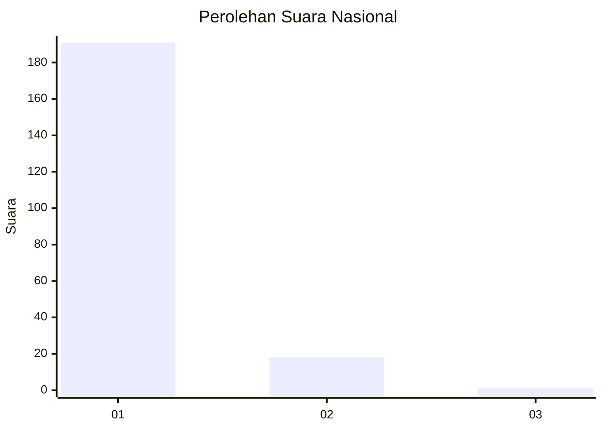
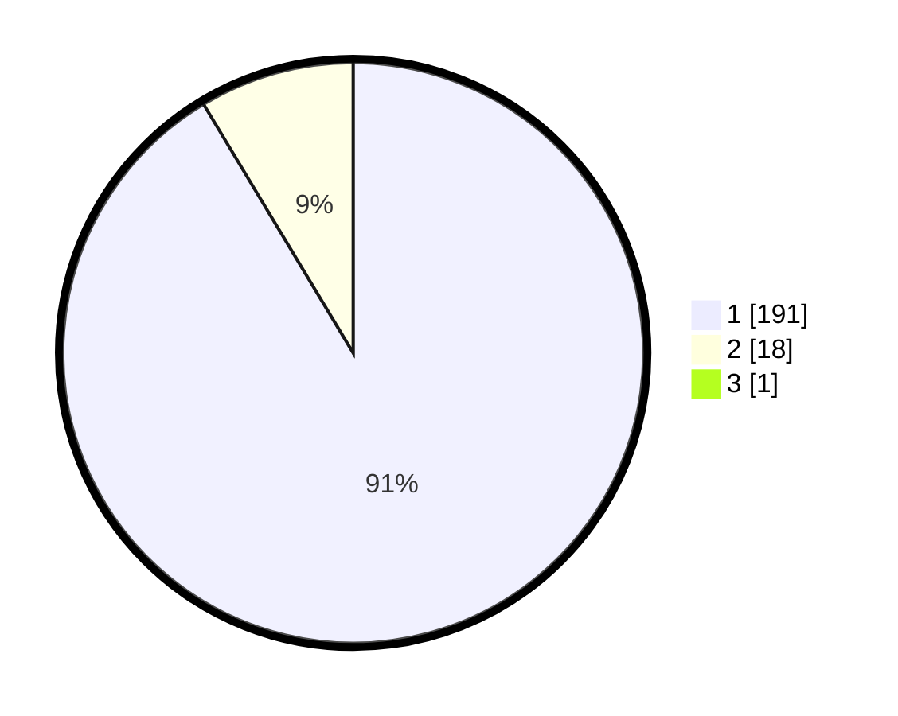

# Hasil

## Grafik

## Tabel

| No. | Nama Paslon    | Suara | Suara (raw) | Persentase |
|:--- |:-------------- | -----:| -----------:| ----------:|
| 1   | ANIES MUHAIMIN | 191   | [191][p-1]  | 90,95      |
| 2   | PRABOWO GIBRAN | 18    | [18][p-2]   | 8,57       |
| 3   | GANJAR MAHFUD  | 1     | [1][p-3]    | 0,48       |

[p-1]: https://github.com/gigit-pemilu/pemilu-2024/blob/main/pilpres/hitung-suara/sub/11-aceh/sub/14-aceh-jaya/sub/07-indra-jaya/sub/2009-teumareum/sub/002-tps/sub/paslon-1.txt
[p-2]: https://github.com/gigit-pemilu/pemilu-2024/blob/main/pilpres/hitung-suara/sub/11-aceh/sub/14-aceh-jaya/sub/07-indra-jaya/sub/2009-teumareum/sub/002-tps/sub/paslon-2.txt
[p-3]: https://github.com/gigit-pemilu/pemilu-2024/blob/main/pilpres/hitung-suara/sub/11-aceh/sub/14-aceh-jaya/sub/07-indra-jaya/sub/2009-teumareum/sub/002-tps/sub/paslon-3.txt

## Foto C Plano

https://sirekap-obj-formc.kpu.go.id/1997/pemilu/ppwp/11/14/07/20/09/1114072009002-20240215-162637--c5d619a4-88a4-43a9-86b0-de2f7a6af920.jpg

https://sirekap-obj-formc.kpu.go.id/1997/pemilu/ppwp/11/14/07/20/09/1114072009002-20240215-163350--f7a1bde6-7599-46b4-b9a4-817f70c11da0.jpg

https://sirekap-obj-formc.kpu.go.id/1997/pemilu/ppwp/11/14/07/20/09/1114072009002-20240215-013620--6ac35f2a-f7f2-4123-8b68-4ef33d0f5f7c.jpg

## Metadata

| Key        | Value               |
| ---------- | ------------------- |
| Time Stamp | 2024-02-15 21:30:27 |

