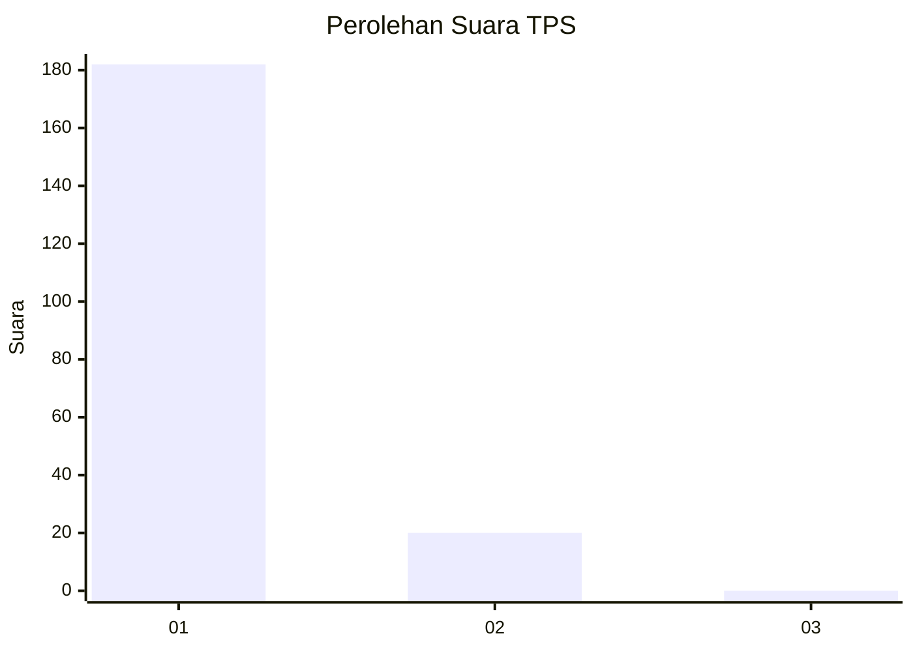
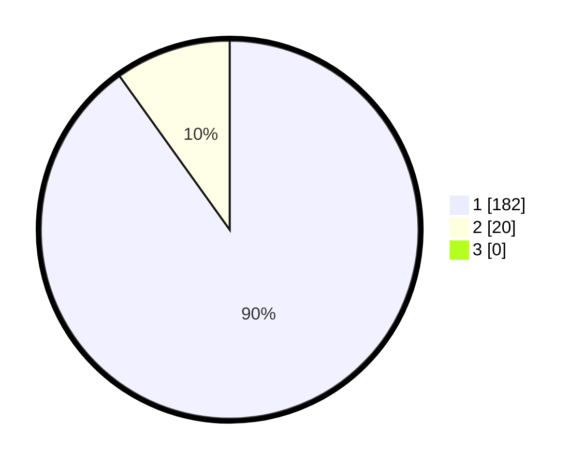

# Hasil

## Grafik

## Tabel

| No. | Nama Paslon    | Suara | Suara (raw) | Persentase |
|:--- |:-------------- | -----:| -----------:| ----------:|
| 1   | ANIES MUHAIMIN | 182   | [182][p-1]  | 90,10      |
| 2   | PRABOWO GIBRAN | 20    | [20][p-2]   | 9,90       |
| 3   | GANJAR MAHFUD  | 0     | [0][p-3]    | 0,00       |

[p-1]: https://github.com/gigit-pemilu/pemilu-2024-11-aceh/blob/main/pilpres/hitung-suara/sub/11-aceh/sub/14-aceh-jaya/sub/07-indra-jaya/sub/2012-kareung-ateuh/sub/001-tps/sub/paslon-1.txt
[p-2]: https://github.com/gigit-pemilu/pemilu-2024-11-aceh/blob/main/pilpres/hitung-suara/sub/11-aceh/sub/14-aceh-jaya/sub/07-indra-jaya/sub/2012-kareung-ateuh/sub/001-tps/sub/paslon-2.txt
[p-3]: https://github.com/gigit-pemilu/pemilu-2024-11-aceh/blob/main/pilpres/hitung-suara/sub/11-aceh/sub/14-aceh-jaya/sub/07-indra-jaya/sub/2012-kareung-ateuh/sub/001-tps/sub/paslon-3.txt

## Foto C Plano

https://sirekap-obj-formc.kpu.go.id/94b1/pemilu/ppwp/11/14/07/20/12/1114072012001-20240215-151930--038f22a7-6d41-45da-b337-2adefd5c95bf.jpg

https://sirekap-obj-formc.kpu.go.id/94b1/pemilu/ppwp/11/14/07/20/12/1114072012001-20240215-114415--9ce7c4bb-e88e-47f6-9f77-79aca55c89b0.jpg

https://sirekap-obj-formc.kpu.go.id/94b1/pemilu/ppwp/11/14/07/20/12/1114072012001-20240215-161719--9699e3dc-566d-4e94-ab51-43bb7a2f39cb.jpg

## Metadata

| Key        | Value               |
| ---------- | ------------------- |
| Time Stamp | 2024-02-16 11:00:29 |

