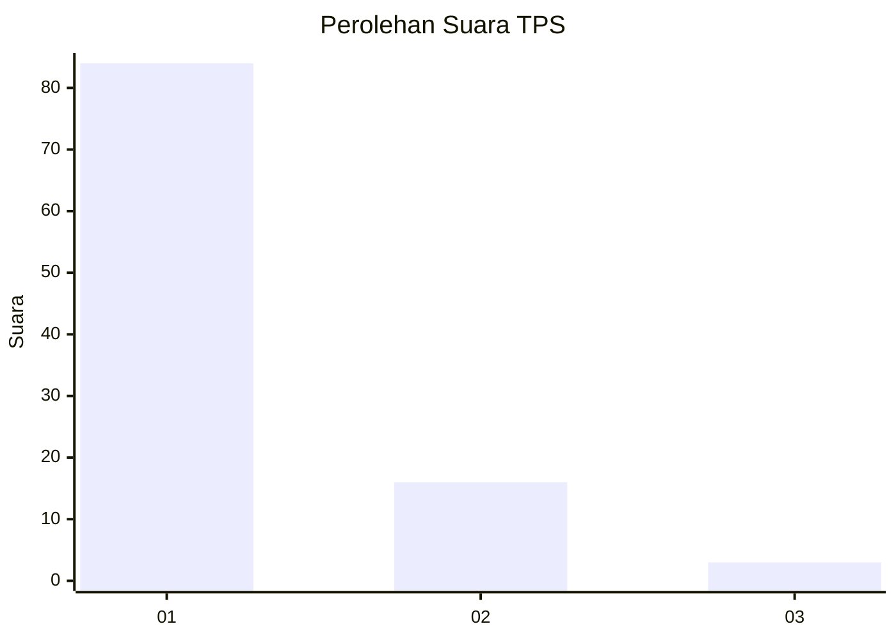
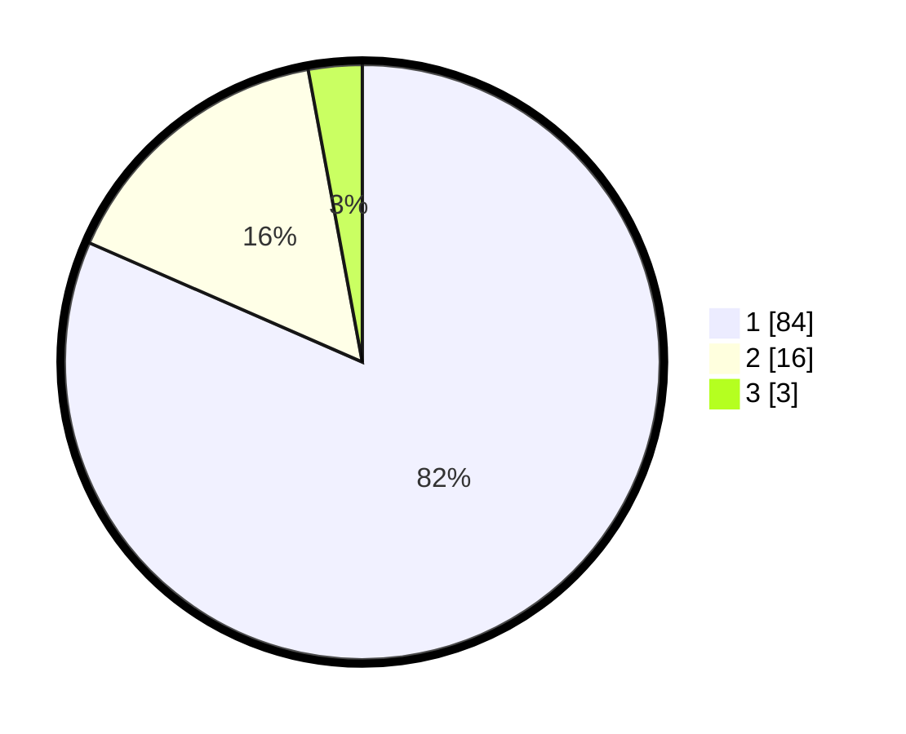

# Hasil

## Grafik

## Tabel

| No. | Nama Paslon    | Suara | Suara (raw) | Persentase |
|:--- |:-------------- | -----:| -----------:| ----------:|
| 1   | ANIES MUHAIMIN | 84    | [84][p-1]   | 81,55      |
| 2   | PRABOWO GIBRAN | 16    | [16][p-2]   | 15,53      |
| 3   | GANJAR MAHFUD  | 3     | [3][p-3]    | 2,91       |

[p-1]: https://github.com/gigit-pemilu/pemilu-2024-11-aceh/blob/main/pilpres/hitung-suara/sub/11-aceh/sub/14-aceh-jaya/sub/07-indra-jaya/sub/2012-kareung-ateuh/sub/002-tps/sub/paslon-1.txt
[p-2]: https://github.com/gigit-pemilu/pemilu-2024-11-aceh/blob/main/pilpres/hitung-suara/sub/11-aceh/sub/14-aceh-jaya/sub/07-indra-jaya/sub/2012-kareung-ateuh/sub/002-tps/sub/paslon-2.txt
[p-3]: https://github.com/gigit-pemilu/pemilu-2024-11-aceh/blob/main/pilpres/hitung-suara/sub/11-aceh/sub/14-aceh-jaya/sub/07-indra-jaya/sub/2012-kareung-ateuh/sub/002-tps/sub/paslon-3.txt

## Foto C Plano

https://sirekap-obj-formc.kpu.go.id/361c/pemilu/ppwp/11/14/07/20/12/1114072012002-20240215-112915--185d2116-e45f-460c-8cff-2f5d2a44db06.jpg

https://sirekap-obj-formc.kpu.go.id/361c/pemilu/ppwp/11/14/07/20/12/1114072012002-20240215-113300--cbdd34d5-562d-4827-b176-9a6230c3d890.jpg

https://sirekap-obj-formc.kpu.go.id/361c/pemilu/ppwp/11/14/07/20/12/1114072012002-20240215-113654--148f481a-0bc9-487d-8e6e-1c4c79968967.jpg

## Metadata

| Key        | Value               |
| ---------- | ------------------- |
| Time Stamp | 2024-02-16 16:25:10 |

## DATA PEMILIH TETAP

Jumlah pemilih dalam DPT: **104**.
 * L: **56**.
 * P: **48**.

## DATA PENGGUNA HAK PILIH

Jumlah pengguna hak pilih dalam DPT: **97**.
 * L: **53**.
 * P: **44**.

Jumlah pengguna hak pilih dalam DPTb: **0**.
 * L: **0**.
 * P: **0**.

Jumlah pengguna hak pilih dalam DPK: **7**.
 * L: **2**.
 * P: **5**.

Jumlah pengguna hak pilih: **104**.
 * L: **55**.
 * P: **49**.

## JUMLAH SUARA SAH DAN TIDAK SAH

JUMLAH SELURUH SUARA SAH: **103**.

JUMLAH SUARA TIDAK SAH: **1**.

JUMLAH SELURUH SUARA SAH DAN SUARA TIDAK SAH: **104**.

