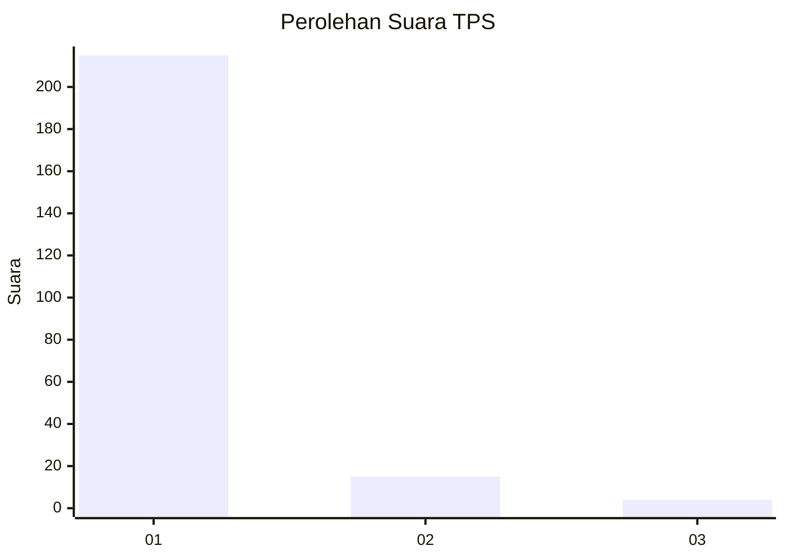
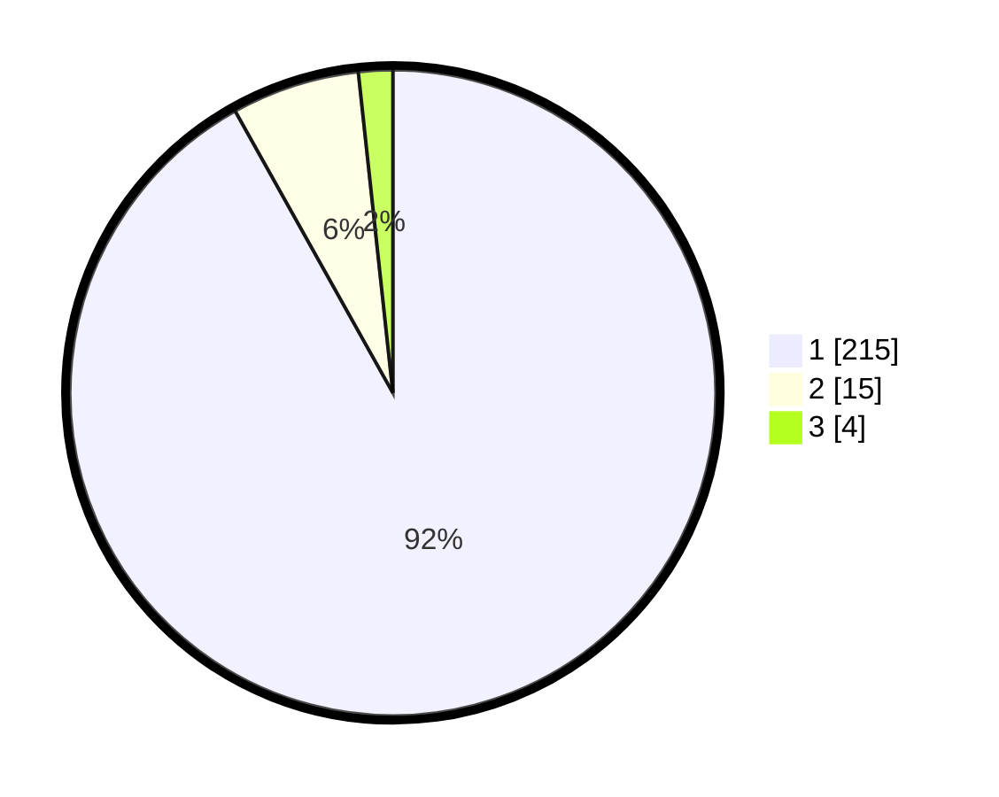

# Hasil

## Grafik

## Tabel

| No. | Nama Paslon    | Suara | Suara (raw) | Persentase |
|:--- |:-------------- | -----:| -----------:| ----------:|
| 1   | ANIES MUHAIMIN | 215   | [215][p-1]  | 91,88      |
| 2   | PRABOWO GIBRAN | 15    | [15][p-2]   | 6,41       |
| 3   | GANJAR MAHFUD  | 4     | [4][p-3]    | 1,71       |

[p-1]: https://github.com/gigit-pemilu/pemilu-2024-11-aceh/blob/main/pilpres/hitung-suara/sub/11-aceh/sub/14-aceh-jaya/sub/08-darul-hikmah/sub/2001-patek/sub/002-tps/sub/paslon-1.txt
[p-2]: https://github.com/gigit-pemilu/pemilu-2024-11-aceh/blob/main/pilpres/hitung-suara/sub/11-aceh/sub/14-aceh-jaya/sub/08-darul-hikmah/sub/2001-patek/sub/002-tps/sub/paslon-2.txt
[p-3]: https://github.com/gigit-pemilu/pemilu-2024-11-aceh/blob/main/pilpres/hitung-suara/sub/11-aceh/sub/14-aceh-jaya/sub/08-darul-hikmah/sub/2001-patek/sub/002-tps/sub/paslon-3.txt

## Foto C Plano

https://sirekap-obj-formc.kpu.go.id/cd31/pemilu/ppwp/11/14/08/20/01/1114082001002-20240217-114913--3d10f8c8-5b63-41e4-8279-2c1a941f02f9.jpg

https://sirekap-obj-formc.kpu.go.id/cd31/pemilu/ppwp/11/14/08/20/01/1114082001002-20240217-115025--a93e4a13-04f7-4912-bc7c-65ccd3cd64ca.jpg

## Metadata

| Key        | Value               |
| ---------- | ------------------- |
| Time Stamp | 2024-02-17 12:00:00 |

