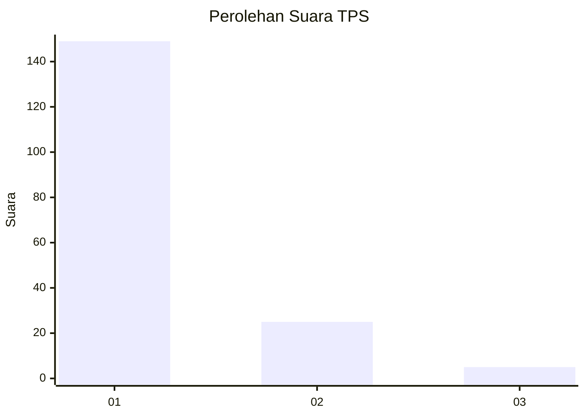
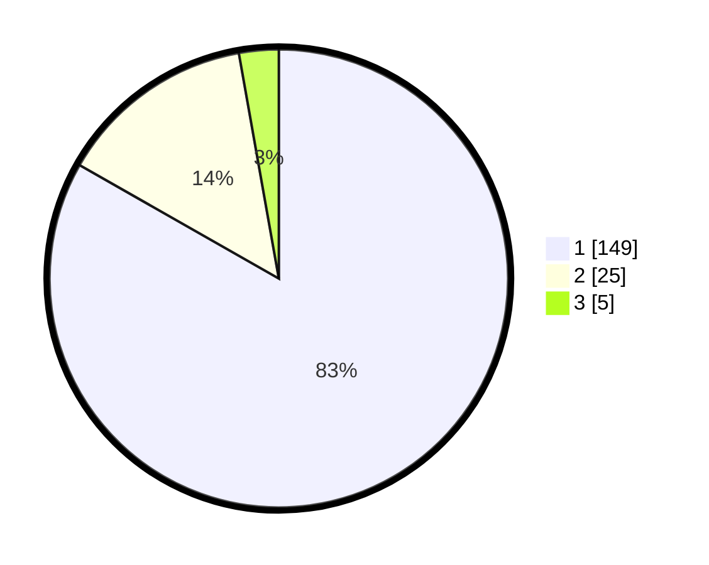

# Hasil

## Grafik

## Tabel

| No. | Nama Paslon    | Suara | Suara (raw) | Persentase |
|:--- |:-------------- | -----:| -----------:| ----------:|
| 1   | ANIES MUHAIMIN | 149   | [149][p-1]  | 83,24      |
| 2   | PRABOWO GIBRAN | 25    | [25][p-2]   | 13,97      |
| 3   | GANJAR MAHFUD  | 5     | [5][p-3]    | 2,79       |

[p-1]: https://github.com/gigit-pemilu/pemilu-2024-11-aceh/blob/main/pilpres/hitung-suara/sub/11-aceh/sub/14-aceh-jaya/sub/08-darul-hikmah/sub/2002-gampong-baro-patek/sub/001-tps/sub/paslon-1.txt
[p-2]: https://github.com/gigit-pemilu/pemilu-2024-11-aceh/blob/main/pilpres/hitung-suara/sub/11-aceh/sub/14-aceh-jaya/sub/08-darul-hikmah/sub/2002-gampong-baro-patek/sub/001-tps/sub/paslon-2.txt
[p-3]: https://github.com/gigit-pemilu/pemilu-2024-11-aceh/blob/main/pilpres/hitung-suara/sub/11-aceh/sub/14-aceh-jaya/sub/08-darul-hikmah/sub/2002-gampong-baro-patek/sub/001-tps/sub/paslon-3.txt

## Foto C Plano

https://sirekap-obj-formc.kpu.go.id/4434/pemilu/ppwp/11/14/08/20/02/1114082002001-20240217-115908--684dee68-7f1a-4c75-91b1-5454a7455ed9.jpg

https://sirekap-obj-formc.kpu.go.id/4434/pemilu/ppwp/11/14/08/20/02/1114082002001-20240217-115431--f67e7374-be18-4c45-8c5c-73cbfd867298.jpg

https://sirekap-obj-formc.kpu.go.id/4434/pemilu/ppwp/11/14/08/20/02/1114082002001-20240217-114652--4450475f-b120-46d7-825c-68708e656335.jpg

## Metadata

| Key        | Value               |
| ---------- | ------------------- |
| Time Stamp | 2024-02-17 13:37:34 |

## DATA PEMILIH TETAP

Jumlah pemilih dalam DPT: **893**.
 * L: **100**.
 * P: **93**.

## DATA PENGGUNA HAK PILIH

Jumlah pengguna hak pilih dalam DPT: **178**.
 * L: **93**.
 * P: **85**.

Jumlah pengguna hak pilih dalam DPTb: **2**.
 * L: **1**.
 * P: **1**.

Jumlah pengguna hak pilih dalam DPK: **2**.
 * L: **0**.
 * P: **2**.

Jumlah pengguna hak pilih: **182**.
 * L: **94**.
 * P: **88**.

## JUMLAH SUARA SAH DAN TIDAK SAH

JUMLAH SELURUH SUARA SAH: **179**.

JUMLAH SUARA TIDAK SAH: **3**.

JUMLAH SELURUH SUARA SAH DAN SUARA TIDAK SAH: **182**.

