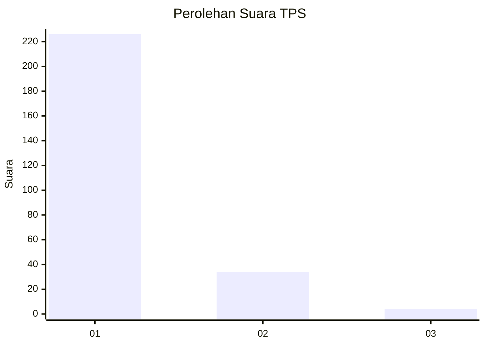
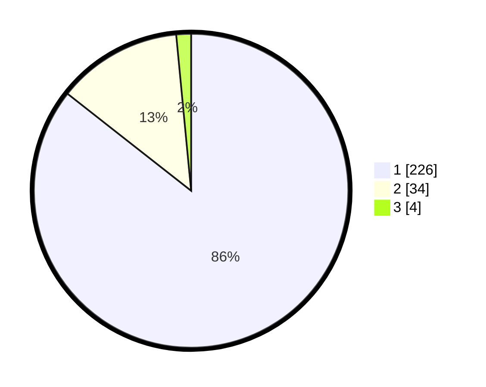

# Hasil

## Grafik

## Tabel

| No. | Nama Paslon    | Suara | Suara (raw) | Persentase |
|:--- |:-------------- | -----:| -----------:| ----------:|
| 1   | ANIES MUHAIMIN | 226   | [226][p-1]  | 85,61      |
| 2   | PRABOWO GIBRAN | 34    | [34][p-2]   | 12,88      |
| 3   | GANJAR MAHFUD  | 4     | [4][p-3]    | 1,52       |

[p-1]: https://github.com/gigit-pemilu/pemilu-2024-11-aceh/blob/main/pilpres/hitung-suara/sub/11-aceh/sub/14-aceh-jaya/sub/08-darul-hikmah/sub/2004-pajar/sub/002-tps/sub/paslon-1.txt
[p-2]: https://github.com/gigit-pemilu/pemilu-2024-11-aceh/blob/main/pilpres/hitung-suara/sub/11-aceh/sub/14-aceh-jaya/sub/08-darul-hikmah/sub/2004-pajar/sub/002-tps/sub/paslon-2.txt
[p-3]: https://github.com/gigit-pemilu/pemilu-2024-11-aceh/blob/main/pilpres/hitung-suara/sub/11-aceh/sub/14-aceh-jaya/sub/08-darul-hikmah/sub/2004-pajar/sub/002-tps/sub/paslon-3.txt

## Foto C Plano

https://sirekap-obj-formc.kpu.go.id/8e61/pemilu/ppwp/11/14/08/20/04/1114082004002-20240218-180126--0e121f82-66dd-4f44-bdd1-310c835e3f01.jpg

https://sirekap-obj-formc.kpu.go.id/8e61/pemilu/ppwp/11/14/08/20/04/1114082004002-20240218-180943--f2d59924-958b-4945-b4f9-5c5be71b85b1.jpg

https://sirekap-obj-formc.kpu.go.id/8e61/pemilu/ppwp/11/14/08/20/04/1114082004002-20240218-181247--df05313c-acdc-41a8-8c0c-6fb7d3aac639.jpg

## Metadata

| Key        | Value               |
| ---------- | ------------------- |
| Time Stamp | 2024-02-19 06:16:00 |

## DATA PEMILIH TETAP

Jumlah pemilih dalam DPT: **285**.
 * L: **148**.
 * P: **137**.

## DATA PENGGUNA HAK PILIH

Jumlah pengguna hak pilih dalam DPT: **255**.
 * L: **130**.
 * P: **125**.

Jumlah pengguna hak pilih dalam DPTb: **2**.
 * L: **1**.
 * P: **1**.

Jumlah pengguna hak pilih dalam DPK: **11**.
 * L: **7**.
 * P: **4**.

Jumlah pengguna hak pilih: **268**.
 * L: **138**.
 * P: **130**.

## JUMLAH SUARA SAH DAN TIDAK SAH

JUMLAH SELURUH SUARA SAH: **264**.

JUMLAH SUARA TIDAK SAH: **4**.

JUMLAH SELURUH SUARA SAH DAN SUARA TIDAK SAH: **268**.

