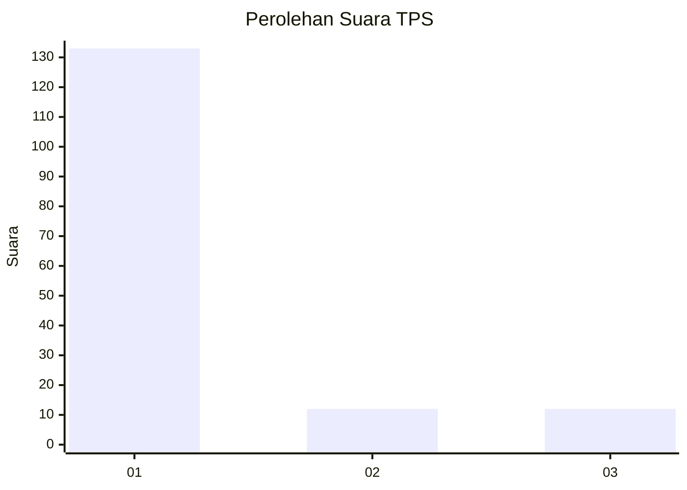
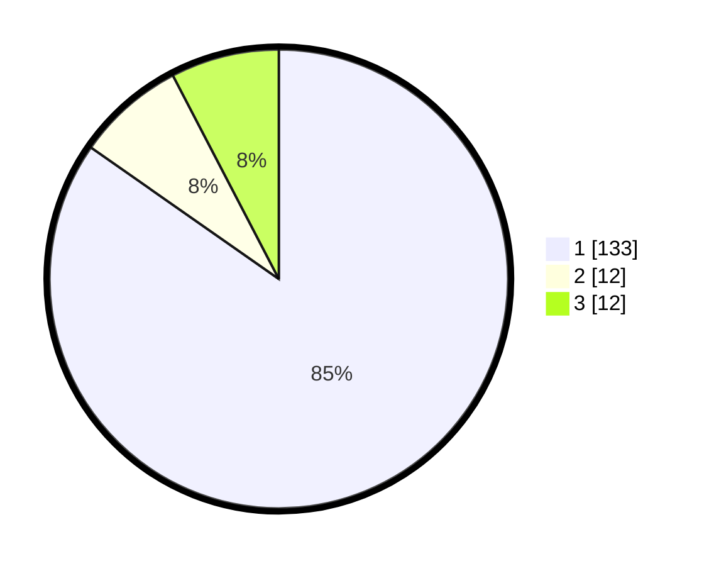

# Hasil

## Grafik

## Tabel

| No. | Nama Paslon    | Suara | Suara (raw) | Persentase |
|:--- |:-------------- | -----:| -----------:| ----------:|
| 1   | ANIES MUHAIMIN | 133   | [133][p-1]  | 84,71      |
| 2   | PRABOWO GIBRAN | 12    | [12][p-2]   | 7,64       |
| 3   | GANJAR MAHFUD  | 12    | [12][p-3]   | 7,64       |

[p-1]: https://github.com/gigit-pemilu/pemilu-2024-11-aceh/blob/main/pilpres/hitung-suara/sub/11-aceh/sub/14-aceh-jaya/sub/08-darul-hikmah/sub/2009-krueng-tho/sub/002-tps/sub/paslon-1.txt
[p-2]: https://github.com/gigit-pemilu/pemilu-2024-11-aceh/blob/main/pilpres/hitung-suara/sub/11-aceh/sub/14-aceh-jaya/sub/08-darul-hikmah/sub/2009-krueng-tho/sub/002-tps/sub/paslon-2.txt
[p-3]: https://github.com/gigit-pemilu/pemilu-2024-11-aceh/blob/main/pilpres/hitung-suara/sub/11-aceh/sub/14-aceh-jaya/sub/08-darul-hikmah/sub/2009-krueng-tho/sub/002-tps/sub/paslon-3.txt

## Foto C Plano

https://sirekap-obj-formc.kpu.go.id/aa0f/pemilu/ppwp/11/14/08/20/09/1114082009002-20240217-141508--4d821984-44b2-4679-85ee-51fddd115659.jpg

https://sirekap-obj-formc.kpu.go.id/aa0f/pemilu/ppwp/11/14/08/20/09/1114082009002-20240217-005627--49335505-06bf-4cb8-93a4-2dc9dbdb88fc.jpg

https://sirekap-obj-formc.kpu.go.id/aa0f/pemilu/ppwp/11/14/08/20/09/1114082009002-20240217-005639--adeb86de-4430-4396-8061-7bed2e3fa532.jpg

## Metadata

| Key        | Value               |
| ---------- | ------------------- |
| Time Stamp | 2024-02-17 14:45:18 |

## DATA PEMILIH TETAP

Jumlah pemilih dalam DPT: **154**.
 * L: **77**.
 * P: **77**.

## DATA PENGGUNA HAK PILIH

Jumlah pengguna hak pilih dalam DPT: **151**.
 * L: **75**.
 * P: **76**.

Jumlah pengguna hak pilih dalam DPTb: **4**.
 * L: **1**.
 * P: **3**.

Jumlah pengguna hak pilih dalam DPK: **2**.
 * L: **1**.
 * P: **1**.

Jumlah pengguna hak pilih: **157**.
 * L: **77**.
 * P: **70**.

## JUMLAH SUARA SAH DAN TIDAK SAH

JUMLAH SELURUH SUARA SAH: **123**.

JUMLAH SUARA TIDAK SAH: **0**.

JUMLAH SELURUH SUARA SAH DAN SUARA TIDAK SAH: **25**.

