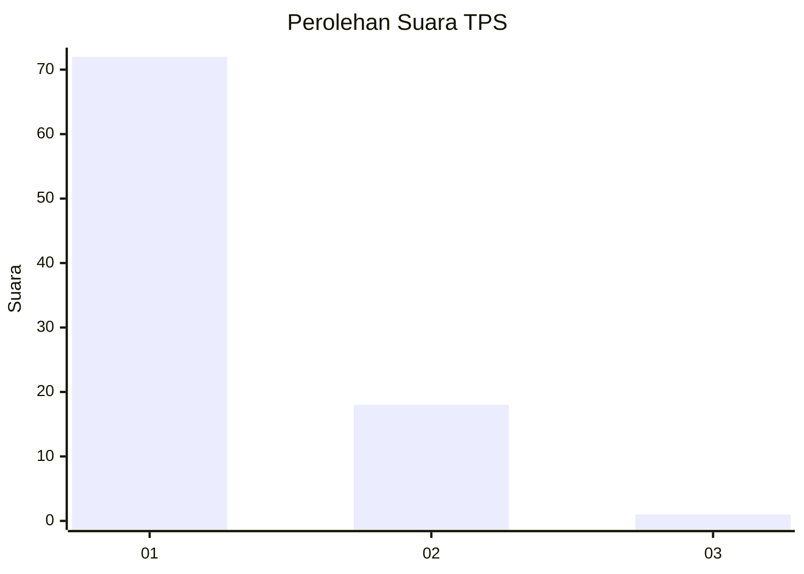
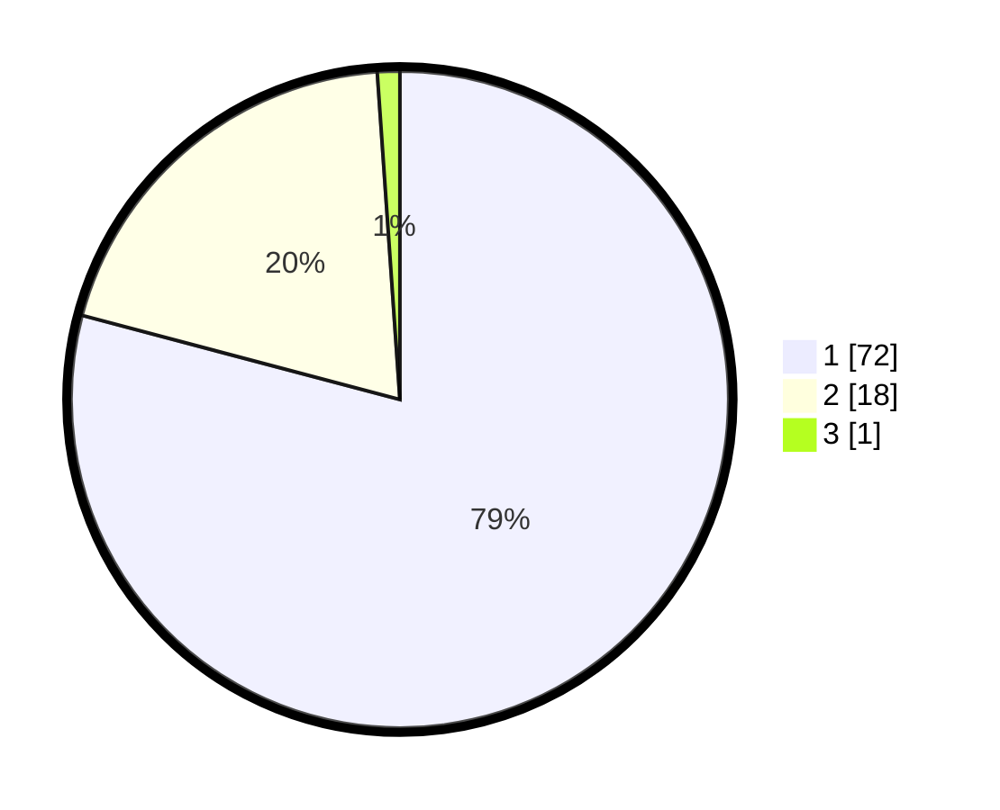

# Hasil

## Grafik

## Tabel

| No. | Nama Paslon    | Suara | Suara (raw) | Persentase |
|:--- |:-------------- | -----:| -----------:| ----------:|
| 1   | ANIES MUHAIMIN | 72    | [72][p-1]   | 79,12      |
| 2   | PRABOWO GIBRAN | 18    | [18][p-2]   | 19,78      |
| 3   | GANJAR MAHFUD  | 1     | [1][p-3]    | 1,10       |

[p-1]: https://github.com/gigit-pemilu/pemilu-2024-11-aceh/blob/main/pilpres/hitung-suara/sub/11-aceh/sub/14-aceh-jaya/sub/08-darul-hikmah/sub/2010-panton-krueng/sub/001-tps/sub/paslon-1.txt
[p-2]: https://github.com/gigit-pemilu/pemilu-2024-11-aceh/blob/main/pilpres/hitung-suara/sub/11-aceh/sub/14-aceh-jaya/sub/08-darul-hikmah/sub/2010-panton-krueng/sub/001-tps/sub/paslon-2.txt
[p-3]: https://github.com/gigit-pemilu/pemilu-2024-11-aceh/blob/main/pilpres/hitung-suara/sub/11-aceh/sub/14-aceh-jaya/sub/08-darul-hikmah/sub/2010-panton-krueng/sub/001-tps/sub/paslon-3.txt

## Foto C Plano

https://sirekap-obj-formc.kpu.go.id/bd03/pemilu/ppwp/11/14/08/20/10/1114082010001-20240217-161515--309fd5d3-9f51-4089-b79b-566d99fd729d.jpg

https://sirekap-obj-formc.kpu.go.id/bd03/pemilu/ppwp/11/14/08/20/10/1114082010001-20240217-175409--a723fa21-f102-47c2-88bc-f745c4ab0f74.jpg

https://sirekap-obj-formc.kpu.go.id/bd03/pemilu/ppwp/11/14/08/20/10/1114082010001-20240217-175550--7f0c93a9-e67f-462f-b722-640d8c368265.jpg

## Metadata

| Key        | Value               |
| ---------- | ------------------- |
| Time Stamp | 2024-02-17 18:00:00 |

## DATA PEMILIH TETAP

Jumlah pemilih dalam DPT: **93**.
 * L: **47**.
 * P: **46**.

## DATA PENGGUNA HAK PILIH

Jumlah pengguna hak pilih dalam DPT: **88**.
 * L: **44**.
 * P: **44**.

Jumlah pengguna hak pilih dalam DPTb: **4**.
 * L: **3**.
 * P: **1**.

Jumlah pengguna hak pilih dalam DPK: **0**.
 * L: **0**.
 * P: **0**.

Jumlah pengguna hak pilih: **92**.
 * L: **47**.
 * P: **45**.

## JUMLAH SUARA SAH DAN TIDAK SAH

JUMLAH SELURUH SUARA SAH: **91**.

JUMLAH SUARA TIDAK SAH: **1**.

JUMLAH SELURUH SUARA SAH DAN SUARA TIDAK SAH: **92**.

