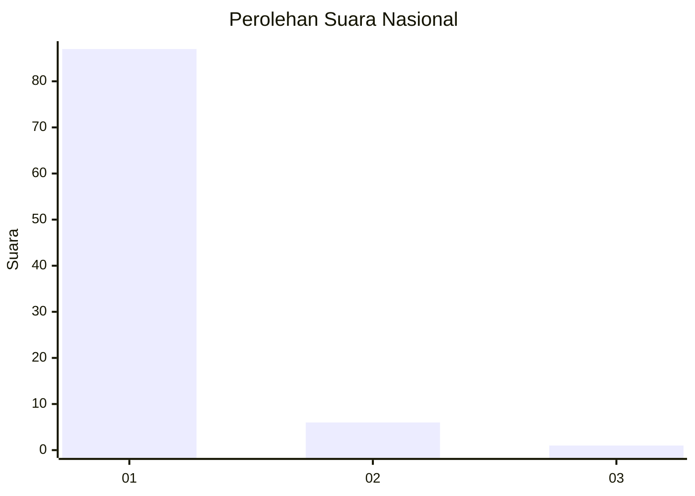
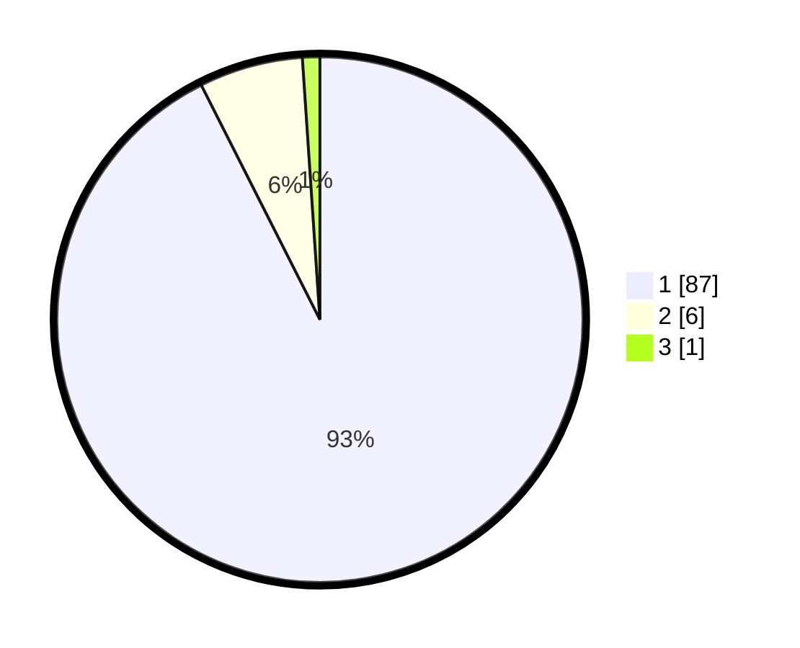

# Hasil

## Grafik

## Tabel

| No. | Nama Paslon    | Suara | Suara (raw) | Persentase |
|:--- |:-------------- | -----:| -----------:| ----------:|
| 1   | ANIES MUHAIMIN | 87    | [87][p-1]   | 92,55      |
| 2   | PRABOWO GIBRAN | 6     | [6][p-2]    | 6,38       |
| 3   | GANJAR MAHFUD  | 1     | [1][p-3]    | 1,06       |

[p-1]: https://github.com/gigit-pemilu/pemilu-2024/blob/main/pilpres/hitung-suara/sub/11-aceh/sub/14-aceh-jaya/sub/09-pasie-raya/sub/2002-alue-krueng/sub/002-tps/sub/paslon-1.txt
[p-2]: https://github.com/gigit-pemilu/pemilu-2024/blob/main/pilpres/hitung-suara/sub/11-aceh/sub/14-aceh-jaya/sub/09-pasie-raya/sub/2002-alue-krueng/sub/002-tps/sub/paslon-2.txt
[p-3]: https://github.com/gigit-pemilu/pemilu-2024/blob/main/pilpres/hitung-suara/sub/11-aceh/sub/14-aceh-jaya/sub/09-pasie-raya/sub/2002-alue-krueng/sub/002-tps/sub/paslon-3.txt

## Foto C Plano

https://sirekap-obj-formc.kpu.go.id/e7b9/pemilu/ppwp/11/14/09/20/02/1114092002002-20240214-220654--e1ac8912-3bb2-4d11-aa7e-2e3fd20658c2.jpg

https://sirekap-obj-formc.kpu.go.id/e7b9/pemilu/ppwp/11/14/09/20/02/1114092002002-20240214-220658--70084a7b-9da7-4896-8281-52603cd84f39.jpg

https://sirekap-obj-formc.kpu.go.id/e7b9/pemilu/ppwp/11/14/09/20/02/1114092002002-20240214-220701--16548b4e-e8cd-48cb-b734-e58d7c4385d4.jpg

## Metadata

| Key        | Value               |
| ---------- | ------------------- |
| Time Stamp | 2024-02-15 06:00:23 |

## DATA PEMILIH TETAP

Jumlah pemilih dalam DPT: **99**.
 * L: **47**.
 * P: **52**.

## DATA PENGGUNA HAK PILIH

Jumlah pengguna hak pilih dalam DPT: **91**.
 * L: **43**.
 * P: **48**.

Jumlah pengguna hak pilih dalam DPTb: **2**.
 * L: **1**.
 * P: **1**.

Jumlah pengguna hak pilih dalam DPK: **2**.
 * L: **1**.
 * P: **1**.

Jumlah pengguna hak pilih: **95**.
 * L: **45**.
 * P: **50**.

## JUMLAH SUARA SAH DAN TIDAK SAH

JUMLAH SELURUH SUARA SAH: **94**.

JUMLAH SUARA TIDAK SAH: **1**.

JUMLAH SELURUH SUARA SAH DAN SUARA TIDAK SAH: **95**.

