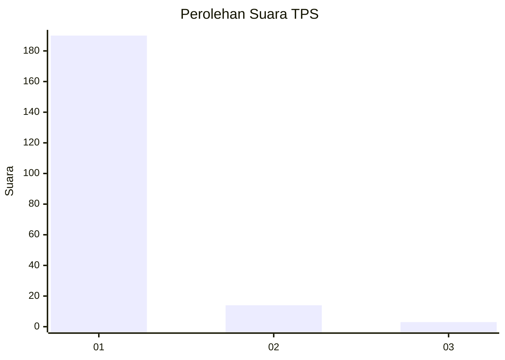
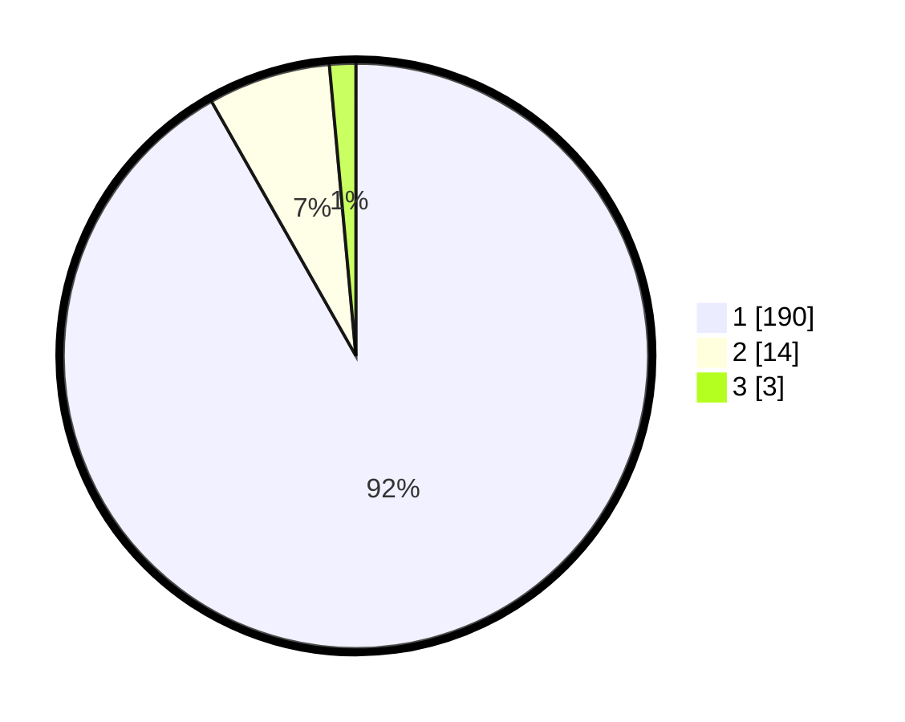

# Hasil

## Grafik

## Tabel

| No. | Nama Paslon    | Suara | Suara (raw) | Persentase |
|:--- |:-------------- | -----:| -----------:| ----------:|
| 1   | ANIES MUHAIMIN | 190   | [190][p-1]  | 91,79      |
| 2   | PRABOWO GIBRAN | 14    | [14][p-2]   | 6,76       |
| 3   | GANJAR MAHFUD  | 3     | [3][p-3]    | 1,45       |

[p-1]: https://github.com/gigit-pemilu/pemilu-2024-11-aceh/blob/main/pilpres/hitung-suara/sub/11-aceh/sub/14-aceh-jaya/sub/09-pasie-raya/sub/2013-bintah/sub/001-tps/sub/paslon-1.txt
[p-2]: https://github.com/gigit-pemilu/pemilu-2024-11-aceh/blob/main/pilpres/hitung-suara/sub/11-aceh/sub/14-aceh-jaya/sub/09-pasie-raya/sub/2013-bintah/sub/001-tps/sub/paslon-2.txt
[p-3]: https://github.com/gigit-pemilu/pemilu-2024-11-aceh/blob/main/pilpres/hitung-suara/sub/11-aceh/sub/14-aceh-jaya/sub/09-pasie-raya/sub/2013-bintah/sub/001-tps/sub/paslon-3.txt

## Foto C Plano

https://sirekap-obj-formc.kpu.go.id/fb93/pemilu/ppwp/11/14/09/20/13/1114092013001-20240215-084930--39345065-c58f-4ce6-8210-e9ca295027ac.jpg

https://sirekap-obj-formc.kpu.go.id/fb93/pemilu/ppwp/11/14/09/20/13/1114092013001-20240215-085809--03a2af88-de51-4f01-b2ec-1253b331280f.jpg

https://sirekap-obj-formc.kpu.go.id/fb93/pemilu/ppwp/11/14/09/20/13/1114092013001-20240215-085607--f6b330f9-39a3-44c5-a5e3-f78c9e813fc6.jpg

## Metadata

| Key        | Value               |
| ---------- | ------------------- |
| Time Stamp | 2024-02-15 23:29:50 |

