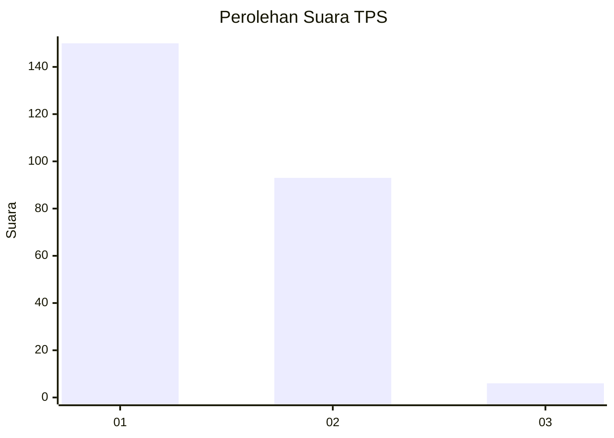
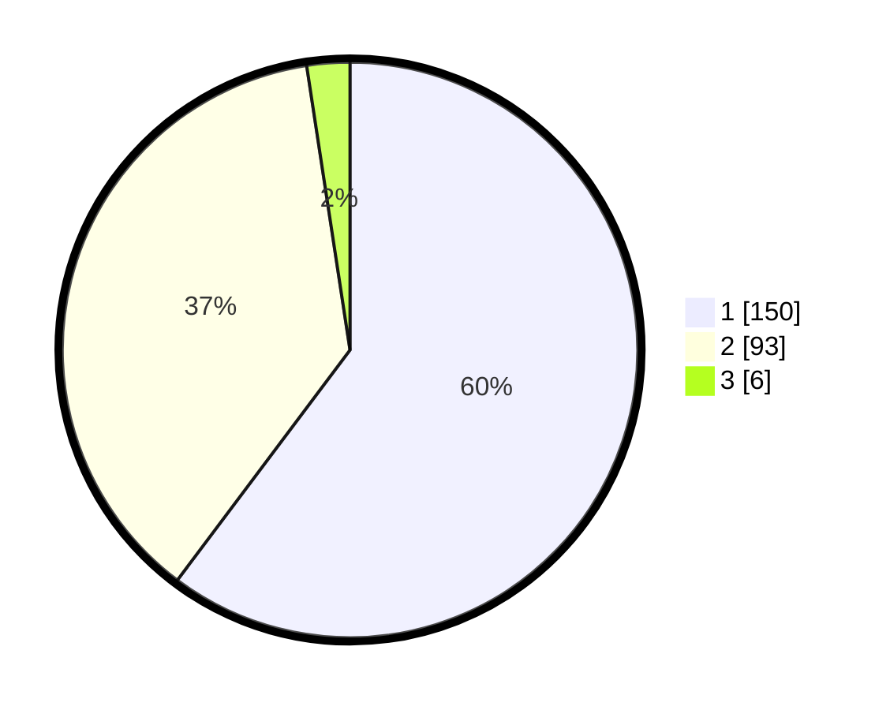

# Hasil

## Grafik

## Tabel

| No. | Nama Paslon    | Suara | Suara (raw) | Persentase |
|:--- |:-------------- | -----:| -----------:| ----------:|
| 1   | ANIES MUHAIMIN | 150   | [150][p-1]  | 60,24      |
| 2   | PRABOWO GIBRAN | 93    | [93][p-2]   | 37,35      |
| 3   | GANJAR MAHFUD  | 6     | [6][p-3]    | 2,41       |

[p-1]: https://github.com/gigit-pemilu/pemilu-2024-11-aceh/blob/main/pilpres/hitung-suara/sub/11-aceh/sub/15-nagan-raya/sub/01-kuala/sub/2003-lawa-batu/sub/001-tps/sub/paslon-1.txt
[p-2]: https://github.com/gigit-pemilu/pemilu-2024-11-aceh/blob/main/pilpres/hitung-suara/sub/11-aceh/sub/15-nagan-raya/sub/01-kuala/sub/2003-lawa-batu/sub/001-tps/sub/paslon-2.txt
[p-3]: https://github.com/gigit-pemilu/pemilu-2024-11-aceh/blob/main/pilpres/hitung-suara/sub/11-aceh/sub/15-nagan-raya/sub/01-kuala/sub/2003-lawa-batu/sub/001-tps/sub/paslon-3.txt

## Foto C Plano

https://sirekap-obj-formc.kpu.go.id/d5f8/pemilu/ppwp/11/15/01/20/03/1115012003001-20240216-194628--1132f0b2-27c0-416d-8e0d-1d7166954da9.jpg

https://sirekap-obj-formc.kpu.go.id/d5f8/pemilu/ppwp/11/15/01/20/03/1115012003001-20240216-194630--cb669926-361f-4308-a3e1-5317875e6cf2.jpg

https://sirekap-obj-formc.kpu.go.id/d5f8/pemilu/ppwp/11/15/01/20/03/1115012003001-20240216-194629--3d129634-1799-42c3-9c92-3989c8925acd.jpg

## Metadata

| Key        | Value               |
| ---------- | ------------------- |
| Time Stamp | 2024-02-16 22:01:00 |

## DATA PEMILIH TETAP

Jumlah pemilih dalam DPT: **276**.
 * L: **145**.
 * P: **131**.

## DATA PENGGUNA HAK PILIH

Jumlah pengguna hak pilih dalam DPT: **259**.
 * L: **131**.
 * P: **128**.

Jumlah pengguna hak pilih dalam DPTb: **0**.
 * L: **0**.
 * P: **0**.

Jumlah pengguna hak pilih dalam DPK: **4**.
 * L: **2**.
 * P: **2**.

Jumlah pengguna hak pilih: **263**.
 * L: **133**.
 * P: **130**.

## JUMLAH SUARA SAH DAN TIDAK SAH

JUMLAH SELURUH SUARA SAH: **249**.

JUMLAH SUARA TIDAK SAH: **14**.

JUMLAH SELURUH SUARA SAH DAN SUARA TIDAK SAH: **263**.

