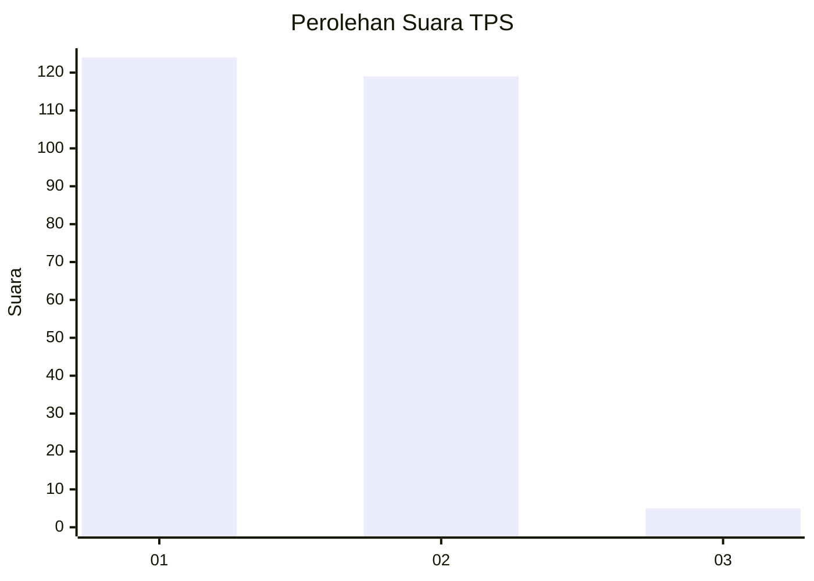
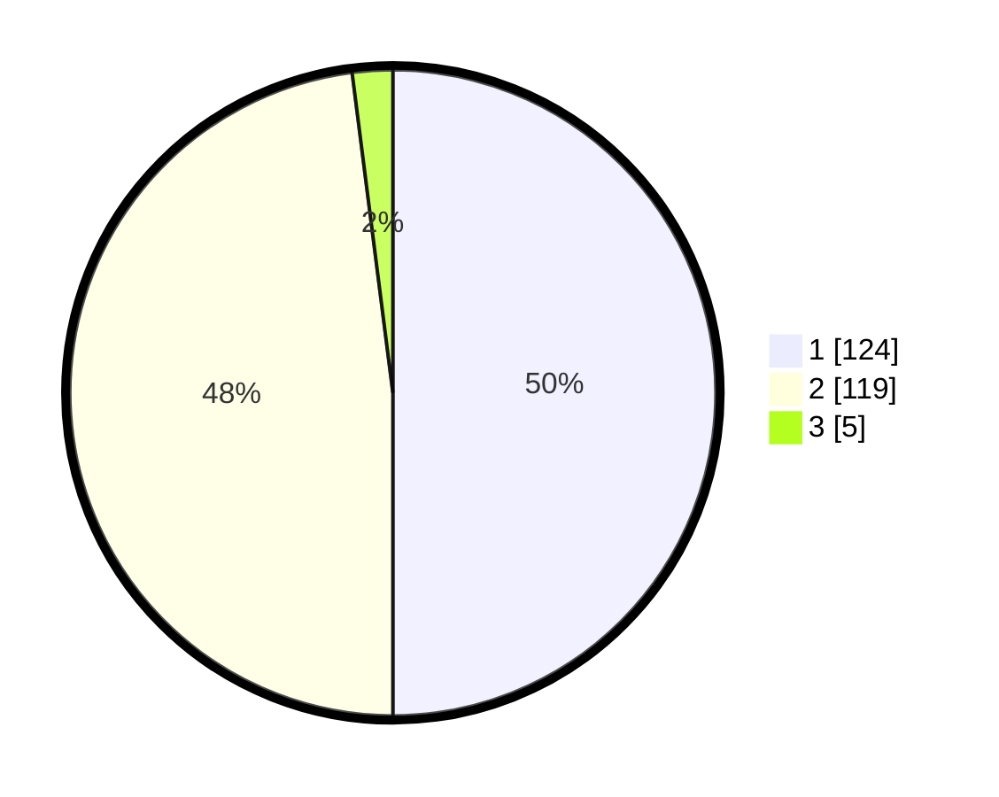

# Hasil

## Grafik

## Tabel

| No. | Nama Paslon    | Suara | Suara (raw) | Persentase |
|:--- |:-------------- | -----:| -----------:| ----------:|
| 1   | ANIES MUHAIMIN | 124   | [124][p-1]  | 50,00      |
| 2   | PRABOWO GIBRAN | 119   | [119][p-2]  | 47,98      |
| 3   | GANJAR MAHFUD  | 5     | [5][p-3]    | 2,02       |

[p-1]: https://github.com/gigit-pemilu/pemilu-2024-11-aceh/blob/main/pilpres/hitung-suara/sub/11-aceh/sub/15-nagan-raya/sub/01-kuala/sub/2003-lawa-batu/sub/002-tps/sub/paslon-1.txt
[p-2]: https://github.com/gigit-pemilu/pemilu-2024-11-aceh/blob/main/pilpres/hitung-suara/sub/11-aceh/sub/15-nagan-raya/sub/01-kuala/sub/2003-lawa-batu/sub/002-tps/sub/paslon-2.txt
[p-3]: https://github.com/gigit-pemilu/pemilu-2024-11-aceh/blob/main/pilpres/hitung-suara/sub/11-aceh/sub/15-nagan-raya/sub/01-kuala/sub/2003-lawa-batu/sub/002-tps/sub/paslon-3.txt

## Foto C Plano

https://sirekap-obj-formc.kpu.go.id/5048/pemilu/ppwp/11/15/01/20/03/1115012003002-20240216-215117--42a53b67-31e8-45fa-8a9c-1a3ccd75744e.jpg

https://sirekap-obj-formc.kpu.go.id/5048/pemilu/ppwp/11/15/01/20/03/1115012003002-20240216-215118--ed97de7b-71a5-45a1-a675-578982b0e20b.jpg

https://sirekap-obj-formc.kpu.go.id/5048/pemilu/ppwp/11/15/01/20/03/1115012003002-20240216-215117--ff6ac3b3-8cc6-460c-85f3-a0cf64d7c989.jpg

## Metadata

| Key        | Value               |
| ---------- | ------------------- |
| Time Stamp | 2024-02-17 11:00:02 |

## DATA PEMILIH TETAP

Jumlah pemilih dalam DPT: **284**.
 * L: **147**.
 * P: **137**.

## DATA PENGGUNA HAK PILIH

Jumlah pengguna hak pilih dalam DPT: **260**.
 * L: **135**.
 * P: **125**.

Jumlah pengguna hak pilih dalam DPTb: **0**.
 * L: **0**.
 * P: **0**.

Jumlah pengguna hak pilih dalam DPK: **3**.
 * L: **0**.
 * P: **3**.

Jumlah pengguna hak pilih: **263**.
 * L: **135**.
 * P: **128**.

## JUMLAH SUARA SAH DAN TIDAK SAH

JUMLAH SELURUH SUARA SAH: **248**.

JUMLAH SUARA TIDAK SAH: **15**.

JUMLAH SELURUH SUARA SAH DAN SUARA TIDAK SAH: **263**.

