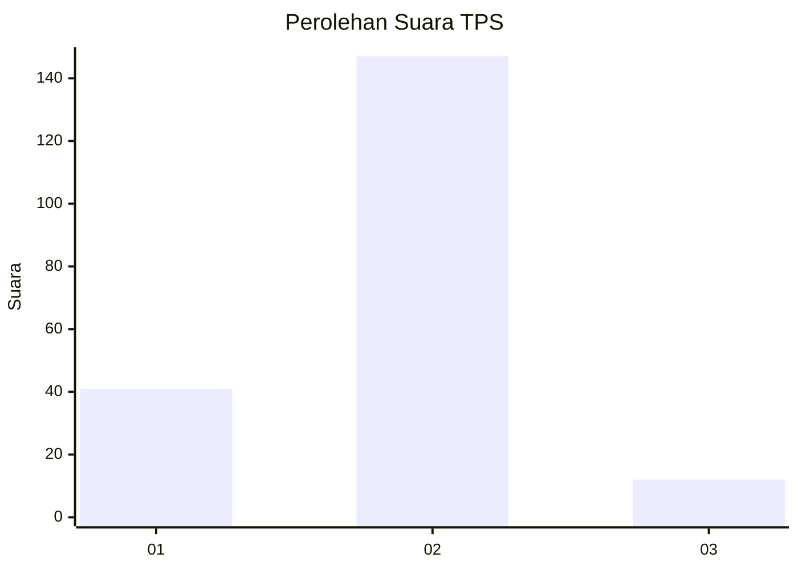

# Hasil

## Grafik

## Tabel

| No. | Nama Paslon    | Suara | Suara (raw) | Persentase |
|:--- |:-------------- | -----:| -----------:| ----------:|
| 1   | ANIES MUHAIMIN | 41    | [41][p-1]   | 20,50      |
| 2   | PRABOWO GIBRAN | 147   | [147][p-2]  | 73,50      |
| 3   | GANJAR MAHFUD  | 12    | [12][p-3]   | 6,00       |

[p-1]: https://github.com/gigit-pemilu/pemilu-2024-11-aceh/blob/main/pilpres/hitung-suara/sub/11-aceh/sub/15-nagan-raya/sub/01-kuala/sub/2004-jogja/sub/001-tps/sub/paslon-1.txt
[p-2]: https://github.com/gigit-pemilu/pemilu-2024-11-aceh/blob/main/pilpres/hitung-suara/sub/11-aceh/sub/15-nagan-raya/sub/01-kuala/sub/2004-jogja/sub/001-tps/sub/paslon-2.txt
[p-3]: https://github.com/gigit-pemilu/pemilu-2024-11-aceh/blob/main/pilpres/hitung-suara/sub/11-aceh/sub/15-nagan-raya/sub/01-kuala/sub/2004-jogja/sub/001-tps/sub/paslon-3.txt

## Foto C Plano

https://sirekap-obj-formc.kpu.go.id/4eda/pemilu/ppwp/11/15/01/20/04/1115012004001-20240216-134726--1329198e-c571-4ea6-8fd5-e526f3c423c8.jpg

https://sirekap-obj-formc.kpu.go.id/4eda/pemilu/ppwp/11/15/01/20/04/1115012004001-20240216-134727--61b0fe55-8924-4564-8f54-a761bd4241a2.jpg

https://sirekap-obj-formc.kpu.go.id/4eda/pemilu/ppwp/11/15/01/20/04/1115012004001-20240216-134727--7e257b46-cba9-4df9-9a77-835e0438677a.jpg

## Metadata

| Key        | Value               |
| ---------- | ------------------- |
| Time Stamp | 2024-02-16 21:01:00 |

## DATA PEMILIH TETAP

Jumlah pemilih dalam DPT: **236**.
 * L: **126**.
 * P: **110**.

## DATA PENGGUNA HAK PILIH

Jumlah pengguna hak pilih dalam DPT: **209**.
 * L: **111**.
 * P: **98**.

Jumlah pengguna hak pilih dalam DPTb: **2**.
 * L: **1**.
 * P: **1**.

Jumlah pengguna hak pilih dalam DPK: **2**.
 * L: **0**.
 * P: **2**.

Jumlah pengguna hak pilih: **213**.
 * L: **121**.
 * P: **101**.

## JUMLAH SUARA SAH DAN TIDAK SAH

JUMLAH SELURUH SUARA SAH: **200**.

JUMLAH SUARA TIDAK SAH: **13**.

JUMLAH SELURUH SUARA SAH DAN SUARA TIDAK SAH: **213**.

