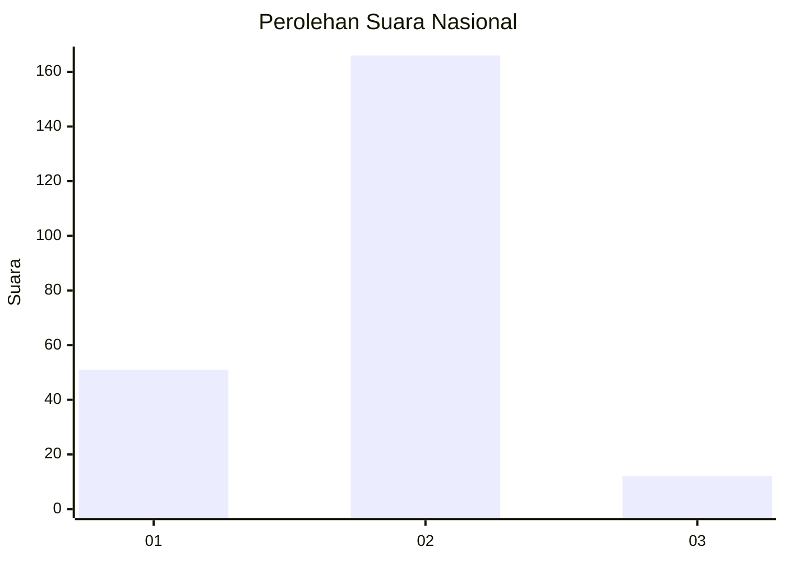
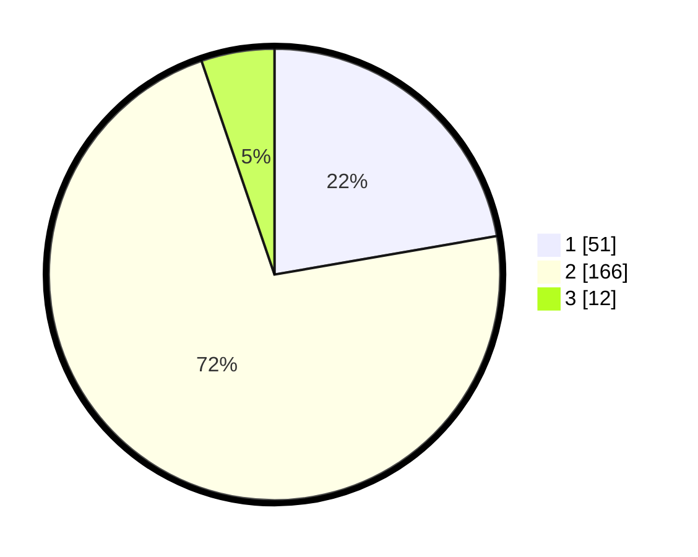

# Hasil

## Grafik

## Tabel

| No. | Nama Paslon    | Suara | Suara (raw) | Persentase |
|:--- |:-------------- | -----:| -----------:| ----------:|
| 1   | ANIES MUHAIMIN | 51    | [51][p-1]   | 22,27      |
| 2   | PRABOWO GIBRAN | 166   | [166][p-2]  | 72,49      |
| 3   | GANJAR MAHFUD  | 12    | [12][p-3]   | 5,24       |

[p-1]: https://github.com/gigit-pemilu/pemilu-2024/blob/main/pilpres/hitung-suara/sub/11-aceh/sub/15-nagan-raya/sub/01-kuala/sub/2004-jogja/sub/002-tps/sub/paslon-1.txt
[p-2]: https://github.com/gigit-pemilu/pemilu-2024/blob/main/pilpres/hitung-suara/sub/11-aceh/sub/15-nagan-raya/sub/01-kuala/sub/2004-jogja/sub/002-tps/sub/paslon-2.txt
[p-3]: https://github.com/gigit-pemilu/pemilu-2024/blob/main/pilpres/hitung-suara/sub/11-aceh/sub/15-nagan-raya/sub/01-kuala/sub/2004-jogja/sub/002-tps/sub/paslon-3.txt

## Foto C Plano

https://sirekap-obj-formc.kpu.go.id/2329/pemilu/ppwp/11/15/01/20/04/1115012004002-20240216-145143--2d0427ce-74bb-43c5-b025-42c07dc19b5a.jpg

https://sirekap-obj-formc.kpu.go.id/2329/pemilu/ppwp/11/15/01/20/04/1115012004002-20240216-145144--a4f21166-af30-45f6-8337-ea822dfc75a0.jpg

https://sirekap-obj-formc.kpu.go.id/2329/pemilu/ppwp/11/15/01/20/04/1115012004002-20240216-145144--e487e50a-80c0-4114-90e0-f682fb2fc1a9.jpg

## Metadata

| Key        | Value               |
| ---------- | ------------------- |
| Time Stamp | 2024-02-16 21:01:00 |

## DATA PEMILIH TETAP

Jumlah pemilih dalam DPT: **252**.
 * L: **132**.
 * P: **120**.

## DATA PENGGUNA HAK PILIH

Jumlah pengguna hak pilih dalam DPT: **234**.
 * L: **120**.
 * P: **114**.

Jumlah pengguna hak pilih dalam DPTb: **0**.
 * L: **0**.
 * P: **0**.

Jumlah pengguna hak pilih dalam DPK: **2**.
 * L: **1**.
 * P: **1**.

Jumlah pengguna hak pilih: **236**.
 * L: **121**.
 * P: **115**.

## JUMLAH SUARA SAH DAN TIDAK SAH

JUMLAH SELURUH SUARA SAH: **229**.

JUMLAH SUARA TIDAK SAH: **7**.

JUMLAH SELURUH SUARA SAH DAN SUARA TIDAK SAH: **236**.

