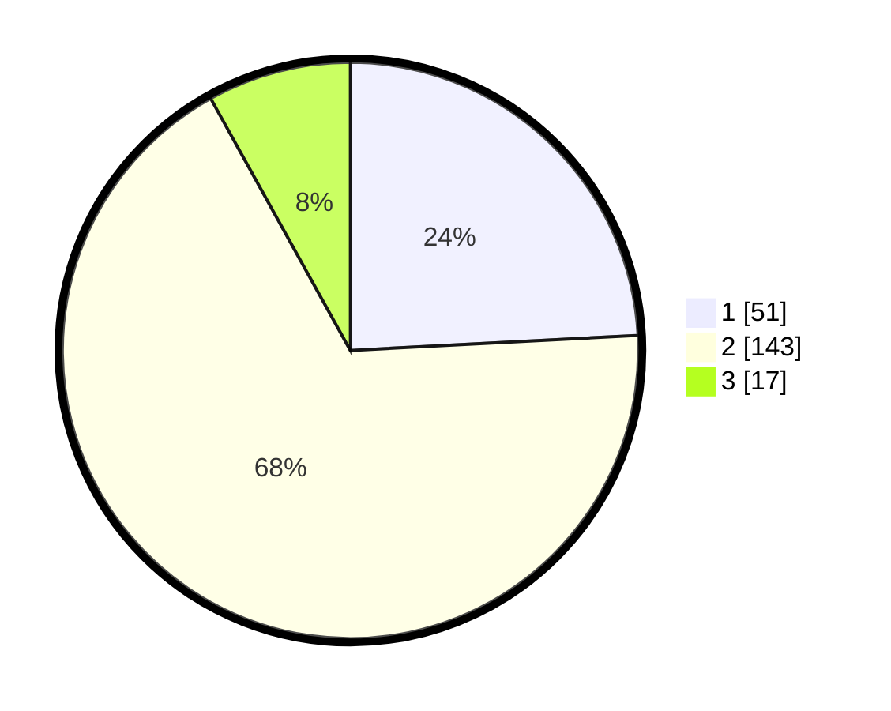

# Hasil

## Grafik

## Tabel

| No. | Nama Paslon    | Suara | Suara (raw) | Persentase |
|:--- |:-------------- | -----:| -----------:| ----------:|
| 1   | ANIES MUHAIMIN | 51    | [51][p-1]   | 24,17      |
| 2   | PRABOWO GIBRAN | 143   | [143][p-2]  | 67,77      |
| 3   | GANJAR MAHFUD  | 17    | [17][p-3]   | 8,06       |

[p-1]: https://github.com/gigit-pemilu/pemilu-2024-11-aceh/blob/main/pilpres/hitung-suara/sub/11-aceh/sub/15-nagan-raya/sub/01-kuala/sub/2004-jogja/sub/003-tps/sub/paslon-1.txt
[p-2]: https://github.com/gigit-pemilu/pemilu-2024-11-aceh/blob/main/pilpres/hitung-suara/sub/11-aceh/sub/15-nagan-raya/sub/01-kuala/sub/2004-jogja/sub/003-tps/sub/paslon-2.txt
[p-3]: https://github.com/gigit-pemilu/pemilu-2024-11-aceh/blob/main/pilpres/hitung-suara/sub/11-aceh/sub/15-nagan-raya/sub/01-kuala/sub/2004-jogja/sub/003-tps/sub/paslon-3.txt

## Foto C Plano

https://sirekap-obj-formc.kpu.go.id/6389/pemilu/ppwp/11/15/01/20/04/1115012004003-20240216-140210--eb2aa867-9d06-4643-a96b-60cd0a4d94f2.jpg

https://sirekap-obj-formc.kpu.go.id/6389/pemilu/ppwp/11/15/01/20/04/1115012004003-20240216-140211--43324be0-7614-4df4-a1a4-c1f7cd9716e3.jpg

https://sirekap-obj-formc.kpu.go.id/6389/pemilu/ppwp/11/15/01/20/04/1115012004003-20240216-140211--6310b853-3cdb-43bd-bc42-2ee0094b08bb.jpg

## Metadata

| Key        | Value               |
| ---------- | ------------------- |
| Time Stamp | 2024-02-16 21:01:00 |

## DATA PEMILIH TETAP

Jumlah pemilih dalam DPT: **237**.
 * L: **118**.
 * P: **119**.

## DATA PENGGUNA HAK PILIH

Jumlah pengguna hak pilih dalam DPT: **216**.
 * L: **106**.
 * P: **110**.

Jumlah pengguna hak pilih dalam DPTb: **0**.
 * L: **0**.
 * P: **0**.

Jumlah pengguna hak pilih dalam DPK: **2**.
 * L: **1**.
 * P: **1**.

Jumlah pengguna hak pilih: **218**.
 * L: **107**.
 * P: **111**.

## JUMLAH SUARA SAH DAN TIDAK SAH

JUMLAH SELURUH SUARA SAH: **211**.

JUMLAH SUARA TIDAK SAH: **7**.

JUMLAH SELURUH SUARA SAH DAN SUARA TIDAK SAH: **218**.

