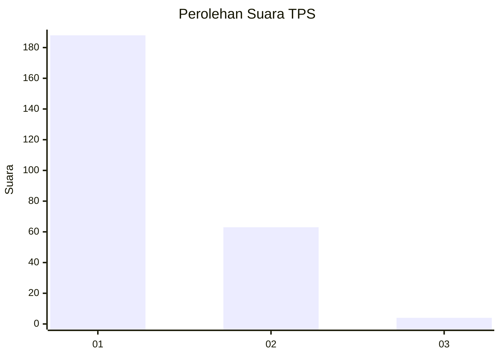
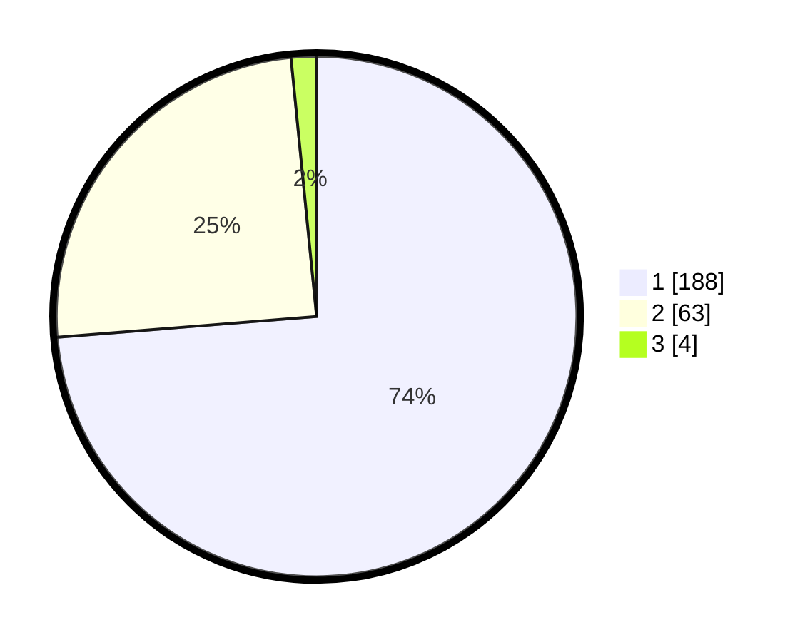

# Hasil

## Grafik

## Tabel

| No. | Nama Paslon    | Suara | Suara (raw) | Persentase |
|:--- |:-------------- | -----:| -----------:| ----------:|
| 1   | ANIES MUHAIMIN | 188   | [188][p-1]  | 73,73      |
| 2   | PRABOWO GIBRAN | 63    | [63][p-2]   | 24,71      |
| 3   | GANJAR MAHFUD  | 4     | [4][p-3]    | 1,57       |

[p-1]: https://github.com/gigit-pemilu/pemilu-2024-11-aceh/blob/main/pilpres/hitung-suara/sub/11-aceh/sub/15-nagan-raya/sub/01-kuala/sub/2031-ujong-patihah/sub/001-tps/sub/paslon-1.txt
[p-2]: https://github.com/gigit-pemilu/pemilu-2024-11-aceh/blob/main/pilpres/hitung-suara/sub/11-aceh/sub/15-nagan-raya/sub/01-kuala/sub/2031-ujong-patihah/sub/001-tps/sub/paslon-2.txt
[p-3]: https://github.com/gigit-pemilu/pemilu-2024-11-aceh/blob/main/pilpres/hitung-suara/sub/11-aceh/sub/15-nagan-raya/sub/01-kuala/sub/2031-ujong-patihah/sub/001-tps/sub/paslon-3.txt

## Foto C Plano

https://sirekap-obj-formc.kpu.go.id/b53b/pemilu/ppwp/11/15/01/20/31/1115012031001-20240217-163038--5c139055-27e8-4c93-8280-aa446373186f.jpg

https://sirekap-obj-formc.kpu.go.id/b53b/pemilu/ppwp/11/15/01/20/31/1115012031001-20240217-163039--22c3668b-eb5e-41ec-be25-82d8367bdfcd.jpg

https://sirekap-obj-formc.kpu.go.id/b53b/pemilu/ppwp/11/15/01/20/31/1115012031001-20240217-163038--f289b3f8-29a1-4ab4-bdbf-735b96c2f04c.jpg

## Metadata

| Key        | Value               |
| ---------- | ------------------- |
| Time Stamp | 2024-02-21 23:00:00 |

## DATA PEMILIH TETAP

Jumlah pemilih dalam DPT: **296**.
 * L: **129**.
 * P: **167**.

## DATA PENGGUNA HAK PILIH

Jumlah pengguna hak pilih dalam DPT: **296**.
 * L: **129**.
 * P: **167**.

Jumlah pengguna hak pilih dalam DPTb: **10**.
 * L: **5**.
 * P: **5**.

Jumlah pengguna hak pilih dalam DPK: **0**.
 * L: **0**.
 * P: **0**.

Jumlah pengguna hak pilih: **306**.
 * L: **134**.
 * P: **172**.

## JUMLAH SUARA SAH DAN TIDAK SAH

JUMLAH SELURUH SUARA SAH: **255**.

JUMLAH SUARA TIDAK SAH: **7**.

JUMLAH SELURUH SUARA SAH DAN SUARA TIDAK SAH: **262**.

