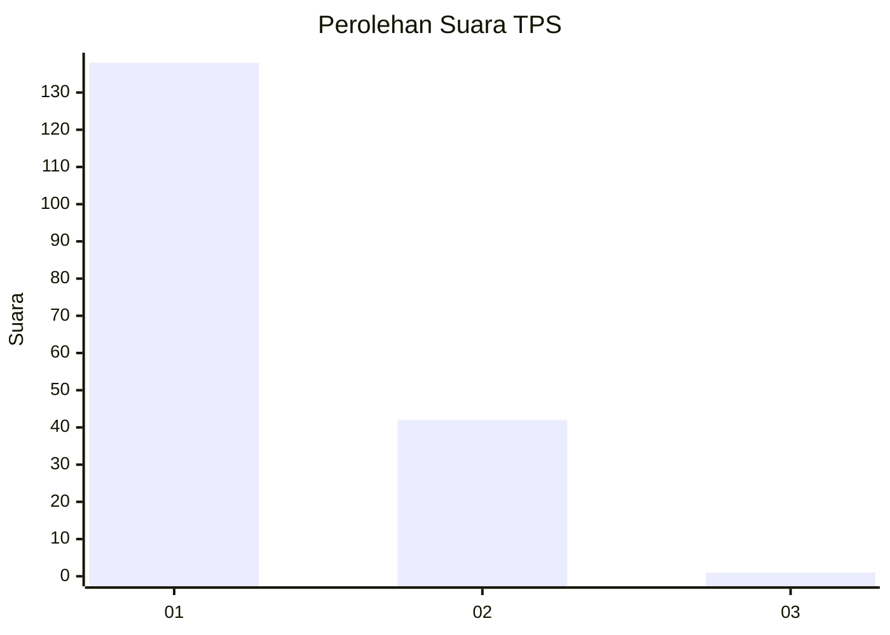
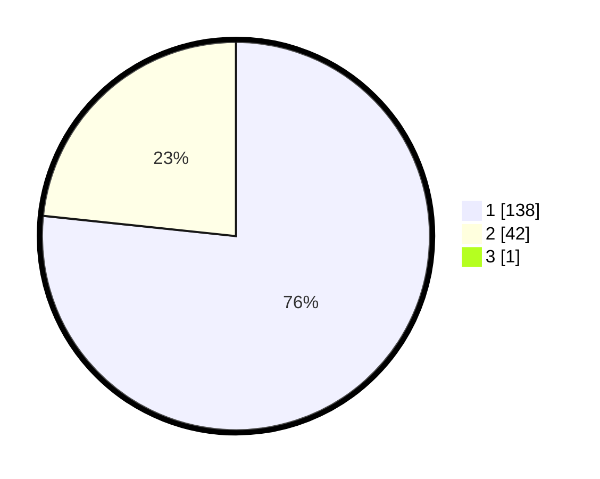

# Hasil

## Grafik

## Tabel

| No. | Nama Paslon    | Suara | Suara (raw) | Persentase |
|:--- |:-------------- | -----:| -----------:| ----------:|
| 1   | ANIES MUHAIMIN | 138   | [138][p-1]  | 76,24      |
| 2   | PRABOWO GIBRAN | 42    | [42][p-2]   | 23,20      |
| 3   | GANJAR MAHFUD  | 1     | [1][p-3]    | 0,55       |

[p-1]: https://github.com/gigit-pemilu/pemilu-2024-11-aceh/blob/main/pilpres/hitung-suara/sub/11-aceh/sub/15-nagan-raya/sub/02-seunagan/sub/2008-padang/sub/002-tps/sub/paslon-1.txt
[p-2]: https://github.com/gigit-pemilu/pemilu-2024-11-aceh/blob/main/pilpres/hitung-suara/sub/11-aceh/sub/15-nagan-raya/sub/02-seunagan/sub/2008-padang/sub/002-tps/sub/paslon-2.txt
[p-3]: https://github.com/gigit-pemilu/pemilu-2024-11-aceh/blob/main/pilpres/hitung-suara/sub/11-aceh/sub/15-nagan-raya/sub/02-seunagan/sub/2008-padang/sub/002-tps/sub/paslon-3.txt

## Foto C Plano

https://sirekap-obj-formc.kpu.go.id/5e1d/pemilu/ppwp/11/15/02/20/08/1115022008002-20240219-122719--fbc3542c-2149-416a-8054-701111b7b5b0.jpg

https://sirekap-obj-formc.kpu.go.id/5e1d/pemilu/ppwp/11/15/02/20/08/1115022008002-20240219-122514--7cbfec6a-dab8-4118-ab4e-f86c8f1f0559.jpg

https://sirekap-obj-formc.kpu.go.id/5e1d/pemilu/ppwp/11/15/02/20/08/1115022008002-20240218-223508--d8d62fd4-0884-4d16-b935-00ecd269cffd.jpg

## Metadata

| Key        | Value               |
| ---------- | ------------------- |
| Time Stamp | 2024-02-24 22:31:28 |

