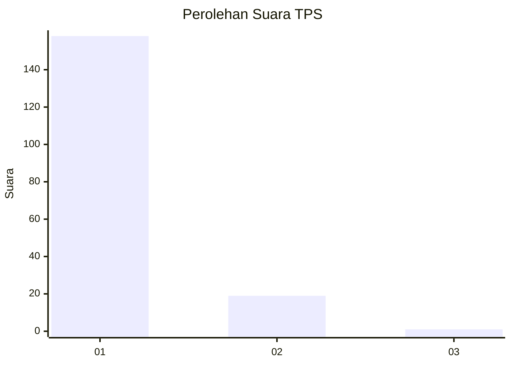
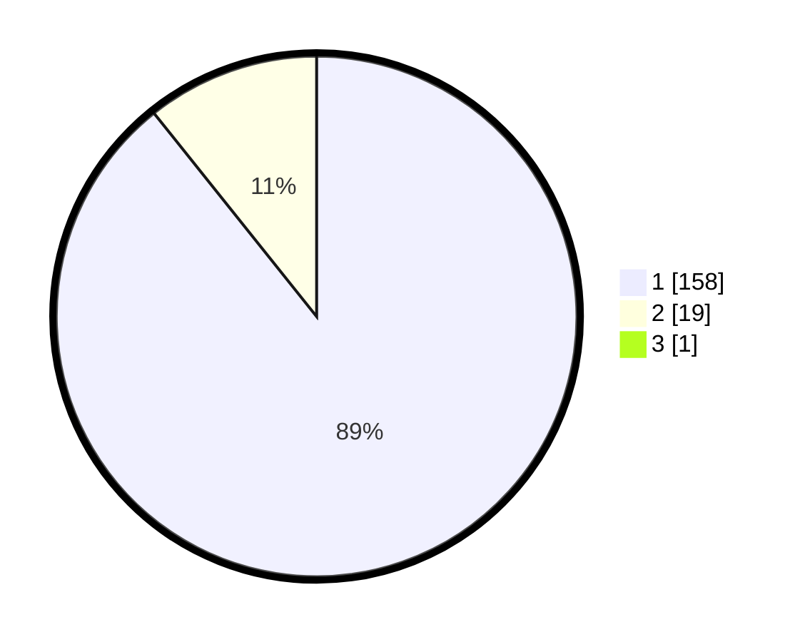

# Hasil

## Grafik

## Tabel

| No. | Nama Paslon    | Suara | Suara (raw) | Persentase |
|:--- |:-------------- | -----:| -----------:| ----------:|
| 1   | ANIES MUHAIMIN | 158   | [158][p-1]  | 88,76      |
| 2   | PRABOWO GIBRAN | 19    | [19][p-2]   | 10,67      |
| 3   | GANJAR MAHFUD  | 1     | [1][p-3]    | 0,56       |

[p-1]: https://github.com/gigit-pemilu/pemilu-2024-11-aceh/blob/main/pilpres/hitung-suara/sub/11-aceh/sub/15-nagan-raya/sub/02-seunagan/sub/2010-lhok-parom/sub/001-tps/sub/paslon-1.txt
[p-2]: https://github.com/gigit-pemilu/pemilu-2024-11-aceh/blob/main/pilpres/hitung-suara/sub/11-aceh/sub/15-nagan-raya/sub/02-seunagan/sub/2010-lhok-parom/sub/001-tps/sub/paslon-2.txt
[p-3]: https://github.com/gigit-pemilu/pemilu-2024-11-aceh/blob/main/pilpres/hitung-suara/sub/11-aceh/sub/15-nagan-raya/sub/02-seunagan/sub/2010-lhok-parom/sub/001-tps/sub/paslon-3.txt

## Foto C Plano

https://sirekap-obj-formc.kpu.go.id/e0d5/pemilu/ppwp/11/15/02/20/10/1115022010001-20240220-112418--f072c1f1-be01-464b-b3d1-ff0f7466691e.jpg

https://sirekap-obj-formc.kpu.go.id/e0d5/pemilu/ppwp/11/15/02/20/10/1115022010001-20240220-112443--3055f6d1-5a3a-448c-a40c-adfe048a53c2.jpg

https://sirekap-obj-formc.kpu.go.id/e0d5/pemilu/ppwp/11/15/02/20/10/1115022010001-20240220-112648--8364ad1c-104c-4b76-b3e8-05de60c6ad0a.jpg

## Metadata

| Key        | Value               |
| ---------- | ------------------- |
| Time Stamp | 2024-02-25 17:00:00 |

