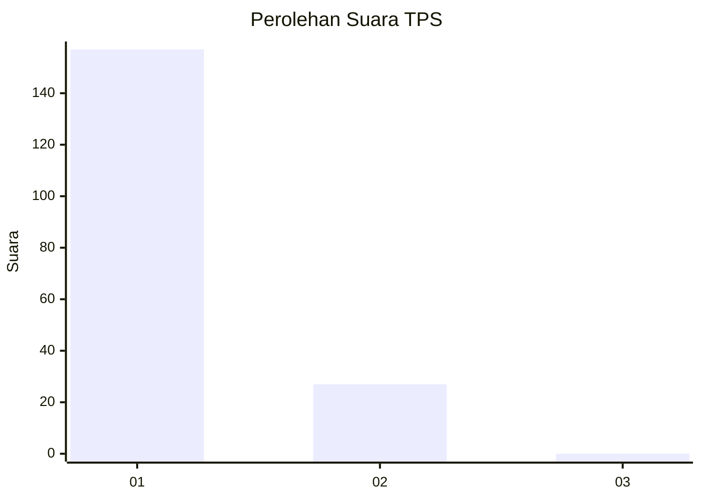
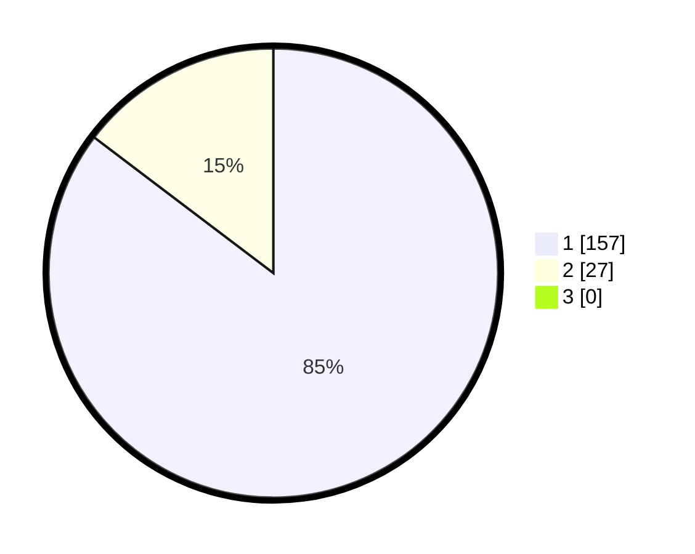

# Hasil

## Grafik

## Tabel

| No. | Nama Paslon    | Suara | Suara (raw) | Persentase |
|:--- |:-------------- | -----:| -----------:| ----------:|
| 1   | ANIES MUHAIMIN | 157   | [157][p-1]  | 85,33      |
| 2   | PRABOWO GIBRAN | 27    | [27][p-2]   | 14,67      |
| 3   | GANJAR MAHFUD  | 0     | [0][p-3]    | 0,00       |

[p-1]: https://github.com/gigit-pemilu/pemilu-2024-11-aceh/blob/main/pilpres/hitung-suara/sub/11-aceh/sub/15-nagan-raya/sub/02-seunagan/sub/2011-sapek/sub/002-tps/sub/paslon-1.txt
[p-2]: https://github.com/gigit-pemilu/pemilu-2024-11-aceh/blob/main/pilpres/hitung-suara/sub/11-aceh/sub/15-nagan-raya/sub/02-seunagan/sub/2011-sapek/sub/002-tps/sub/paslon-2.txt
[p-3]: https://github.com/gigit-pemilu/pemilu-2024-11-aceh/blob/main/pilpres/hitung-suara/sub/11-aceh/sub/15-nagan-raya/sub/02-seunagan/sub/2011-sapek/sub/002-tps/sub/paslon-3.txt

## Foto C Plano

https://sirekap-obj-formc.kpu.go.id/7393/pemilu/ppwp/11/15/02/20/11/1115022011002-20240215-123906--52d54f06-f468-4f69-b20d-fb312308451a.jpg

https://sirekap-obj-formc.kpu.go.id/7393/pemilu/ppwp/11/15/02/20/11/1115022011002-20240215-124202--289e4017-d143-4e11-89af-a08f413ea86e.jpg

https://sirekap-obj-formc.kpu.go.id/7393/pemilu/ppwp/11/15/02/20/11/1115022011002-20240215-124721--88fd009b-9ca0-4f64-984b-0dab5c961f2b.jpg

## Metadata

| Key        | Value               |
| ---------- | ------------------- |
| Time Stamp | 2024-02-15 16:30:25 |

