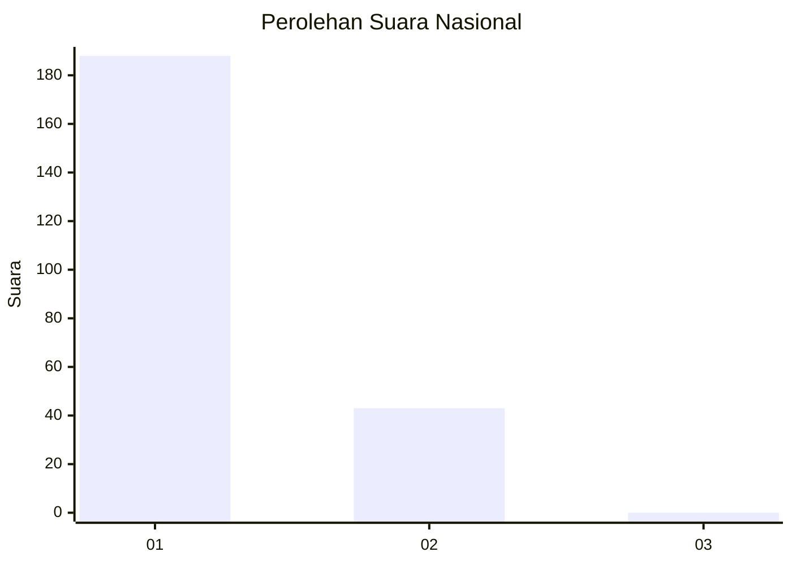
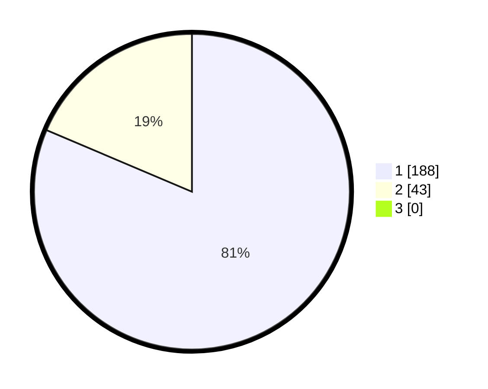

# Hasil

## Grafik

## Tabel

| No. | Nama Paslon    | Suara | Suara (raw) | Persentase |
|:--- |:-------------- | -----:| -----------:| ----------:|
| 1   | ANIES MUHAIMIN | 188   | [188][p-1]  | 81,39      |
| 2   | PRABOWO GIBRAN | 43    | [43][p-2]   | 18,61      |
| 3   | GANJAR MAHFUD  | 0     | [0][p-3]    | 0,00       |

[p-1]: https://github.com/gigit-pemilu/pemilu-2024/blob/main/pilpres/hitung-suara/sub/11-aceh/sub/15-nagan-raya/sub/02-seunagan/sub/2015-nigan/sub/002-tps/sub/paslon-1.txt
[p-2]: https://github.com/gigit-pemilu/pemilu-2024/blob/main/pilpres/hitung-suara/sub/11-aceh/sub/15-nagan-raya/sub/02-seunagan/sub/2015-nigan/sub/002-tps/sub/paslon-2.txt
[p-3]: https://github.com/gigit-pemilu/pemilu-2024/blob/main/pilpres/hitung-suara/sub/11-aceh/sub/15-nagan-raya/sub/02-seunagan/sub/2015-nigan/sub/002-tps/sub/paslon-3.txt

## Foto C Plano

https://sirekap-obj-formc.kpu.go.id/f865/pemilu/ppwp/11/15/02/20/15/1115022015002-20240219-160517--2a5c9c4c-f95b-4e56-b4d4-006fbcf8203d.jpg

https://sirekap-obj-formc.kpu.go.id/f865/pemilu/ppwp/11/15/02/20/15/1115022015002-20240214-185612--f7a6b4c7-d2d0-4abb-a75f-09912bd60c49.jpg

https://sirekap-obj-formc.kpu.go.id/f865/pemilu/ppwp/11/15/02/20/15/1115022015002-20240214-203312--87e1e9a8-ff00-4f41-a69b-7a30af470083.jpg

## Metadata

| Key        | Value               |
| ---------- | ------------------- |
| Time Stamp | 2024-02-19 17:00:00 |

