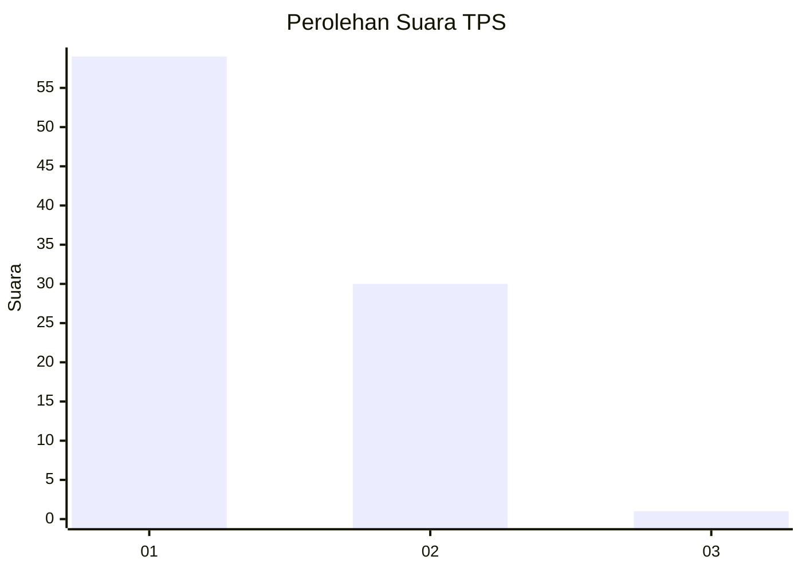
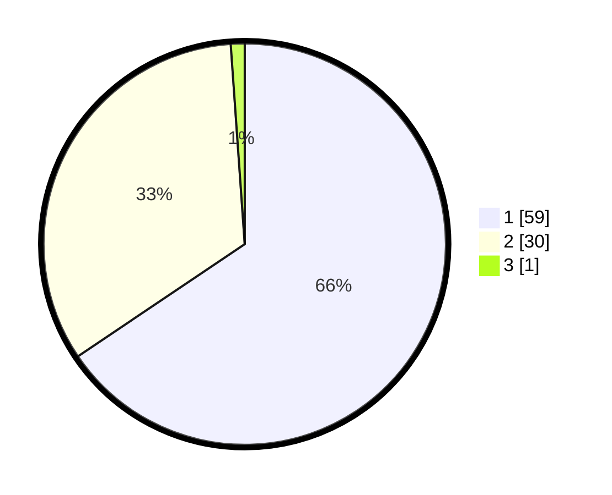

# Hasil

## Grafik

## Tabel

| No. | Nama Paslon    | Suara | Suara (raw) | Persentase |
|:--- |:-------------- | -----:| -----------:| ----------:|
| 1   | ANIES MUHAIMIN | 59    | [59][p-1]   | 65,56      |
| 2   | PRABOWO GIBRAN | 30    | [30][p-2]   | 33,33      |
| 3   | GANJAR MAHFUD  | 1     | [1][p-3]    | 1,11       |

[p-1]: https://github.com/gigit-pemilu/pemilu-2024-11-aceh/blob/main/pilpres/hitung-suara/sub/11-aceh/sub/15-nagan-raya/sub/02-seunagan/sub/2029-krueng-mangkom/sub/001-tps/sub/paslon-1.txt
[p-2]: https://github.com/gigit-pemilu/pemilu-2024-11-aceh/blob/main/pilpres/hitung-suara/sub/11-aceh/sub/15-nagan-raya/sub/02-seunagan/sub/2029-krueng-mangkom/sub/001-tps/sub/paslon-2.txt
[p-3]: https://github.com/gigit-pemilu/pemilu-2024-11-aceh/blob/main/pilpres/hitung-suara/sub/11-aceh/sub/15-nagan-raya/sub/02-seunagan/sub/2029-krueng-mangkom/sub/001-tps/sub/paslon-3.txt

## Foto C Plano

https://sirekap-obj-formc.kpu.go.id/c567/pemilu/ppwp/11/15/02/20/29/1115022029001-20240216-134739--d8793061-307e-467d-aa8f-10153ff258e4.jpg

https://sirekap-obj-formc.kpu.go.id/c567/pemilu/ppwp/11/15/02/20/29/1115022029001-20240216-134740--99b329d9-f864-477a-86b3-45ca714306fc.jpg

https://sirekap-obj-formc.kpu.go.id/c567/pemilu/ppwp/11/15/02/20/29/1115022029001-20240216-134739--99fb153a-1b1a-4103-949b-5078ecd1e561.jpg

## Metadata

| Key        | Value               |
| ---------- | ------------------- |
| Time Stamp | 2024-02-16 21:01:00 |

## DATA PEMILIH TETAP

Jumlah pemilih dalam DPT: **94**.
 * L: **51**.
 * P: **43**.

## DATA PENGGUNA HAK PILIH

Jumlah pengguna hak pilih dalam DPT: **94**.
 * L: **51**.
 * P: **43**.

Jumlah pengguna hak pilih dalam DPTb: **3**.
 * L: **3**.
 * P: **0**.

Jumlah pengguna hak pilih dalam DPK: **2**.
 * L: **2**.
 * P: **0**.

Jumlah pengguna hak pilih: **99**.
 * L: **56**.
 * P: **43**.

## JUMLAH SUARA SAH DAN TIDAK SAH

JUMLAH SELURUH SUARA SAH: **90**.

JUMLAH SUARA TIDAK SAH: **0**.

JUMLAH SELURUH SUARA SAH DAN SUARA TIDAK SAH: **90**.

