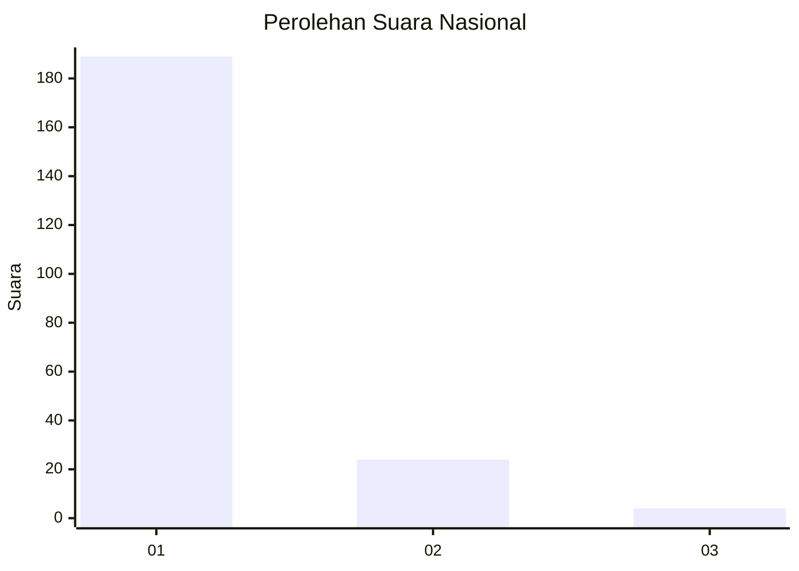
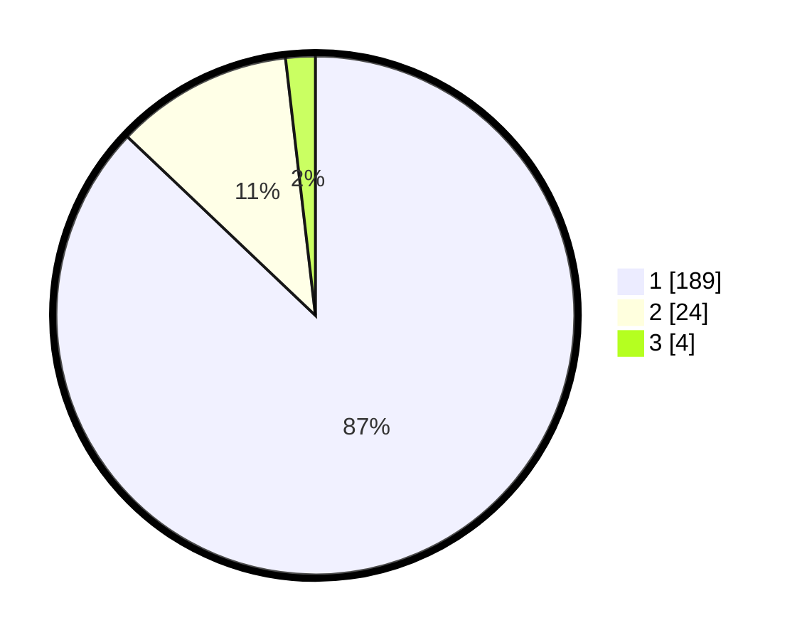

# Hasil

## Grafik

## Tabel

| No. | Nama Paslon    | Suara | Suara (raw) | Persentase |
|:--- |:-------------- | -----:| -----------:| ----------:|
| 1   | ANIES MUHAIMIN | 189   | [189][p-1]  | 87,10      |
| 2   | PRABOWO GIBRAN | 24    | [24][p-2]   | 11,06      |
| 3   | GANJAR MAHFUD  | 4     | [4][p-3]    | 1,84       |

[p-1]: https://github.com/gigit-pemilu/pemilu-2024/blob/main/pilpres/hitung-suara/sub/11-aceh/sub/15-nagan-raya/sub/02-seunagan/sub/2030-latong/sub/003-tps/sub/paslon-1.txt
[p-2]: https://github.com/gigit-pemilu/pemilu-2024/blob/main/pilpres/hitung-suara/sub/11-aceh/sub/15-nagan-raya/sub/02-seunagan/sub/2030-latong/sub/003-tps/sub/paslon-2.txt
[p-3]: https://github.com/gigit-pemilu/pemilu-2024/blob/main/pilpres/hitung-suara/sub/11-aceh/sub/15-nagan-raya/sub/02-seunagan/sub/2030-latong/sub/003-tps/sub/paslon-3.txt

## Foto C Plano

https://sirekap-obj-formc.kpu.go.id/cbb4/pemilu/ppwp/11/15/02/20/30/1115022030003-20240215-005804--947bfb42-61a0-43d6-9c01-0e45825dd789.jpg

https://sirekap-obj-formc.kpu.go.id/cbb4/pemilu/ppwp/11/15/02/20/30/1115022030003-20240215-011604--4033af26-70ff-43c6-b939-4f31a29a35b6.jpg

https://sirekap-obj-formc.kpu.go.id/cbb4/pemilu/ppwp/11/15/02/20/30/1115022030003-20240214-230427--1604e359-55a8-49b9-9c00-cc377c6ab594.jpg

## Metadata

| Key        | Value               |
| ---------- | ------------------- |
| Time Stamp | 2024-02-15 19:30:26 |

