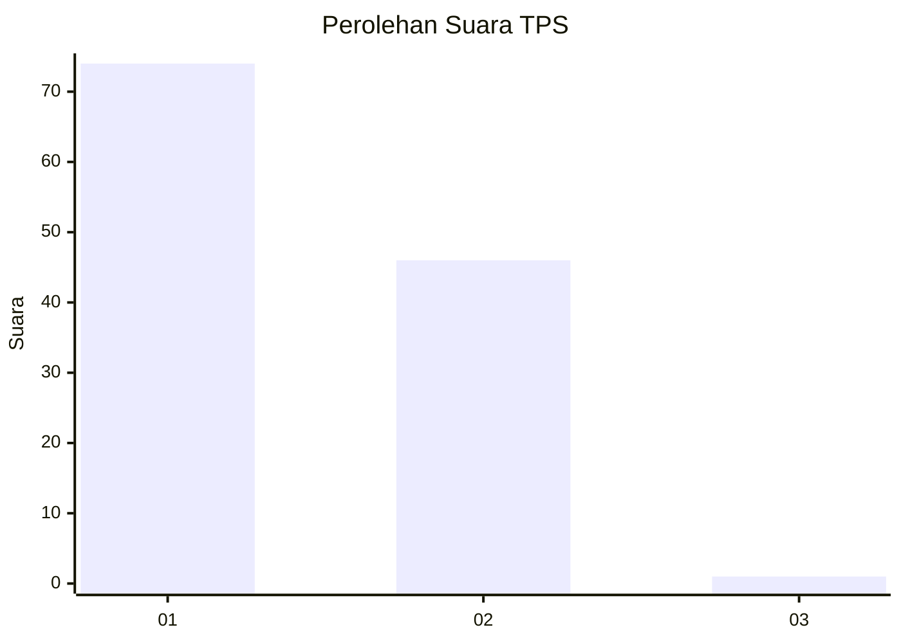
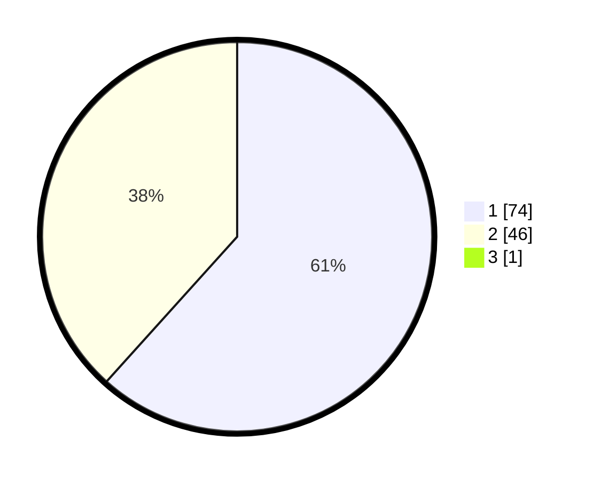

# Hasil

## Grafik

## Tabel

| No. | Nama Paslon    | Suara | Suara (raw) | Persentase |
|:--- |:-------------- | -----:| -----------:| ----------:|
| 1   | ANIES MUHAIMIN | 74    | [74][p-1]   | 61,16      |
| 2   | PRABOWO GIBRAN | 46    | [46][p-2]   | 38,02      |
| 3   | GANJAR MAHFUD  | 1     | [1][p-3]    | 0,83       |

[p-1]: https://github.com/gigit-pemilu/pemilu-2024-11-aceh/blob/main/pilpres/hitung-suara/sub/11-aceh/sub/15-nagan-raya/sub/02-seunagan/sub/2035-rambong-cut/sub/001-tps/sub/paslon-1.txt
[p-2]: https://github.com/gigit-pemilu/pemilu-2024-11-aceh/blob/main/pilpres/hitung-suara/sub/11-aceh/sub/15-nagan-raya/sub/02-seunagan/sub/2035-rambong-cut/sub/001-tps/sub/paslon-2.txt
[p-3]: https://github.com/gigit-pemilu/pemilu-2024-11-aceh/blob/main/pilpres/hitung-suara/sub/11-aceh/sub/15-nagan-raya/sub/02-seunagan/sub/2035-rambong-cut/sub/001-tps/sub/paslon-3.txt

## Foto C Plano

https://sirekap-obj-formc.kpu.go.id/73f6/pemilu/ppwp/11/15/02/20/35/1115022035001-20240215-111310--d1cf1967-88d7-4e15-8fee-238f087c8335.jpg

https://sirekap-obj-formc.kpu.go.id/73f6/pemilu/ppwp/11/15/02/20/35/1115022035001-20240215-111407--22302510-c619-45c2-aec4-e2465ecb21e0.jpg

https://sirekap-obj-formc.kpu.go.id/73f6/pemilu/ppwp/11/15/02/20/35/1115022035001-20240215-111547--ec1c880f-114c-45e4-a4f3-36df720c2b72.jpg

## Metadata

| Key        | Value               |
| ---------- | ------------------- |
| Time Stamp | 2024-02-15 19:30:26 |

