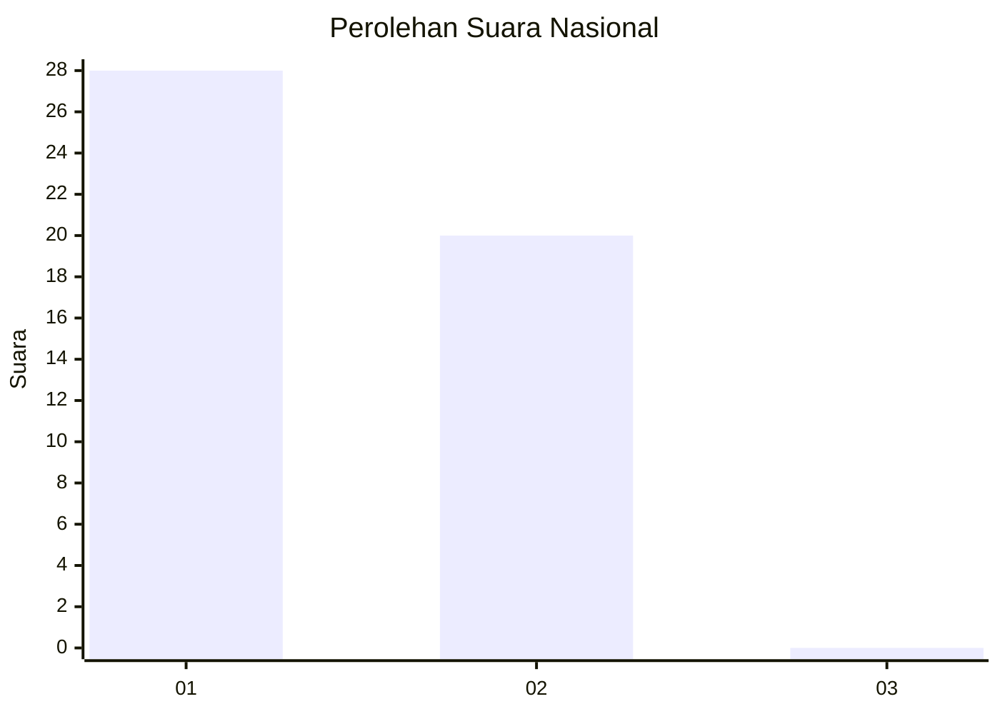
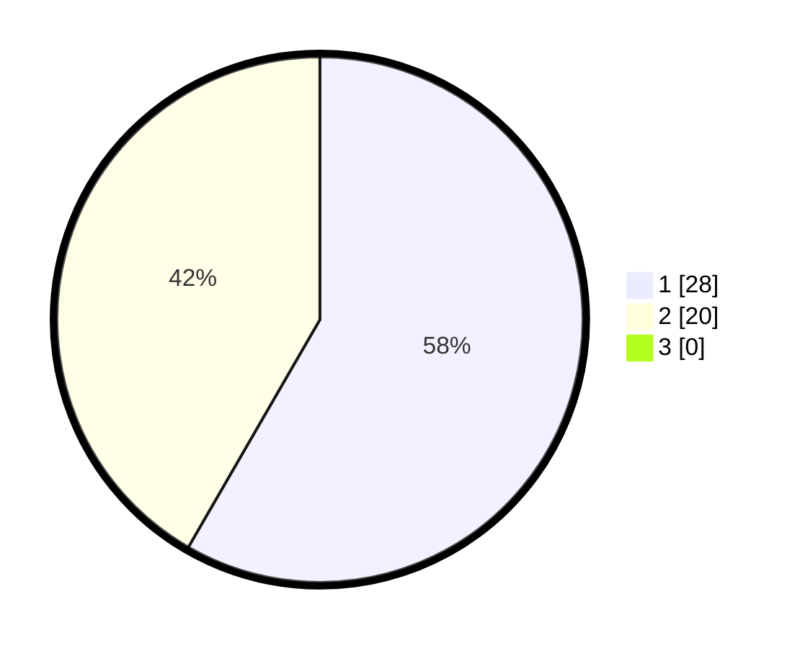

# Hasil

## Grafik

## Tabel

| No. | Nama Paslon    | Suara | Suara (raw) | Persentase |
|:--- |:-------------- | -----:| -----------:| ----------:|
| 1   | ANIES MUHAIMIN | 28    | [28][p-1]   | 58,33      |
| 2   | PRABOWO GIBRAN | 20    | [20][p-2]   | 41,67      |
| 3   | GANJAR MAHFUD  | 0     | [0][p-3]    | 0,00       |

[p-1]: https://github.com/gigit-pemilu/pemilu-2024/blob/main/pilpres/hitung-suara/sub/11-aceh/sub/15-nagan-raya/sub/03-seunagan-timur/sub/2020-cot-dirui/sub/001-tps/sub/paslon-1.txt
[p-2]: https://github.com/gigit-pemilu/pemilu-2024/blob/main/pilpres/hitung-suara/sub/11-aceh/sub/15-nagan-raya/sub/03-seunagan-timur/sub/2020-cot-dirui/sub/001-tps/sub/paslon-2.txt
[p-3]: https://github.com/gigit-pemilu/pemilu-2024/blob/main/pilpres/hitung-suara/sub/11-aceh/sub/15-nagan-raya/sub/03-seunagan-timur/sub/2020-cot-dirui/sub/001-tps/sub/paslon-3.txt

## Foto C Plano

https://sirekap-obj-formc.kpu.go.id/7875/pemilu/ppwp/11/15/03/20/20/1115032020001-20240216-130147--96a0751c-e35a-47a4-a22c-4a4bbc1b708c.jpg

https://sirekap-obj-formc.kpu.go.id/7875/pemilu/ppwp/11/15/03/20/20/1115032020001-20240216-130155--4b06c15f-3dec-4498-ab9f-9baa83f12317.jpg

https://sirekap-obj-formc.kpu.go.id/7875/pemilu/ppwp/11/15/03/20/20/1115032020001-20240216-130151--6a55ed52-f554-4837-87aa-aefbe944de67.jpg

## Metadata

| Key        | Value               |
| ---------- | ------------------- |
| Time Stamp | 2024-02-16 21:01:00 |

## DATA PEMILIH TETAP

Jumlah pemilih dalam DPT: **50**.
 * L: **25**.
 * P: **25**.

## DATA PENGGUNA HAK PILIH

Jumlah pengguna hak pilih dalam DPT: **47**.
 * L: **24**.
 * P: **23**.

Jumlah pengguna hak pilih dalam DPTb: **1**.
 * L: **1**.
 * P: **0**.

Jumlah pengguna hak pilih dalam DPK: **0**.
 * L: **0**.
 * P: **0**.

Jumlah pengguna hak pilih: **48**.
 * L: **25**.
 * P: **23**.

## JUMLAH SUARA SAH DAN TIDAK SAH

JUMLAH SELURUH SUARA SAH: **48**.

JUMLAH SUARA TIDAK SAH: **0**.

JUMLAH SELURUH SUARA SAH DAN SUARA TIDAK SAH: **48**.

