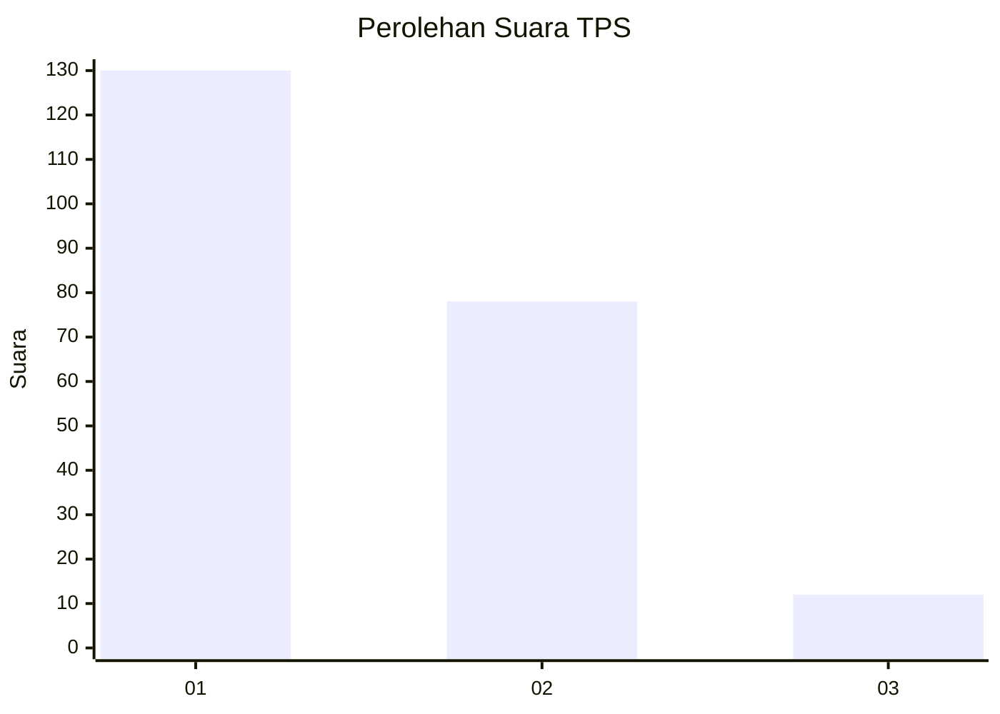
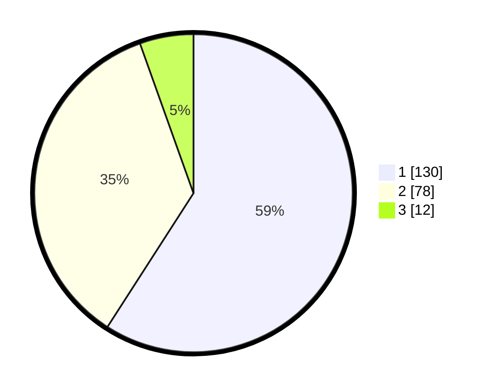

# Hasil

## Grafik

## Tabel

| No. | Nama Paslon    | Suara | Suara (raw) | Persentase |
|:--- |:-------------- | -----:| -----------:| ----------:|
| 1   | ANIES MUHAIMIN | 130   | [130][p-1]  | 59,09      |
| 2   | PRABOWO GIBRAN | 78    | [78][p-2]   | 35,45      |
| 3   | GANJAR MAHFUD  | 12    | [12][p-3]   | 5,45       |

[p-1]: https://github.com/gigit-pemilu/pemilu-2024-11-aceh/blob/main/pilpres/hitung-suara/sub/11-aceh/sub/15-nagan-raya/sub/05-darul-makmur/sub/2012-lamie/sub/003-tps/sub/paslon-1.txt
[p-2]: https://github.com/gigit-pemilu/pemilu-2024-11-aceh/blob/main/pilpres/hitung-suara/sub/11-aceh/sub/15-nagan-raya/sub/05-darul-makmur/sub/2012-lamie/sub/003-tps/sub/paslon-2.txt
[p-3]: https://github.com/gigit-pemilu/pemilu-2024-11-aceh/blob/main/pilpres/hitung-suara/sub/11-aceh/sub/15-nagan-raya/sub/05-darul-makmur/sub/2012-lamie/sub/003-tps/sub/paslon-3.txt

## Foto C Plano

https://sirekap-obj-formc.kpu.go.id/b05d/pemilu/ppwp/11/15/05/20/12/1115052012003-20240214-203150--2b9046d0-ef51-4c39-b49c-99802f6773a3.jpg

https://sirekap-obj-formc.kpu.go.id/b05d/pemilu/ppwp/11/15/05/20/12/1115052012003-20240214-203327--58863ae3-bc95-4ab5-b67c-d13c02be6165.jpg

https://sirekap-obj-formc.kpu.go.id/b05d/pemilu/ppwp/11/15/05/20/12/1115052012003-20240214-203435--a60f5d9c-54eb-4c0a-a87f-ea5514731117.jpg

## Metadata

| Key        | Value               |
| ---------- | ------------------- |
| Time Stamp | 2024-02-22 12:00:00 |

## DATA PEMILIH TETAP

Jumlah pemilih dalam DPT: **242**.
 * L: **123**.
 * P: **119**.

## DATA PENGGUNA HAK PILIH

Jumlah pengguna hak pilih dalam DPT: **213**.
 * L: **109**.
 * P: **104**.

Jumlah pengguna hak pilih dalam DPTb: **0**.
 * L: **0**.
 * P: **0**.

Jumlah pengguna hak pilih dalam DPK: **10**.
 * L: **2**.
 * P: **8**.

Jumlah pengguna hak pilih: **223**.
 * L: **111**.
 * P: **112**.

## JUMLAH SUARA SAH DAN TIDAK SAH

JUMLAH SELURUH SUARA SAH: **220**.

JUMLAH SUARA TIDAK SAH: **5**.

JUMLAH SELURUH SUARA SAH DAN SUARA TIDAK SAH: **225**.

