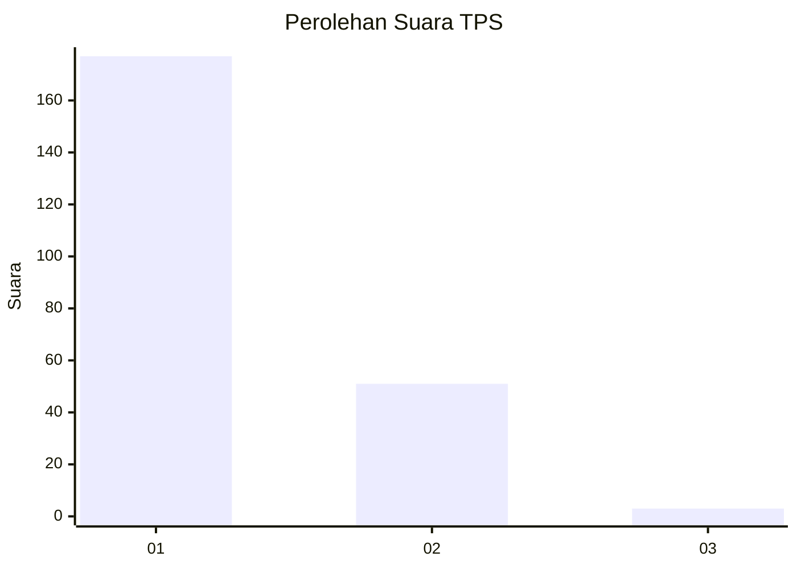
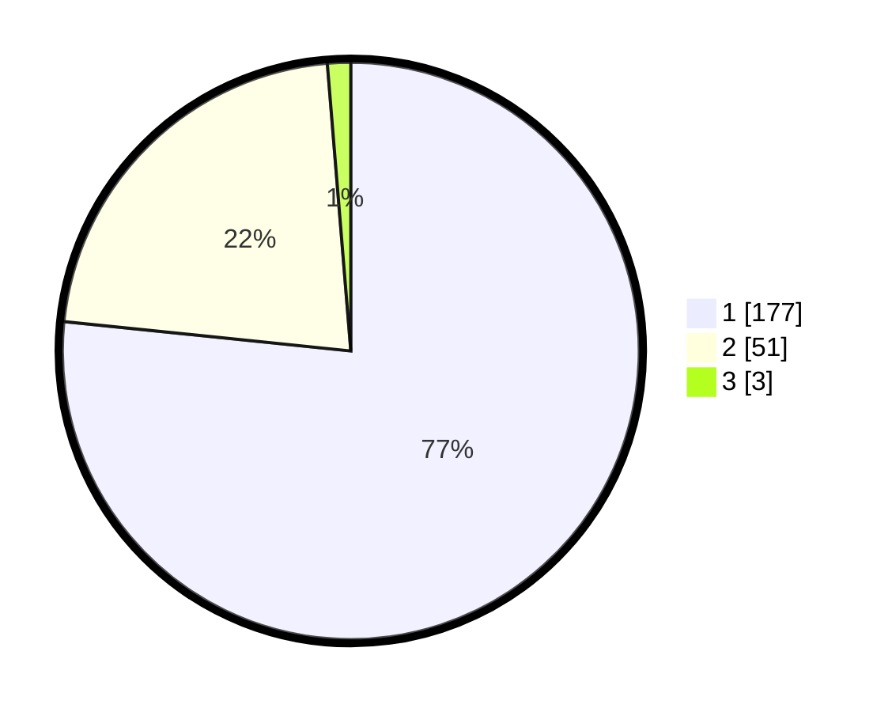

# Hasil

## Grafik

## Tabel

| No. | Nama Paslon    | Suara | Suara (raw) | Persentase |
|:--- |:-------------- | -----:| -----------:| ----------:|
| 1   | ANIES MUHAIMIN | 177   | [177][p-1]  | 76,62      |
| 2   | PRABOWO GIBRAN | 51    | [51][p-2]   | 22,08      |
| 3   | GANJAR MAHFUD  | 3     | [3][p-3]    | 1,30       |

[p-1]: https://github.com/gigit-pemilu/pemilu-2024-11-aceh/blob/main/pilpres/hitung-suara/sub/11-aceh/sub/15-nagan-raya/sub/05-darul-makmur/sub/2012-lamie/sub/005-tps/sub/paslon-1.txt
[p-2]: https://github.com/gigit-pemilu/pemilu-2024-11-aceh/blob/main/pilpres/hitung-suara/sub/11-aceh/sub/15-nagan-raya/sub/05-darul-makmur/sub/2012-lamie/sub/005-tps/sub/paslon-2.txt
[p-3]: https://github.com/gigit-pemilu/pemilu-2024-11-aceh/blob/main/pilpres/hitung-suara/sub/11-aceh/sub/15-nagan-raya/sub/05-darul-makmur/sub/2012-lamie/sub/005-tps/sub/paslon-3.txt

## Foto C Plano

https://sirekap-obj-formc.kpu.go.id/c3a9/pemilu/ppwp/11/15/05/20/12/1115052012005-20240214-202451--32fd2778-ff99-4d82-9965-a26ae8dce743.jpg

https://sirekap-obj-formc.kpu.go.id/c3a9/pemilu/ppwp/11/15/05/20/12/1115052012005-20240214-202626--8aa5291f-9896-4fbc-b7a8-3fb8572a104d.jpg

https://sirekap-obj-formc.kpu.go.id/c3a9/pemilu/ppwp/11/15/05/20/12/1115052012005-20240214-202515--30de5da7-9751-41ff-b667-12f0d065e511.jpg

## Metadata

| Key        | Value               |
| ---------- | ------------------- |
| Time Stamp | 2024-02-15 18:00:26 |

